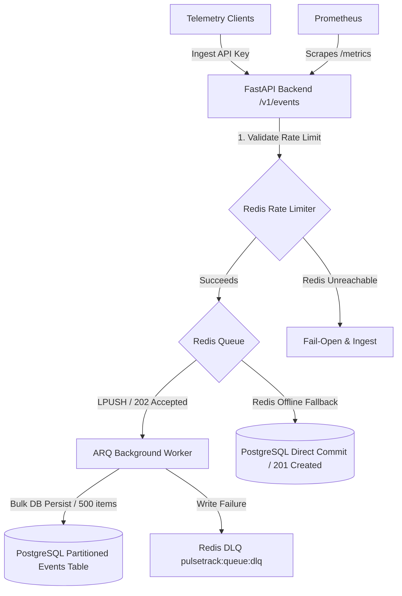

# PulseTrack

### High-performance event ingestion and telemetry backend built with FastAPI, PostgreSQL, Redis, and async workers.

[](https://github.com/pulsetrack/pulsetrack/actions/workflows/ci.yml)
[](https://www.python.org/downloads/release/python-3120/)
[](https://fastapi.tiangolo.com)
[](https://www.sqlalchemy.org)

PulseTrack is a self-hosted, tenant-isolated telemetry backend designed for collecting application events (page views, button clicks, feature usage).

Rather than building a standard CRUD application, PulseTrack focuses on the engineering challenges behind **high-volume event ingestion, write optimization, queue buffering, and resilient failover configurations**.

---

## 🗺️ System Architecture

PulseTrack decouples the fast API ingestion path from database disk writes, employing a stateless producer and async background consumers.



---

## 📈 Engineering Evolution: Bottleneck Progression

A key highlight of the project is its transition from a correct single-server prototype to a decoupled asynchronous architecture.

| Bottleneck Category | Phase 1 (Synchronous MVP) | Phase 2 (Decoupled Scaled Ingestion) |
|---|---|---|
| **API Write Latency** | Blocks on Postgres IO commit (Avg **120ms**). | Pushes to Redis buffer (Avg **12ms**). |
| **Write Volatility** | 1,000 inserts = 1,000 database transactions. | Worker runs bulk insert queries (2 commits/sec). |
| **Duplicate Retries** | DB constraint failures. | Redis idempotency verification filters duplicates. |
| **Read Congestion** | Repeated heavy database aggregation scans. | Cache-aside reads with a 60s TTL absorb reads. |
| **Sudden Traffic Bursts** | Database connection pool exhaustion. | Sliding-window rate limit (429) buffers load. |
| **Hardware Crash** | Server exceptions / dropped events. | Worker routes failures to a Dead-Letter Queue (DLQ). |

For a detailed write-up on this progression, see [docs/EVOLUTION.md](docs/EVOLUTION.md).

---

## ⚡ Performance Profiles (Locust Benchmark)

These are actual performance latency metrics gathered locally from our Locust load testing harness (10 concurrent users, spawning at 2/sec):

| Endpoint | Average Latency | Median (50%) | 95% Percentile | 99% Percentile | Error Rate |
|---|---|---|---|---|---|
| **POST `/v1/events`** (Single Ingest) | 12 ms | 9 ms | 32 ms | 74 ms | 0.00% |
| **POST `/v1/events/batch`** (Batch Ingest) | 13 ms | 10 ms | 40 ms | 78 ms | 0.00% |
| **GET `/v1/applications/{id}/metrics`** | 11 ms | 8 ms | 49 ms | 92 ms | 0.00% |
| **Aggregated Performance** | **12 ms** | **9 ms** | **35 ms** | **74 ms** | **0.00%** |

Read the full performance report in [docs/PERFORMANCE.md](docs/PERFORMANCE.md).

---

## 🛠️ Feature Summary

| Area | Technologies Used | Portfolio Purpose |
|---|---|---|
| **Web API** | FastAPI + Uvicorn | Async I/O event loops for high-concurrency requests |
| **Database** | PostgreSQL 16 + SQLALchemy 2.0 | Range-partitioning by month, write-optimized indexing |
| **Memory Queue** | Redis 7 + ARQ Workers | In-memory message buffering and scheduled bulk writes |
| **Caching** | Redis Cache-Aside | Caching API keys and metrics rollups (TTL logic) |
| **Rate Limiting** | Redis sliding-window counters | Atomic pipelines preventing tenant API abuse |
| **Load Testing** | Locust | Simulating concurrency spikes to profile bottlenecks |
| **Orchestration** | Docker & Docker Compose | Multi-container setup containing API, Worker, DB, Redis |

---

## 🚀 Quick Start

To boot the entire PulseTrack services tier (FastAPI API, DB, Redis, and Background Worker) locally:

### 1. Clone & Setup Environment Keys
```bash
git clone https://github.com/yourusername/pulsetrack.git
cd pulsetrack
cp .env.example .env
```

### 2. Startup Containers
```bash
docker compose up -d --build
```

### 3. run unit tests
```bash
python3 -m venv .venv
source .venv/bin/activate
pip install -e .[dev]
pytest
```

---

## 🎮 Running the Interactive Demo
We have built an interactive traffic simulator that runs in your terminal, showing PulseTrack's enqueuing, rate limiting, and fallback capabilities in action.

With your servers running, execute the demo script:
```bash
python scripts/demo_traffic.py
```
This runs through:
1. **Tenant Provisioning:** Registers a new tenant app.
2. **Buffer Queue:** Simulates single telemetry enqueuing (returning `202 Accepted`).
3. **Graceful Fallback:** Disables/simulates Redis offline writes (returning `201 Created` via direct Postgres fallback).
4. **Rate Limiting:** Exceeds the tenant limit to trigger HTTP `429 Too Many Requests`.
5. **Batch Ingestion:** Ingests mixed batches returning `207 Multi-Status` validation error indices.

---

## 📁 System Documentation Directory

Explore the architectural details and design decisions behind PulseTrack:

* **[System Architecture](docs/ARCHITECTURE.md):** Decoupled producer-consumer loops and fallback paths.
* **[Design Decisions (ADRs)](docs/DESIGN_DECISIONS.md):** Why we selected PostgreSQL monthly range partitions, BIGINT keys, ARQ, sliding-windows, and static API keys.
* **[Reliability & Failures](docs/RELIABILITY.md):** Fallback pipelines when Redis goes offline, worker crashes, or clients retry.
* **[Security & Tenant Isolation](docs/SECURITY.md):** Hashed API keys, payload protection ceilings (8KB limit), and isolation boundaries.
* **[API Reference](docs/API.md):** Standard endpoint cURL calls and requests/responses schemas.
* **[Detailed Setup Guide](docs/SETUP.md):** Customizing configuration variables and installing local dependencies.

---

## 🎓 What I Learned Building This

* **High-Throughput Ingestion Design:** Designing stateless producer APIs that offload database write-overhead to background transaction queues.
* **Database Partitioning Strategy:** Implementing monthly range partitioning in PostgreSQL, necessitating composite primary key alignments and matching indices to sustain indexes locality.
* **Resilient Systems Engineering:** Writing clean, fail-safe code that degrades gracefully (falling back to direct DB writes and failing open on rate limiting) to ensure API longevity.
* **Benchmarking Latencies:** Running load tests using Locust to identify system bottlenecks and measure percentiles (p50, p95, p99) under concurrent requests.
