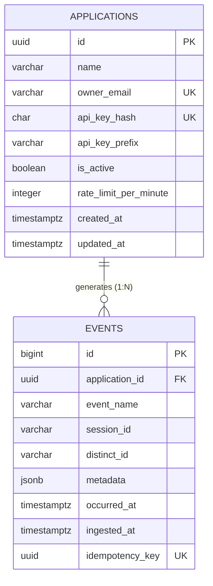

# Database Design Document

**Project:** PulseTrack — Event-Collection & Telemetry Backend
**Author:** Sumukh
**Version:** 1.0
**Status:** Pre-implementation design, consistent with `PulseTrack_PRD.md`, `PulseTrack_SRD.md`, `PulseTrack_API_Design.md`, and `architecture.md`
**Scope note:** This document covers exactly the two entities already defined in the project's requirements — `applications` and `events`. No additional tables, entities, or features are introduced. Where this document goes beyond the letter of the prior docs (e.g. suggesting a `CHECK` constraint), it is explicitly flagged as a database-layer integrity decision consistent with an already-documented requirement, not a new feature.

---

## Table of Contents

1. [Introduction](#1-introduction)
2. [Database Technology](#2-database-technology)
3. [Data Model](#3-data-model)
4. [Entity Relationship Diagram](#4-entity-relationship-diagram)
5. [Tables](#5-tables)
6. [Column Design Decisions](#6-column-design-decisions)
7. [Index Strategy](#7-index-strategy)
8. [Constraints](#8-constraints)
9. [Query Optimization](#9-query-optimization)
10. [Partitioning Strategy](#10-partitioning-strategy)
11. [Migration Strategy](#11-migration-strategy)
12. [Security](#12-security)
13. [Backup and Recovery](#13-backup-and-recovery)
14. [Performance Considerations](#14-performance-considerations)
15. [Scalability Strategy](#15-scalability-strategy)
16. [Risks](#16-risks)
17. [Future Improvements](#17-future-improvements)

---

## 1. Introduction

### Purpose
This document is the authoritative reference for *why* the PulseTrack schema looks the way it does. A reader should be able to reconstruct the DDL's reasoning without needing commit history or a conversation with the author — every column, index, and constraint traces back to a requirement or an explicit trade-off.

### Scope
Two entities: `applications` (tenant registry) and `events` (telemetry fact table). This mirrors the data model already fixed in `PulseTrack_PRD.md` §5 and `PulseTrack_SRD.md` §8. No junction tables, no lookup tables, no additional entities — the domain genuinely is this simple, and resisting premature normalization was itself a decision (§6).

### Database Overview
One logical database, one primary-owned schema, two tables, one foreign-key relationship, one partitioned fact table (`events`, Phase 2), one deliberately schemaless column (`metadata JSONB`).

### Design Goals
1. **Write path is the priority.** `events` is append-only and ingestion-critical; every index and constraint on it is justified against write cost, not added by default.
2. **Predictable read latency for bounded time-range aggregation** — the one read pattern the system actually needs to serve well (§9).
3. **Tenant isolation enforced at the schema and query layer**, not just the application layer — a missing `application_id` filter should be structurally awkward to write, not just a code-review catch.
4. **Boring at the edges, flexible only where the domain requires it** — relational columns everywhere except `metadata`, which exists specifically because client-defined properties are the product's value proposition.
5. **Decisions are cheap to reverse where possible, expensive-but-planned-for where not** — partitioning (§10) is the one decision in this schema that's genuinely costly to retrofit later, so it's addressed deliberately rather than deferred by default.

---

## 2. Database Technology

### Why PostgreSQL
- **JSONB with GIN indexing** — the `metadata` column needs to be queryable, not just storable; PostgreSQL is the mainstream relational database with genuinely first-class (not bolted-on) JSON support.
- **Declarative partitioning** — native `PARTITION BY RANGE`, no extension required for the Phase 2 monthly-partition strategy (§10).
- **Strong consistency (ACID)** — event counts feeding `/metrics` need to be correct, not eventually-approximately-correct; a document store trading consistency for write throughput would undermine the one thing the aggregation endpoint promises.
- **Mature async driver ecosystem** — `asyncpg` is the fastest, most battle-tested async Postgres driver in Python, which is what makes the async-first architecture in `architecture.md` viable at all.
- **No unfamiliar-technology tax** — for a portfolio project meant to be read by other engineers, Postgres requires zero onboarding; a more exotic choice would spend review attention explaining the database instead of the design.

### Why Neon specifically
- **Serverless, scale-to-zero compute** — a portfolio project has bursty, low-baseline traffic; paying for an always-on instance (or building one) would be effort and cost spent on undifferentiated infrastructure.
- **Instant branching** — a Neon branch is a copy-on-write clone of the schema and data, used here for CI test runs and local-parity dev environments without a separate seed/teardown pipeline.
- **Standard Postgres wire protocol** — no proprietary query language or client library; the async SQLAlchemy engine talks to Neon exactly as it would talk to any Postgres instance, so nothing in the application layer is Neon-specific.
- **Built-in connection pooling** (PgBouncer-compatible) — necessary because autoscaled, stateless web instances (`architecture.md` §7) can open more raw connections collectively than a single Postgres primary comfortably serves; Neon's pooler absorbs this without the project needing to run its own PgBouncer.

### Expected Workload
Write-heavy, read-light — the defining shape of a telemetry system. Every user action on a client application is a potential `events` row; a dashboard query against `/metrics` happens orders of magnitude less often than the events it's summarizing were generated.

### Read/Write Ratio
Assumed on the order of **100:1 to 1000:1 writes-to-reads** (many clicks generate few dashboard views). This ratio is not just color commentary — it directly justifies:
- Indexing biased toward the one read pattern that matters (§7), not toward flexibility for hypothetical future reads.
- Caching the *read* side (Redis, `PulseTrack_API_Design.md` §9) rather than trying to optimize the write side down to match read latency needs.
- Batching *writes* (Phase 2) since that's where the volume actually is.

### Scalability Assumptions
Target throughput of 500–2,000 events/sec per `PulseTrack_SRD.md` NFR-SCAL-01 — explicitly portfolio/demonstration scale, not the "millions of events/sec" tier that would require a fundamentally different architecture (columnar storage, stream processing — see §17). This schema is not designed to be reused unmodified at that scale, and pretending otherwise would be dishonest engineering, not ambitious engineering.

---

## 3. Data Model

| Entity | Represents | Why it exists |
|---|---|---|
| **Application** | A registered tenant — the owner of an API key and the events it generates | Without a tenant boundary, there's no way to authenticate ingestion or scope aggregation; it's the unit of both auth and billing-adjacent config (`rate_limit_per_minute`) |
| **Event** | A single telemetry record submitted on behalf of an Application | The entire reason the system exists — every other table and column serves this one |

**Relationship:** One `Application` has many `Events` (1:N). Ownership is strict and non-optional — an `Event` cannot exist without an owning `Application` (`application_id` is `NOT NULL`, with a foreign key). There is no scenario in the documented requirements where an event is unowned or shared across applications.

**Cardinality:** `Application (1) ──── (0..N) Event`. An `Application` may have zero events (freshly registered, no traffic yet); an `Event` always has exactly one `Application`.

**No many-to-many relationships exist.** A junction table would only be justified if, say, an event could belong to multiple applications — nothing in the PRD or SRD describes that, so none was added. This is a deliberate resistance to speculative normalization, not an oversight.

---

## 4. Entity Relationship Diagram



---

## 5. Tables

### 5.1 `applications`

**Purpose:** Tenant registry and authentication boundary. Every request into the system resolves to exactly one row in this table before anything else happens.

```sql
CREATE TABLE applications (
    id                    UUID PRIMARY KEY DEFAULT gen_random_uuid(),
    name                  VARCHAR(255) NOT NULL,
    owner_email           VARCHAR(255) NOT NULL,
    api_key_hash          CHAR(64) NOT NULL,
    api_key_prefix        VARCHAR(12) NOT NULL,
    is_active             BOOLEAN NOT NULL DEFAULT TRUE,
    rate_limit_per_minute INTEGER NOT NULL DEFAULT 600,
    created_at            TIMESTAMPTZ NOT NULL DEFAULT now(),
    updated_at            TIMESTAMPTZ NOT NULL DEFAULT now(),

    CONSTRAINT uq_applications_owner_email UNIQUE (owner_email),
    CONSTRAINT uq_applications_api_key_hash UNIQUE (api_key_hash),
    CONSTRAINT ck_applications_rate_limit_positive CHECK (rate_limit_per_minute > 0)
);
```

| | |
|---|---|
| **Primary Key** | `id` (UUID) |
| **Foreign Keys** | None — this is the root entity |
| **Unique Constraints** | `owner_email`, `api_key_hash` |
| **Indexes** | `idx_applications_api_key_hash` (see §7) |
| **Check Constraints** | `rate_limit_per_minute > 0` |
| **Relationships** | Parent of `events` via `events.application_id` |

### 5.2 `events`

**Purpose:** The telemetry fact table — every ingested event, append-only, partitioned by time (Phase 2).

```sql
CREATE TABLE events (
    id              BIGINT GENERATED ALWAYS AS IDENTITY,
    application_id  UUID NOT NULL REFERENCES applications(id) ON DELETE CASCADE,
    event_name      VARCHAR(100) NOT NULL,
    session_id      VARCHAR(64),
    distinct_id     VARCHAR(128),
    metadata        JSONB NOT NULL DEFAULT '{}'::jsonb,
    occurred_at     TIMESTAMPTZ NOT NULL,
    ingested_at     TIMESTAMPTZ NOT NULL DEFAULT now(),
    idempotency_key UUID,

    CONSTRAINT ck_events_event_name_not_empty CHECK (char_length(event_name) > 0),
    PRIMARY KEY (id, occurred_at)
) PARTITION BY RANGE (occurred_at);
```

| | |
|---|---|
| **Primary Key** | `(id, occurred_at)` — composite; see §8 for why `occurred_at` must be included |
| **Foreign Keys** | `application_id → applications(id)`, `ON DELETE CASCADE` |
| **Unique Constraints** | `(application_id, idempotency_key)` where `idempotency_key IS NOT NULL` (partial) |
| **Indexes** | `idx_events_app_name_time`, `idx_events_metadata_gin` (see §7) |
| **Check Constraints** | `char_length(event_name) > 0` |
| **Relationships** | Child of `applications` via `application_id` |

---

## 6. Column Design Decisions

### `applications.id` — UUID, `events.id` — BIGINT

Two different identifier strategies, deliberately:

- **`applications.id` is UUID** because it's a low-cardinality, externally-exposed identifier — it appears in URLs (`GET /v1/applications/{id}`) and is human/owner-facing. A sequential integer here would let anyone enumerate how many tenants exist and probe adjacent IDs; a UUID closes that off at effectively no cost, since application creation is rare enough that insert-locality doesn't matter.
- **`events.id` is `BIGINT GENERATED ALWAYS AS IDENTITY`** because it's a high-volume, internal-only identifier — no documented endpoint fetches a single event by ID, so unguessability buys nothing, while B-tree insert locality (sequential IDs cluster new inserts at the end of the index rather than scattering them) meaningfully reduces index bloat and page splits under sustained write load. This is `ADR-001` in `architecture.md`, restated here in schema terms.

### Timestamp Strategy

Every timestamp column is `TIMESTAMPTZ`, never bare `TIMESTAMP` — a naive timestamp silently assumes a timezone (usually the server's or the client's, inconsistently), which is a well-known bug class in systems that aggregate data across clients in different regions. `PulseTrack_SRD.md` §2.6 already assumes clients send ISO 8601 with timezone; the schema enforces that this information isn't discarded at the storage layer.

`events` deliberately carries **two** timestamps, not one:
- `occurred_at` — client-reported, when the action actually happened.
- `ingested_at` — server-assigned, when PulseTrack received it.

These diverge whenever a client batches events offline, queues under poor connectivity, or simply experiences network latency. Collapsing them into a single column would make it impossible to later detect or audit clock skew, and would make Phase 2's async ingestion (queued, then written later) silently misrepresent when the write actually happened.

### JSONB Usage (`metadata`)

`metadata` is the **one** deliberately schemaless column in the entire design. Every other field is a normal typed relational column. The justification is narrow and specific: client-defined event properties (`button_id`, `page`, arbitrary product-specific dimensions) can't be predicted or normalized in advance without becoming a migration bottleneck every time an integrator wants to track a new property — which would defeat the purpose of a general-purpose telemetry backend.

The trade-off is taken with eyes open:
- Query-ability is worse than a normalized column (needs a GIN index, §7).
- Size must be capped (8KB, enforced at the Pydantic layer per `PulseTrack_API_Design.md` §6, *not* relied upon as a DB-level guarantee — Postgres has no native JSONB size CHECK that's both cheap and precise, so this is intentionally an application-layer control).

### Nullable Fields

`session_id`, `distinct_id`, and `idempotency_key` are nullable — and each nullability is a deliberate signal, not sloppy modeling:
- `session_id` / `distinct_id` may be absent for server-side or anonymous events where no session or user context exists.
- `idempotency_key` is absent on the vast majority of rows — only requests that opt into the header populate it (§7's partial index depends on this).

### Default Values

| Column | Default | Why |
|---|---|---|
| `applications.is_active` | `TRUE` | New applications should work immediately — no explicit activation step, matching the low-friction registration flow in `PulseTrack_API_Design.md` §5 |
| `applications.rate_limit_per_minute` | `600` | Every application gets a sane limit without requiring explicit configuration at creation time |
| `events.metadata` | `'{}'::jsonb` | Removes an entire class of `NULL`-handling branches everywhere `metadata` is read — code can always assume an object, never `None` |
| `*.created_at` / `events.ingested_at` | `now()` | Removes the "forgot to set the timestamp" bug class entirely — the database, not application code, is the source of truth for receipt time |

---

## 7. Index Strategy

| Index | Definition | Serves | Write Cost | Storage Cost |
|---|---|---|---|---|
| `idx_applications_api_key_hash` | B-tree on `api_key_hash` | `FR-AUTH-01` — every single request authenticates via this lookup | One B-tree entry per application (creation is rare) — negligible | Small — one 64-char hash per row |
| `idx_events_app_name_time` | Composite B-tree on `(application_id, event_name, occurred_at DESC)` | `GET /metrics` — the one read pattern that matters (§9) | One entry per event insert — the dominant index cost in the system | Grows linearly with event volume; bounded per-partition once Phase 2 lands |
| `idx_events_metadata_gin` | GIN on `metadata jsonb_path_ops` | Forward-provisioning for metadata-scoped filtering — **no currently documented endpoint uses this** | GIN indexes cost roughly 2–3× a comparable B-tree per write — the most expensive index in the schema | Larger on disk than the composite B-tree; scales with metadata richness, not just row count |
| `idx_events_app_idempotency` | Partial unique B-tree on `(application_id, idempotency_key) WHERE idempotency_key IS NOT NULL` | `FR-ING-08` — dedup on retried requests | Only rows with a non-null key are indexed — cheap given most rows won't have one | Small in practice; would grow if idempotency-key usage became the norm rather than the exception (flagged as a risk in §16) |

**On the composite index's column order:** `application_id` leads because every single query is tenant-scoped — it's the highest-selectivity, always-present filter. `event_name` is second because it's the next-most-common filter. `occurred_at DESC` is last, supporting both the `BETWEEN` range scan on the date filter and the ascending/descending bucket ordering the aggregation query needs, without a separate sort step.

**On the GIN index specifically — an honest call-out:** this is the one index in the schema that isn't justified by a currently documented query. It's included because `PulseTrack_PRD.md`'s framing of `metadata` as a first-class extensibility point implies metadata-scoped filtering is a near-term need (§17), and retrofitting a GIN index onto a large, already-partitioned table later is more disruptive than building it in from the start. This is a speculative investment, stated as one — not smuggled in as if it served an existing requirement.

**Future indexes** (not yet added, noted for when they become necessary): an index on `(application_id, id)` or `(application_id, occurred_at, id)` to support keyset pagination, reserved as a convention in `PulseTrack_API_Design.md` §10 but not needed until a raw event-listing endpoint actually ships.

---

## 8. Constraints

| Constraint Type | Where | Rule |
|---|---|---|
| **Primary Key** | `applications.id` | UUID, single-column |
| **Primary Key** | `events (id, occurred_at)` | Composite — see note below |
| **Foreign Key** | `events.application_id → applications.id` | `ON DELETE CASCADE` |
| **Unique** | `applications.owner_email` | Prevents duplicate registration; closes the race-condition window `FR-APP-04` describes as an application-layer check alone |
| **Unique** | `applications.api_key_hash` | A hash collision or generation bug must be structurally impossible to silently accept |
| **Unique (partial)** | `events (application_id, idempotency_key) WHERE idempotency_key IS NOT NULL` | Enforces `FR-ING-08` at the database level, not just in application logic |
| **Check** | `applications.rate_limit_per_minute > 0` | A zero or negative limit is nonsensical and would otherwise silently break rate limiting |
| **Check** | `char_length(events.event_name) > 0` | Defense in depth against any write path that bypasses Pydantic validation |

**Why `events`' primary key is `(id, occurred_at)`, not just `id`:** PostgreSQL requires the partition key to be part of any unique constraint (including the primary key) on a partitioned table — this is a hard engine requirement, not a design preference. The practical consequence is that global uniqueness of `id` alone isn't *enforced* by the database across partitions; it's guaranteed in practice by `BIGINT IDENTITY` generating a single monotonic sequence regardless of which partition a row lands in. This is accepted as a low-risk trade-off of Postgres declarative partitioning, stated honestly rather than glossed over.

**Cascade rules:** exactly one cascade exists in the schema (`events → applications`), and it's a deliberately narrow blast radius. A hard delete of an application is expected to be rare — `rules.md` ADR-006 establishes soft-delete-only (`is_active = false`) as the normal path — but the cascade exists as the correct database-level safety net for the rare admin- or compliance-driven hard delete, so no orphaned events with no owning tenant can exist.

**Validation strategy — a deliberate two-layer split:** format and business-rule validation (email format, string length ranges, JSON size caps) lives in Pydantic at the API boundary (`rules.md` R-VAL-01–03). The database's `CHECK` constraints exist only as a last line of defense against paths that bypass the API entirely — migrations, admin scripts, future internal tooling — not as the primary validation layer. This is intentional redundancy at the boundary that matters most, not duplicated logic that could drift.

---

## 9. Query Optimization

### Ingestion (write path)
- **Phase 1:** single-row `INSERT`, one round trip per event.
- **Phase 2:** multi-row `INSERT ... VALUES (...), (...), ...` (or `asyncpg`'s `executemany`/`copy_records_to_table`) from the ARQ worker, batching up to the same 500-event ceiling as the batch API endpoint — collapsing N round trips and N WAL flushes into one is the single largest lever for meeting the throughput NFR in `PulseTrack_SRD.md` §6.

### Aggregation (read path)
The one query that matters:
```sql
SELECT date_trunc(:granularity, occurred_at) AS bucket, COUNT(*) AS count
FROM events
WHERE application_id = :app_id
  AND event_name = :event_name
  AND occurred_at BETWEEN :start_date AND :end_date
GROUP BY bucket
ORDER BY bucket;
```
- **Filtering** on `application_id` + `event_name` + `occurred_at` range is served directly by `idx_events_app_name_time`'s leading columns.
- **Sorting** (`ORDER BY bucket`) falls out of the index's `DESC` ordering on `occurred_at` in the common case — worth confirming with `EXPLAIN ANALYZE` once implemented rather than assumed, since the `GROUP BY`'s bucket truncation can still force a sort node depending on the planner's choice; this is flagged as a concrete post-implementation validation step, not asserted as guaranteed.
- **Pagination** doesn't apply to this endpoint — it's bounded by date range, not row count, per `PulseTrack_API_Design.md` §7. A future raw event-listing endpoint would need the keyset-pagination index noted in §7.
- **Time-based lookups** additionally benefit from partition pruning (§10) on top of the index — a query scoped to one week only touches one partition's slice of the index, not the whole table's ever-growing one.

---

## 10. Partitioning Strategy

`events` is range-partitioned by `occurred_at`, monthly, starting in Phase 2 (per `PulseTrack_PRD.md` §3 and `architecture.md` §6).

### Benefits
- **Partition pruning** shrinks the effective index size per query — a date-bounded aggregation query only touches the relevant month(s), not the whole table's history.
- **Retention as `DETACH PARTITION`** — dropping data older than the 90-day default retention window becomes a near-instant metadata operation instead of a row-by-row `DELETE`, which would otherwise generate large amounts of WAL and dead tuples requiring aggressive `VACUUM`.
- **Bounded `VACUUM`/`ANALYZE` units** — maintenance runs against fixed-size monthly partitions instead of one table that grows without bound.

### Drawbacks — stated honestly
- **Primary key uniqueness is only enforced within the partition key's inclusion**, as discussed in §8 — a real constraint of Postgres declarative partitioning, mitigated but not eliminated by `BIGINT IDENTITY`'s practical monotonicity.
- **Operational overhead**: partitions must be created ahead of each month (a scheduled job, or an extension like `pg_partman`), and Alembic's autogenerate doesn't handle partition DDL well — new partition migrations are written by hand. This overhead is exactly why partitioning is scoped to Phase 2, not Phase 1 — the PRD/SRD phase split already reflects this being a "prove correctness first" vs. "optimize for scale second" trade-off.

### Retention Policy
90 days by default (configurable), enforced by detaching partitions older than the window, then dropping or archiving them (§17).

### Future Evolution
Could extend into a hot/cold split — recent partitions on Neon's primary compute, detached older partitions exported to cheaper columnar storage rather than dropped outright (§17).

---

## 11. Migration Strategy

- **Alembic**, autogenerating from the SQLAlchemy 2.0 ORM models as a starting point — every autogenerated migration is reviewed by hand before commit, since autogenerate handles ordinary column/index changes well but does **not** reliably generate correct partition DDL, which is written manually when needed.
- **Versioning:** a single linear migration history on `main` — no multi-head branching, appropriate for a solo-maintained project (`rules.md` R-GIT-02).
- **Rollback:** every migration ships a working `downgrade()`, exercised at least once against a Neon dev branch before merging (`rules.md` R-DB-03) — Neon's branching makes this cheap enough to actually enforce rather than skip under time pressure.
- **Schema evolution:** purely additive changes (new nullable column, new index) ship without special handling. Any change requiring a backfill (e.g. a new `NOT NULL` column) follows an expand-contract sequence — add nullable → backfill → enforce `NOT NULL` in a later migration — specifically to avoid a single migration taking a blocking, table-rewriting lock on `events` as it grows.

---

## 12. Security

- **Database users:** a single application connection role for the running FastAPI/ARQ processes. A separate, more privileged role is used only for running migrations (CI/Alembic) — the application's runtime role is intentionally **DML-only** (`SELECT`/`INSERT`/`UPDATE`, no `CREATE`/`ALTER`/`DROP`), so that even a worst-case SQL injection or process compromise cannot alter schema.
- **Permissions:** least-privilege is deferred slightly for a read-only reporting role (not yet needed at this scale) — noted as a §17 improvement rather than built speculatively now.
- **Connection security:** TLS-enforced connections to Neon (`sslmode=require` minimum), consistent with `architecture.md` §10.
- **Secrets:** `DATABASE_URL` is injected via Render environment variables only, never committed — `rules.md` R-SEC-04.
- **SQL injection prevention:** parameter binding via SQLAlchemy exclusively (`rules.md` R-DB-02) — no raw string-formatted SQL, no dynamically constructed table or column names built from user input, anywhere in the codebase.
- **Encryption:** Neon encrypts data at rest by default as a managed-service baseline; TLS covers data in transit. Column-level application encryption is **not** implemented, because no column in this schema is documented as storing regulated or sensitive data (`PulseTrack_PRD.md`/`SRD` explicitly don't mandate PII fields) — flagged as a re-evaluation trigger if that assumption ever changes.

---

## 13. Backup and Recovery

- **Neon capabilities:** point-in-time recovery (PITR) within the plan's retention window, plus branch-as-backup — a branch can be created from any past point for inspection or recovery without touching the primary.
- **Recovery strategy:** PITR + Neon's automatic backups are sufficient at this scale. A custom `pg_dump` cron job is deliberately not built — that effort would go toward undifferentiated operational plumbing rather than the backend engineering this project exists to demonstrate.
- **Disaster recovery:** single-region, explicitly, matching the scope boundary already set in `architecture.md`. A full-region Neon outage is an accepted risk at this scale, not mitigated by a cross-region standby — stated here as a conscious boundary, not an oversight.

---

## 14. Performance Considerations

- **Connection pooling:** Neon's built-in pooler fronts the async SQLAlchemy engine's own pool. Autoscaled Render web instances (`architecture.md` §7) can collectively open more raw connections than Postgres comfortably handles, so per-instance pool size (`pool_size` + `max_overflow`) is deliberately conservative and sized against expected instance count × concurrency, not left at a default.
- **Transactions:** ingestion writes are single-statement and effectively auto-committed per request (Phase 1) or per-batch (Phase 2 worker) — no long-running or multi-request transactions anywhere in the write path, keeping lock duration minimal.
- **Bulk inserts:** Phase 2 workers use SQLAlchemy's multi-row `insert().values([...])` (or `asyncpg`'s batch-insert primitives) rather than N separate statements — the single biggest lever for throughput, as in §9.
- **Vacuum:** `events` is high-churn only on `INSERT` — no `UPDATE`/`DELETE` in the hot path — so autovacuum's job here is mostly about refreshing planner statistics rather than reclaiming dead tuples. The periodic `DETACH PARTITION` for retention is cheap precisely because it sidesteps the `DELETE`-driven bloat that would otherwise stress autovacuum on a table this size.
- **Analyze:** each freshly created monthly partition starts with no statistics, which can produce a poor initial query plan for the first queries against it. A manual `ANALYZE` immediately after creating a new partition is called out here as an operational runbook step, not left implicit.
- **Caching interaction:** Redis cache-aside on aggregation results (`PulseTrack_API_Design.md` §9) means Postgres's read-side sizing should be planned against *cache-miss* traffic, not raw client request volume — the database and the cache are sized as one system, not independently.

---

## 15. Scalability Strategy

| Dimension | Current | Future |
|---|---|---|
| **Compute** | Single Neon endpoint, vertical scaling only | Vertical scaling has headroom well past this project's documented NFR targets before it becomes the bottleneck |
| **Query cost as data grows** | Roughly flat per query, since partition pruning + the API's mandatory `start_date`/`end_date` keep query scope narrow regardless of total historical volume | — |
| **Read scaling** | All reads hit the primary (behind Redis cache) | A read replica dedicated to the `/metrics` endpoint is the natural next step — read-heavy, already tolerant of the same eventual consistency the cache assumes |
| **Write scaling** | Single primary, batched inserts | Sharding by `application_id` is explicitly **not** pursued — it solves a scale problem (single-primary write ceiling) this project's documented NFRs are an order of magnitude below. Noted here so a reader understands it was considered and consciously deferred, not overlooked. |

---

## 16. Risks

| Risk | Mechanism | Mitigation |
|---|---|---|
| **Large JSONB payloads** | Even capped at 8KB, a sustained stream of near-max-size `metadata` inflates table and GIN index size faster than row count alone suggests | The 8KB cap itself, plus monitoring average `metadata` size as an early-warning operational metric |
| **Hot composite index** | `idx_events_app_name_time` is written on every single insert; under Phase 2 batch loads this index — not the base table — is often the actual write bottleneck | Kept deliberately narrow (3 columns) rather than "covering" more columns for read convenience, specifically to bound this cost |
| **Write amplification** | Every insert touches the base table + 2 B-tree indexes + 1 GIN index + WAL; GIN maintenance cost per write exceeds B-tree | Batching (§14) reduces fixed per-statement overhead even though total index-maintenance work stays roughly proportional to row count |
| **Connection exhaustion** | Autoscaled web instances each holding a pool can collectively exceed Neon's connection ceiling under a traffic spike | Neon's pooler + conservative, explicitly-sized per-instance pools (§14) |
| **Idempotency index growth** | The partial index's advantage erodes if clients start sending `Idempotency-Key` on every request rather than just retries | Worth monitoring the fraction of rows carrying a non-null key as an assumption-validity check over time |

---

## 17. Future Improvements

- **Materialized views** — pre-aggregated hourly/daily rollups, refreshed by the ARQ worker after each batch insert, to remove cache-miss cost entirely once query load outgrows live `GROUP BY` + cache-aside (ties to `architecture.md` §14's evolution path).
- **Additional indexes** — `(application_id, occurred_at, id)` for keyset pagination, once a raw event-listing endpoint is actually built (the convention is already reserved in `PulseTrack_API_Design.md` §10).
- **Event archival** — detached old partitions exported to cheaper columnar/object storage (e.g. Parquet) rather than dropped outright, once retention needs shift from "delete" to "cheap cold storage."
- **Warehouse integration** — a CDC or scheduled export pipeline into a warehouse (BigQuery/ClickHouse) if analytical needs (funnels, cohorts — explicitly out of PulseTrack's own scope per the PRD) ever outgrow what an OLTP-shaped schema should be asked to serve.
- **Analytics database split** — if aggregation needs evolve from a fixed `event_name` + date-range shape into genuinely ad hoc slice-and-dice queries, that's the signal to introduce a purpose-built analytics store rather than keep stretching Postgres past the query patterns it was indexed for — not a decision to make preemptively.

---

*End of document.*
