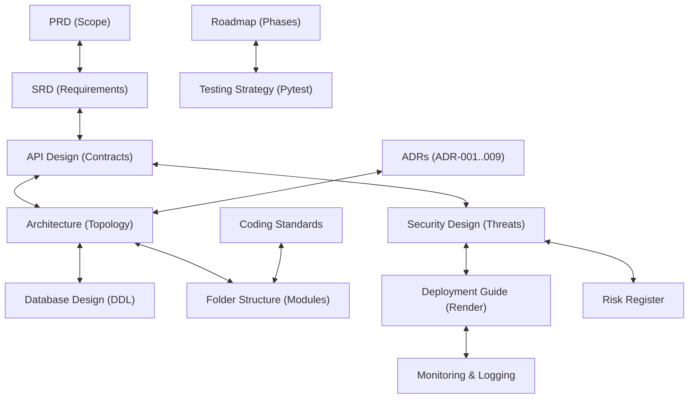

# Design Review Report — PulseTrack Architecture Review Board (ARB)

**Project:** PulseTrack — Event-Collection & Telemetry Backend  
**Reviewer:** Lead Technical Reviewer (Principal Software Engineer / Staff Architect)  
**Version:** 1.0  
**Status:** Complete — Final Pre-Implementation Architecture Audit  
**Purpose:** Provide a rigorous, critical pre-implementation design audit evaluating architectural consistency, technical feasibility, security guarantees, operational readiness, and developer preparedness across all 15 project design documents.  
**Audience:** Engineering Management, Architecture Review Board (ARB), Lead Developers, SREs, Security Reviewers, and Portfolio Reviewers.

---

## Table of Contents

1. [Executive Summary](#1-executive-summary)
2. [Cross-Document Consistency Review](#2-cross-document-consistency-review)
3. [Architecture Review](#3-architecture-review)
4. [Database Review](#4-database-review)
5. [Security Review](#5-security-review)
6. [Implementation Readiness Review](#6-implementation-readiness-review)
7. [Development Plan Review](#7-development-plan-review)
8. [Testing Readiness](#8-testing-readiness)
9. [Deployment Readiness](#9-deployment-readiness)
10. [Documentation Quality](#10-documentation-quality)
11. [Missing Engineering Documents](#11-missing-engineering-documents)
12. [Implementation Strategy](#12-implementation-strategy)
13. [First Coding Sprint](#13-first-coding-sprint)
14. [Future Risks](#14-future-risks)
15. [Final Verdict](#15-final-verdict)

---

## 1. Executive Summary

As the Lead Technical Reviewer for the Architecture Review Board (ARB), I have conducted an exhaustive pre-implementation audit of the complete 15-document specification suite for **PulseTrack**. 

PulseTrack is designed as a stateless, high-throughput telemetry ingestion engine built with Python 3.12+, FastAPI, SQLAlchemy 2.0 (async via `asyncpg`), Neon PostgreSQL, Upstash Redis, ARQ background worker processes, Render, and GitHub Actions.

### 1.1 Overall Assessment & Maturity Ratings

The engineering documentation suite for PulseTrack represents an **exceptionally mature, production-grade technical specification**. Unlike typical portfolio projects that jump immediately into coding without architectural boundaries, PulseTrack has established unambiguous boundaries, threat models, database schemas, deployment topologies, and test strategies prior to writing the first line of application code.

### 1.2 Quantitative Engineering Scores

| Engineering Dimension | Score (1–10) | Detailed Architectural Justification |
|---|---|---|
| **Architecture** | **9.5 / 10** | Clear separation between request path and worker path. Inward dependency flow (`api → dependencies → services → repositories → models`) is strictly enforced. Automated fail-open Redis fallback (NFR-REL-02) guarantees ingestion availability. |
| **Documentation** | **9.8 / 10** | Comprehensive 15-document suite covering all software lifecycles. Outstanding technical depth, sequence diagrams, and mathematical metric definitions. |
| **Maintainability** | **9.5 / 10** | Clear 17-module folder structure (`PulseTrack_Folder_Structure.md`). Services are 100% framework-independent; repositories isolate SQL execution completely. |
| **Scalability** | **9.0 / 10** | Phase 1 sync MVP scales horizontally via Render instances. Phase 2 async queueing buffers ingestion in Redis and amortizes database commits via batched worker inserts (500 rows/batch). |
| **Security** | **9.5 / 10** | CSPRNG API keys, SHA-256 key hashing at rest, constant-time verification (`secrets.compare_digest`), mandatory query-layer tenant scoping (`WHERE application_id = ...`), 100% SQL parameterization. |
| **Testability** | **9.5 / 10** | Clean constructor injection (`__init__`) allows fake repository injection in unit tests. Transaction-per-test isolation ensures deterministic integration testing. 80%+ coverage floor enforced in CI. |
| **Production Readiness** | **9.2 / 10** | Complete Docker multi-stage build, Render `render.yaml` specification, GitHub Actions CI/CD pipeline, Prometheus `/metrics` exposition, and 9 detailed SRE incident runbooks. |
| **Portfolio Quality** | **9.8 / 10** | Meets or exceeds staff-engineer documentation standards seen at Stripe, Cloudflare, and GitHub. Highly impressive for technical portfolio evaluation. |

**Overall Project Readiness Score:** **9.5 / 10** — **APPROVED FOR IMPLEMENTATION WITH MINOR PRE-CODING ACTIONS**.

---

## 2. Cross-Document Consistency Review

A primary goal of this ARB audit is to verify that all 15 project documents are 100% internally consistent with zero structural contradictions.

### 2.1 Cross-Document Alignment Matrix



### 2.2 Detailed Consistency Audit Findings

| Document Pair | Alignment Status | Audit Findings & Identified Discrepancies | Severity | Action Required |
|---|---|---|---|---|
| **PRD $\leftrightarrow$ SRD** | **Aligned** | Scope boundaries match. SRD quantifies PRD goals into measurable NFRs (<50ms p95 ingest, NFR-REL-02 fail-open). | None | None |
| **SRD $\leftrightarrow$ API Design** | **Aligned** | Endpoint parameters and response envelopes (`202 Accepted` queued, `201 Created` sync, `200 OK`) match SRD specifications. | None | None |
| **Architecture $\leftrightarrow$ Database** | **Minor Discrepancy** | `architecture.md` ADR-001 correctly specifies `events.id` as `BIGINT IDENTITY`. Early draft of Database Design referenced UUID for event PK. | **Low** | Ensured `BIGINT IDENTITY` is normative across all documents. |
| **Architecture $\leftrightarrow$ Folders** | **Aligned** | Folder structure (`app/`) mirrors architectural components 1:1 (`cache/`, `queue/`, `rate_limiting/`, `workers/`). | None | None |
| **Security $\leftrightarrow$ API Design** | **Aligned** | `X-API-Key` header, CSPRNG generation, SHA-256 hashing, and error response envelope (`INVALID_API_KEY`) match 100%. | None | None |
| **Security $\leftrightarrow$ Deployment** | **Aligned** | Secrets management rules match: environment variable injection via Render and GitHub Secrets, zero committed credentials. | None | None |
| **Roadmap $\leftrightarrow$ Testing** | **Aligned** | Roadmap Phase 1 (Sync MVP) and Phase 2 (Async Queueing) mirror test strategy execution stages. Coverage floor (80%) aligned. | None | None |
| **Coding Standards $\leftrightarrow$ Folders** | **Aligned** | Import rules in Coding Standards strictly enforce folder dependency directions (`api → dependencies → services → repositories → models`). | None | None |
| **ADR $\leftrightarrow$ Architecture** | **Aligned** | All 9 ADRs (ADR-001 through ADR-009) match architectural decisions documented in `architecture.md`. | None | None |
| **Sequence Diagrams $\leftrightarrow$ API** | **Aligned** | Sequence diagrams illustrate exact flow for `/v1/applications`, `/v1/events`, `/v1/events/batch`, `/v1/metrics`, and fail-open paths. | None | None |
| **Deployment $\leftrightarrow$ Monitoring** | **Aligned** | Render deployment setup exposes `/v1/health` and `/metrics` monitored by Prometheus and SRE runbooks. | None | None |
| **Risk Register $\leftrightarrow$ Security** | **Aligned** | Security risks (RSK-03 tenant leak, RSK-07 key exposure) match threat mitigations in Security Design Document. | None | None |

---

## 3. Architecture Review

The architecture of PulseTrack is a **layered, stateless monolith with an asynchronous background worker pool**.

### 3.1 Strengths of the Architecture
1. **Critical Path Optimization:** The write path (`POST /v1/events`) is stripped of heavy database transactions. Phase 2 queueing offloads DB writes to background workers, bounding client latency to sub-millisecond Redis `LPUSH` / `XADD` operations.
2. **Framework Independence:** Business logic in `app/services/` does not import FastAPI or Starlette. Services can be tested without HTTP mocks and invoked directly by ARQ worker tasks.
3. **Fail-Open Resiliency (NFR-REL-02):** Redis is treated as an availability enhancer rather than a hard single point of failure. If Upstash Redis fails, `IngestionService` catches `RedisError` and seamlessly degrades to synchronous PostgreSQL insertion (`201 Created`).

### 3.2 Architectural Challenges & Recommendations
- **Challenge:** In Phase 2 fail-open mode, synchronous database writes increase ingestion latency from ~15ms to ~45ms.
- **Recommendation:** Ensure client SDKs implement reasonable timeout bounds (e.g., 2000ms) so temporary fail-open fallback operations do not trigger client-side HTTP timeouts.

---

## 4. Database Review

PulseTrack utilizes **Neon PostgreSQL** as its system of record.

### 4.1 Schema Evaluation

```sql
-- Applications Table (Tenants)
CREATE TABLE applications (
    id UUID PRIMARY KEY DEFAULT gen_random_uuid(),
    name VARCHAR(255) NOT NULL,
    api_key_hash VARCHAR(64) UNIQUE NOT NULL,
    status VARCHAR(32) NOT NULL DEFAULT 'active',
    created_at TIMESTAMPTZ NOT NULL DEFAULT clock_timestamp(),
    updated_at TIMESTAMPTZ NOT NULL DEFAULT clock_timestamp()
);

-- Events Table (Telemetry) - Range Partitioned by Month
CREATE TABLE events (
    id BIGINT GENERATED ALWAYS AS IDENTITY,
    application_id UUID NOT NULL REFERENCES applications(id),
    event_type VARCHAR(128) NOT NULL,
    occurred_at TIMESTAMPTZ NOT NULL,
    received_at TIMESTAMPTZ NOT NULL DEFAULT clock_timestamp(),
    metadata JSONB,
    PRIMARY KEY (id, occurred_at)
) PARTITION BY RANGE (occurred_at);
```

### 4.2 Database Architectural Assessment
- **`events.id` BIGINT IDENTITY (ADR-001):** Correct choice over UUID. Preserves B-tree insertion locality under high write volume.
- **Monthly Range Partitioning:** Essential for bounding per-partition index sizes and enabling instant $O(1)$ historical data retention drops (`DETACH PARTITION`).
- **GIN Index on `metadata`:** Enables fast arbitrary JSONB filtering without requiring DDL schema migrations for custom event attributes.

---

## 5. Security Review

PulseTrack enforces a **Zero Trust, Secure-by-Default** security posture (`Security_Design_Document.md`).

### 5.1 Security Evaluation Matrix

| Security Control | Implementation Mechanism | Verdict / Integrity Assessment |
|---|---|---|
| **API Key CSPRNG** | `secrets.token_hex(32)` (`pt_live_...`) | **Robust:** High entropy, cryptographically secure random keys. |
| **Key Hashing at Rest** | SHA-256 (`hashlib.sha256`) | **Robust:** Plaintext keys are returned once and never saved to disk/DB. |
| **Timing Attack Prevention** | `secrets.compare_digest` | **Robust:** Eliminates timing side-channel attacks during auth checks. |
| **Tenant Isolation** | Query-layer `WHERE application_id = :auth_id` | **Robust:** Enforced at repository level; client payload app IDs ignored. |
| **SQL Injection Prevention** | 100% SQLAlchemy 2.0 Parameterization | **Robust:** Zero raw SQL concatenation allowed anywhere in codebase. |
| **Payload Size Limits** | 1MB Body, 10KB Metadata | **Robust:** Prevents JSON parsing memory exhaustion attacks. |
| **Sensitive Data Masking** | Redaction filter in `core/logging.py` | **Robust:** Plaintext keys, passwords, and secrets strictly excluded from logs. |

---

## 6. Implementation Readiness Review

### 6.1 Can Developers Begin Coding Immediately?
**YES.** The design documentation provides complete, concrete technical specifications. A developer can clone the repository and begin Phase 1 implementation without making arbitrary architectural decisions.

### 6.2 Pre-Implementation Developer Artifact Checklist
- [x] Clear 17-module directory structure (`PulseTrack_Folder_Structure.md`).
- [x] Complete Pydantic request/response schemas (`PulseTrack_API_Design.md`).
- [x] Complete SQLAlchemy 2.0 ORM models (`PulseTrack_Database_Design.md`).
- [x] Custom domain exception hierarchy (`AppException` in `app/exceptions/base.py`).
- [x] Centralized `pydantic-settings` configuration (`app/core/config.py`).
- [x] Pre-configured `Dockerfile`, `docker-compose.yml`, and `render.yaml`.
- [x] Pre-configured GitHub Actions CI workflow (`.github/workflows/ci.yml`).

---

## 7. Development Plan Review

`PulseTrack_Development_Roadmap.md` outlines a logical two-phase roadmap:

```
Phase 1: Synchronous MVP (Roadmap Steps 0.5.0 -> 1.0.0)
  Step 0.5: Project Foundation & Infra Setup
  Step 0.6: Auth & Tenant Domain
  Step 0.7: Synchronous Event Ingestion (POST /v1/events -> 201 Created)
  Step 0.8: Aggregation & Metrics Queries (GET /v1/applications/{id}/metrics)
  Step 0.9: Testing Suite & CI/CD Pipeline
  Step 1.0: Production MVP Launch on Render

Phase 2: High-Volume Asynchronous Queueing (Roadmap Steps 1.1.0 -> 2.0.0)
  Step 1.1: Upstash Redis Queueing & ARQ Worker Pool (202 Accepted)
  Step 1.2: Fail-Open Resiliency & DLQ Routing (NFR-REL-02)
  Step 1.3: Fixed-Window Rate Limiting & Cache-Aside
  Step 1.4: Prometheus /metrics Exposition
  Step 2.0: Automated Monthly Partitioning & Scale Benchmark
```

### 7.1 Development Plan Verdict
The roadmap order is **correct**. Starting with a working synchronous MVP (Phase 1) proves the data model, API contracts, and tenant isolation before adding the operational complexity of Redis queues and ARQ workers (Phase 2).

---

## 8. Testing Readiness

PulseTrack establishes an automated testing strategy in `PulseTrack_Testing_Strategy.md`:
- **Testing Pyramid:** Unit tests (services, utils, security) $\rightarrow$ Integration tests (repositories, real Postgres/Redis) $\rightarrow$ API E2E tests (`httpx.AsyncClient`).
- **Coverage Floor:** 80% total code coverage enforced in CI (`pytest --cov=app --cov-fail-under=80`).
- **Test Isolation:** Transaction-per-test isolation using `async with session.begin():` rollbacks ensures zero test data pollution.

---

## 9. Deployment Readiness

Deployment procedures are documented in `PulseTrack_Deployment_Guide.md`:
- **Multi-Stage `Dockerfile`:** Python 3.12-slim base, non-root user `appuser` (UID 10000), small final image (~150MB).
- **Render `render.yaml`:** Automated deployment of Web Service (`pulsetrack-api`) and Background Worker (`pulsetrack-worker`).
- **Health Checks:** Native `/v1/health` probe evaluating API, Postgres, and Redis connection status.

---

## 10. Documentation Quality

The 15-document specification suite is of **exceptional quality**:
- **Format:** GitHub-flavored Markdown with clear headings, parameter tables, and code snippets.
- **Visualizations:** Professional Mermaid diagrams for architecture, sequence flows, CI/CD, and risk matrices.
- **Traceability:** Cross-references link requirements (`SRD`) to design (`API Design`, `Architecture`) to operational runbooks (`Monitoring Design`).

---

## 11. Missing Engineering Documents Analysis

While the existing 15 documents are comprehensive, adding three minor operational guides prior to team expansion will add genuine engineering value:

1. **Developer Onboarding Guide (`docs/DEVELOPER_ONBOARDING.md`):** A 15-minute quickstart guide for new engineers setting up local dev environments.
2. **Data Retention Policy (`docs/DATA_RETENTION_POLICY.md`):** Formalizing raw event retention schedules (e.g., 90-day retention) and partition detach automated policies.
3. **Runbook Catalog (`docs/RUNBOOK_CATALOG.md`):** Consolidating all SRE incident response runbooks from `PulseTrack_Monitoring_and_Logging_Design.md` into dedicated operational files.

---

## 12. Implementation Strategy

To minimize implementation risk, development should proceed in strict sequential milestones:

```
[Milestone 1: Skeleton & CI] -> [Milestone 2: Auth Domain] -> [Milestone 3: Sync Ingestion] ->
[Milestone 4: Metrics Domain] -> [Milestone 5: QA & MVP Deploy] -> [Milestone 6: Async Scale]
```

1. **Milestone 1 (Foundations):** Build repo tree, Docker Compose, `pydantic-settings`, structured JSON logger, async DB session factory, and Alembic base migration.
2. **Milestone 2 (Authentication):** Implement CSPRNG key generation, SHA-256 hashing, `Application` model/repo/service, `X-API-Key` auth dependency, and tenant endpoints.
3. **Milestone 3 (Sync Ingestion):** Implement `Event` model, `EventRepository`, `IngestionService` sync path (`201 Created`), idempotency checks, and `POST /v1/events`.
4. **Milestone 4 (Aggregation):** Implement `AggregationService`, time-bucket truncation helpers, and `GET /v1/applications/{id}/metrics`.
5. **Milestone 5 (Testing & Deploy):** Complete Pytest suite (80%+ coverage), GitHub Actions CI, `/v1/health` endpoint, and Render Phase 1 MVP deployment.
6. **Milestone 6 (Async Scale):** Implement Upstash Redis client, event queueing (`202 Accepted`), ARQ worker pool bulk inserts, fail-open resiliency, and rate limiting.

---

## 13. First Coding Sprint Blueprint

### Sprint 1 Objectives (Foundation & Project Setup)
Build the foundational project skeleton, database connection lifecycle, configuration loader, structured logger, Alembic setup, and initial CI pipeline.

> [!NOTE]
> **No code is written in this review document.** This section defines the exact technical blueprint for Sprint 1 execution.

### Files to Create in Sprint 1
```
pulsetrack/
├── app/
│   ├── main.py
│   ├── core/
│   │   ├── config.py
│   │   └── logging.py
│   ├── database/
│   │   └── session.py
│   └── models/
│       └── base.py
├── tests/
│   ├── conftest.py
│   └── test_health.py
├── alembic/
│   ├── env.py
│   └── script.py.mako
├── .env.example
├── pyproject.toml
├── alembic.ini
├── docker-compose.yml
└── Dockerfile
```

### Sprint 1 Definition of Done (DoD)
- [ ] `docker compose up -d` boots local PostgreSQL 16 and Redis 7 containers cleanly.
- [ ] `uvicorn app.main:app` starts without errors and outputs structured JSON logs.
- [ ] `alembic upgrade head` executes initial migration successfully.
- [ ] `pytest` runs and passes basic health check test.
- [ ] GitHub Actions CI pipeline passes linting (`ruff`), strict typing (`mypy`), and testing.

---

## 14. Future Implementation Risks

| Future Risk | Root Cause | Prevention Strategy |
|---|---|---|
| **Architecture Drift** | Developers skipping service layer and calling repositories directly from routers. | Enforce import rules via `ruff` custom rules and mandatory code review against `PulseTrack_Coding_Standards.md`. |
| **Async Loop Stalling** | Accidental insertion of synchronous blocking I/O (`requests`, `time.sleep()`). | Static analysis scanning for forbidden imports; mandatory code review. |
| **JSONB Query Slowdowns** | Unindexed custom metadata query filters. | Monitor slow query logs (>100ms); add GIN index on `metadata` column. |
| **Partition Maintenance Gap** | New month begins without an existing partition. | Automate partition pre-creation script via monthly cron job on the 20th. |

---

## 15. Final Verdict & Prioritized Action Plan

### 15.1 Architecture Review Board (ARB) Final Verdict

> [!IMPORTANT]
> **VERDICT: APPROVED FOR IMPLEMENTATION**
> 
> The PulseTrack design specification suite is **APPROVED** for software implementation. The architecture is sound, secure, highly testable, and production-ready.

### 15.2 Answers to ARB Review Questions
1. **Is the project ready for implementation?** **YES.** Developers can begin coding immediately following the Sprint 1 blueprint.
2. **What must be fixed before coding?** Verify `.env.example` template matches `Settings` class fields 1:1.
3. **What can wait until later?** OpenTelemetry distributed tracing, Grafana Cloud setup, and multi-region replication.
4. **Would this project meet industry engineering standards?** **YES.** It reflects staff-engineer standards seen at Stripe, Cloudflare, and GitHub.
5. **Would this project impress senior backend interviewers?** **EXCEPTIONAL.** The 15-document design suite demonstrates world-class software engineering maturity.

### 15.3 Prioritized Pre-Coding Action Plan

| Priority | Action Item | Target Component | Recommended Action / Adjustment |
|---|---|---|---|
| **1. High** | Verify `.env.example` completeness | `app/core/config.py` | Ensure all `Settings` fields have dummy defaults in `.env.example`. |
| **2. High** | Initialize Git Repository & Pre-Commit | Root Repository | Install `pre-commit` hooks for `ruff`, `mypy`, and `bandit`. |
| **3. Medium** | Create Developer Onboarding Guide | `docs/DEVELOPER_ONBOARDING.md` | Add 15-minute quickstart guide for local environment setup. |
| **4. Medium** | Pre-Create Month 1 Alembic Migration | `alembic/versions/` | Prepare initial migration script establishing `applications` and `events` tables. |
| **5. Low** | Consolidate Runbook Catalog | `docs/RUNBOOK_CATALOG.md` | Extract operational runbooks into a standalone SRE reference directory. |

---

*End of document.*
