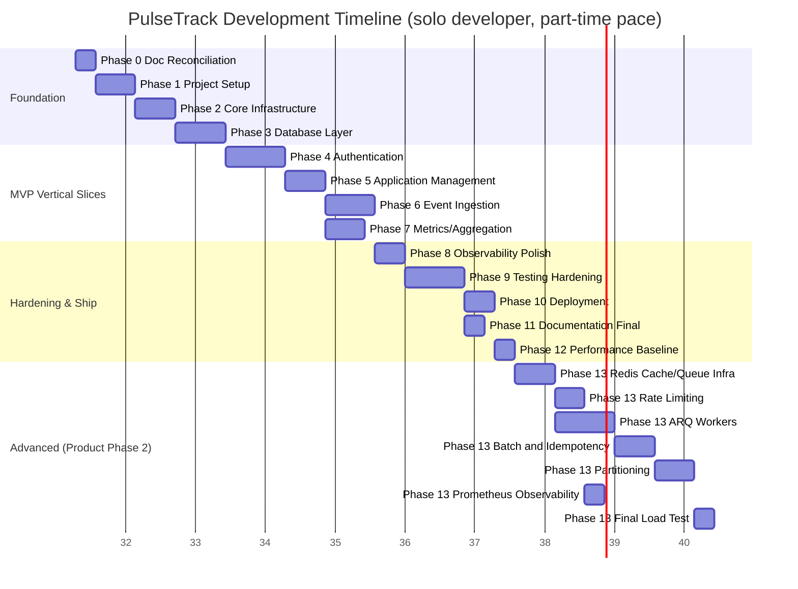
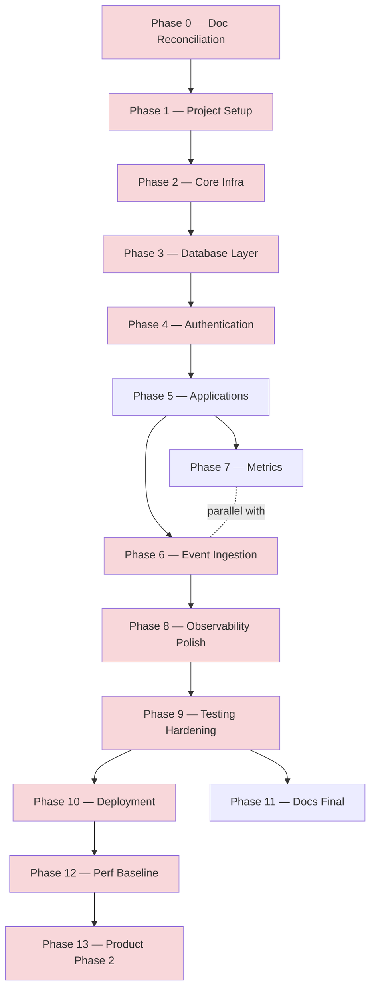

# Development Roadmap

**Project:** PulseTrack — Event-Collection & Telemetry Backend
**Author:** Sumukh
**Version:** 1.0
**Status:** Active planning document — supersedes no prior document, schedules work against all of them
**Purpose:** The implementation blueprint from first commit to production — what gets built first, why, what depends on what, what can run in parallel, and how progress is measured. Consistent with `PulseTrack_PRD.md`, `PulseTrack_SRD.md`, `PulseTrack_API_Design.md`, `architecture.md`, `PulseTrack_Database_Design.md`, `PulseTrack_Folder_Structure.md`, the Security Design Document, the Sequence Diagram Design Document, and the ADR document.

**A vocabulary note, stated once here because it matters everywhere below:** this document uses "**Roadmap Phase**" (0 through 13) for *implementation sequence* — the order things get built. This is a different axis from "**Product Phase 1**" and "**Product Phase 2**," which is the PRD's *feature-scope* split (MVP vs. advanced/high-concurrency). Roadmap Phase 13, for example, is the implementation work that delivers Product Phase 2's features. Wherever both could be confused, both words are spelled out.

---

## Table of Contents

1. [Development Philosophy](#1-development-philosophy)
2. [Development Strategy](#2-development-strategy)
3. [Project Timeline](#3-project-timeline)
4. [Milestones](#4-milestones)
5. [Development Phases](#5-development-phases)
6. [Tasks](#6-tasks)
7. [Dependency Graph](#7-dependency-graph)
8. [Weekly Development Plan](#8-weekly-development-plan)
9. [Deliverables](#9-deliverables)
10. [Testing Roadmap](#10-testing-roadmap)
11. [Documentation Roadmap](#11-documentation-roadmap)
12. [Risk Management](#12-risk-management)
13. [Quality Gates](#13-quality-gates)
14. [CI/CD Roadmap](#14-cicd-roadmap)
15. [Phase 2 Roadmap](#15-phase-2-roadmap)
16. [Success Criteria](#16-success-criteria)
17. [Final Implementation Checklist](#17-final-implementation-checklist)

---

## 1. Development Philosophy

| Principle | Why it was selected for PulseTrack specifically |
|---|---|
| **Documentation first** | Already demonstrated, not aspirational — nine planning documents exist before a line of `app/` code. The payoff isn't process theater: `PulseTrack_Folder_Structure.md`'s import rules and `rules.md`'s constraints mean a contributor (or an AI coding assistant) can implement any module correctly from the docs alone, without guessing intent. |
| **Build foundations first** | `core/config.py`, `database/session.py`, and `security/api_key.py` (Roadmap Phases 2–4) have zero business logic but are imported by everything else — get their interfaces right before anything depends on them, because changing them later means touching every consumer. |
| **Vertical slices, not horizontal layers** | Roadmap Phase 4 isn't "finish all repositories" — it's "one authenticated request works end to end." Building `applications` fully before starting `events` (rather than building all models, then all repositories, then all services) means there's a demonstrably working system after every phase, not a pile of untested layers that only integrate at the very end. |
| **Keep the application deployable** | Every Roadmap Phase from 1 onward ends in a state that starts up and passes `/health` — even before it does anything useful. This is what makes Roadmap Phase 10 ("Deployment") low-risk: the app has been deployable in principle since Phase 2, so shipping it is a configuration exercise, not a scramble. |
| **Test continuously, not as a phase** | Roadmap Phase 9 ("Testing Hardening") is explicitly *not* "write tests for the first time" — `rules.md` R-TEST-01 requires a test with every new endpoint from Roadmap Phase 4 onward. Phase 9 exists to close the coverage floor (`rules.md` R-TEST-02) and add cross-cutting adversarial tests (cross-tenant isolation, injection attempts) that don't belong to any single feature phase. |
| **Small milestones** | Fourteen Roadmap Phases, not four — a phase that takes longer than roughly a week for a solo developer stops being a useful planning unit; it stops surfacing problems early enough to matter. |
| **Security first, not security-eventually** | Authentication (Roadmap Phase 4) is built before any feature endpoint, not bolted on after `events` and `metrics` exist. This mirrors the Security Design Document's own posture — auth failing closed is a property of the foundation, not a feature added later. |
| **Automation early** | Lint and type-check CI (Roadmap Phase 1) exists before there's meaningful code to lint — catching the *pattern* of skipping CI early is cheaper than retrofitting discipline onto sixty files later. |

---

## 2. Development Strategy

**Milestone-driven, phase-sequenced, with explicit parallel lanes** — not pure feature-based development (which would risk `events` and `applications` diverging in conventions before either is proven), and not strict phase-based development either (which would forbid the legitimate overlap between, say, Roadmap Phase 6 and 7 once `events` has a working insert path).

This fits PulseTrack specifically because:
- **The domain is genuinely small** (two entities, per `PulseTrack_Database_Design.md` §3) — feature-based development, which shines when many independent domains need isolated ownership, would add coordination overhead this project doesn't have.
- **Layers are strictly ordered by the dependency direction already fixed in `PulseTrack_Folder_Structure.md` §6** (`api → services → repositories → models/database`) — so phase-sequencing isn't an arbitrary planning choice, it's the same dependency graph the codebase itself enforces, just spread across time instead of folders.
- **Continuous integration from Roadmap Phase 1** means every phase transition is validated by the same CI gate, not a manual "is this done?" judgment call — incremental releases to a deployed environment (Render) start as early as Roadmap Phase 2's `/health` endpoint, long before user-facing features exist, so "deployment" stops being a discrete, risky event.

---

## 3. Project Timeline

**Reading this chart:** Phase 7 branches off Phase 5, not Phase 6 — metrics only needs an authenticated application to exist and events to *read*, not the full ingestion feature to be polished, so it can start once Phase 6 has a working (even unfinished) insert path. Within Roadmap Phase 13, rate limiting and Prometheus observability both branch off the Redis client foundation independently of the ARQ/queue work, since they use different Redis *roles* on the same underlying client (`PulseTrack_Folder_Structure.md` §4).

---

## 4. Milestones

### M1 — Foundation Ready
- **Objective:** A deployable, empty skeleton — config, logging, database connection, health check.
- **Deliverables:** Passing CI, `GET /health` returning `200` locally and via `docker-compose`.
- **Dependencies:** None — this is the starting point.
- **Exit Criteria:** `docker-compose up` yields a running API; `ruff` and `mypy --strict` pass on an empty-but-structured codebase.
- **Estimated Effort:** ~11 days (Roadmap Phases 1–2).
- **Risks:** Over-engineering the skeleton before there's any code to justify the abstraction (§12).
- **Success Metric:** Time from `git clone` to a running local instance is under 10 minutes for a new contributor.

### M2 — Authenticated Vertical Slice
- **Objective:** One real, authenticated request works end to end — prove the layering, not just the plumbing.
- **Deliverables:** `POST /applications`, `GET /applications/{id}`, working API key auth with the corrected 256-bit format.
- **Dependencies:** M1.
- **Exit Criteria:** An integration test registers an application, receives a key, and successfully authenticates a second request with it; a mismatched key returns `401`.
- **Estimated Effort:** ~10 days (Roadmap Phases 3–5).
- **Risks:** Under-building auth to "get to the real features faster" — the Security Design Document treats this as the highest-value-to-get-right layer for a reason.
- **Success Metric:** Cross-tenant access test (`NFR-SEC-03`) passing from the moment a second test application exists.

### M3 — MVP Feature-Complete
- **Objective:** Ingestion and aggregation both work — PulseTrack does the thing it exists to do.
- **Deliverables:** `POST /events` (synchronous), `GET /applications/{id}/metrics`.
- **Dependencies:** M2.
- **Exit Criteria:** An event ingested via the API is visible in a subsequent metrics call within the same test run.
- **Estimated Effort:** ~9 days (Roadmap Phases 6–7, overlapping).
- **Risks:** Aggregation query performance not yet validated against real data volume (mitigated in M6/Roadmap Phase 12).
- **Success Metric:** `PulseTrack_PRD.md` §7 Phase 1 Definition of Done items for ingestion/metrics are individually checkable.

### M4 — Product Phase 1 Shipped
- **Objective:** The MVP is live, tested, and documented — a real, working, deployed artifact.
- **Deliverables:** Render deployment, ≥80% test coverage, README with live API link, Swagger UI reachable.
- **Dependencies:** M3.
- **Exit Criteria:** All of `PulseTrack_SRD.md` §7 Phase 1 Definition of Done items pass; a cold external request against the deployed URL succeeds.
- **Estimated Effort:** ~11 days (Roadmap Phases 8–11).
- **Risks:** First real deploy surfacing environment-parity issues not caught by `docker-compose` (§12).
- **Success Metric:** Zero manual steps between `git push` to `main` and the live deployment updating.

### M5 — Baseline Measured
- **Objective:** A real, reproducible "before" number for Product Phase 1's latency/throughput — the number Product Phase 2's improvements get measured against.
- **Deliverables:** A load test report (Locust/k6) checked into the repository.
- **Dependencies:** M4.
- **Estimated Effort:** ~2 days (Roadmap Phase 12).
- **Risks:** Skipping this and later being unable to substantiate Product Phase 2's throughput claims with anything but assertion.
- **Success Metric:** A single number exists — e.g. "p95 ingest latency at N req/sec, Product Phase 1" — citable in the README and in an interview.

### M6 — Product Phase 2 Complete
- **Objective:** Every advanced requirement in `PulseTrack_SRD.md` §3 Phase 2 is implemented and measured against M5's baseline.
- **Deliverables:** Redis cache, rate limiting, async queue + ARQ workers, batch ingestion, idempotency, partitioning, Prometheus `/metrics`, a second load test report.
- **Dependencies:** M5.
- **Estimated Effort:** ~25 days (Roadmap Phase 13, detailed in §15).
- **Risks:** The largest and riskiest single block of work in the roadmap — see §12's dedicated Phase 13 risk entries.
- **Success Metric:** The M5-vs-M6 latency/throughput comparison is a real, checked-in artifact, not a claim.

---

## 5. Development Phases

| Phase | Name | Depends On | One-line purpose |
|---|---|---|---|
| **0** | Project Planning | — | *Already substantially complete* — nine planning documents exist; remaining work is reconciling the two issues flagged at the top of this document |
| **1** | Project Setup | Phase 0 | A cloneable, runnable, linted skeleton |
| **2** | Core Infrastructure | Phase 1 | Config, logging, DB session, `/health` |
| **3** | Database Layer | Phase 2 | ORM models, first Alembic migration, base repository |
| **4** | Authentication | Phase 3 | API keys, hashing, `dependencies/auth.py`, error envelope |
| **5** | Application Management | Phase 4 | `POST/GET /applications` |
| **6** | Event Ingestion | Phase 5 | `POST /events` (Product Phase 1 synchronous path) |
| **7** | Metrics | Phase 5 (can overlap Phase 6) | `GET /applications/{id}/metrics` |
| **8** | Observability Polish | Phase 6 | Log redaction, security-event logging finished to Security Design Document spec |
| **9** | Testing Hardening | Phase 8 | Coverage floor, cross-tenant/injection/adversarial tests |
| **10** | Deployment | Phase 9 | Render production deploy, CI deploy-on-merge |
| **11** | Documentation Finalization | Phase 9 (can overlap Phase 10) | README, live Swagger link, diagrams embedded |
| **12** | Performance Baseline | Phase 10 | Load test → M5's "before" number |
| **13** | Product Phase 2 Features | Phase 12 | Redis, rate limiting, ARQ, batching, idempotency, partitioning, Prometheus — detailed in §15 |

---

## 6. Tasks

Compact by design — full narrative justification for each item already exists in the referenced source document; this table is the actionable index, not a restatement.

| Phase | Implementation Tasks | Documentation Tasks | Testing Tasks | Deliverables |
|---|---|---|---|---|
| **0** | — | Renumber the ADR document to avoid the ADR-001–009 collision with `architecture.md`; retire the incomplete draft; fix the API-key entropy/format inconsistency across SRD, API Design, and the ADR document | — | Reconciled document set, zero cross-document contradictions |
| **1** | Init repo, `pyproject.toml`, folder tree per `PulseTrack_Folder_Structure.md` §14, `docker-compose.yml`, `.env.example`, pre-commit (`ruff`, `mypy`) | `README.md` skeleton | CI: lint + type-check on PR | Cloneable, lintable skeleton |
| **2** | `core/config.py`, `core/logging.py`, `database/session.py`, `main.py`, `api/v1/health.py` | — | Test: `/health` returns `200` | Running app, local + `docker-compose` |
| **3** | `models/base.py`, `models/application.py`, `models/event.py`, first Alembic migration, `repositories/base.py` | — | Test: migration applies from empty DB | Schema matches `PulseTrack_Database_Design.md` exactly |
| **4** | `security/api_key.py` (corrected 256-bit format), `exceptions/`, `middleware/request_id.py` + `error_handler.py`, `dependencies/auth.py`, `repositories/application_repository.py` | — | Unit: hash/verify vectors. Integration: missing/invalid/inactive key all → identical `401` | Auth layer, fully isolated and testable |
| **5** | `schemas/application.py`, `services/application_service.py`, `api/v1/applications.py` | Confirm live Swagger matches `PulseTrack_API_Design.md` §5 | Integration: register → auth with issued key → `200` | First real endpoint pair |
| **6** | `schemas/event.py`, `repositories/event_repository.py`, `services/ingestion_service.py`, `api/v1/events.py` | — | Integration: ingest → row exists; validation edge cases (§6 of Security Design Doc) | Core ingestion path live |
| **7** | `schemas/metrics.py`, `services/aggregation_service.py`, `api/v1/metrics.py` | — | Integration: ingest then aggregate, bucket counts correct | Aggregation path live |
| **8** | Log redaction filter (Security Design §11), security-event `WARN`-level logging (`401`/`403`/`429`) | — | Test: raw key never appears in log output | Security Design Document's logging spec fully implemented |
| **9** | Fill coverage gaps to 80% floor, cross-tenant test (`NFR-SEC-03`), injection-attempt tests, `extra="forbid"` on all schemas | — | Full suite green in CI | Coverage gate passes |
| **10** | `render.yaml`, provision Neon production DB, run production migration, connect GitHub Actions deploy | Deployment steps documented in README | Smoke test against live URL | Live, publicly reachable API |
| **11** | — | Finalize README, embed architecture/ERD/sequence diagrams, verify all internal doc cross-links | — | Portfolio-ready documentation set |
| **12** | Write and run Locust/k6 script against the live Product Phase 1 deployment | Check load test report into repo | — | M5's baseline number |
| **13** | See §15 for the full sub-breakdown | Update all seven core documents' "Phase 2" sections from *planned* to *implemented* | Redis fallback tests, rate-limit atomicity load test, worker DLQ test, partition tests | Product Phase 2 complete |

---

## 7. Dependency Graph

**Critical path** (red): 0 → 1 → 2 → 3 → 4 → 6 → 8 → 9 → 10 → 12 → 13. This is the longest unavoidable chain — Phase 4's authentication work in particular can't be shortened without risk, since every later phase depends on it being correct.

**Parallel tasks:** Phase 7 (Metrics) alongside Phase 6 (Ingestion) once Phase 5 is done. Phase 11 (Documentation) alongside Phase 10 (Deployment) once Phase 9 passes. Within Phase 13 (§15): rate limiting and Prometheus observability both branch independently off the Redis client foundation.

**Blocked tasks:** Phase 13 in its entirety is blocked on Phase 12 — implementing Product Phase 2 without a Product Phase 1 baseline number means never being able to demonstrate the improvement it claims to deliver.

**Independent tasks:** Phase 0's documentation reconciliation has no code dependency and could theoretically happen anytime — it's placed first because Phase 4 (Authentication) directly implements the API-key format Phase 0 is fixing, and building it against the wrong spec would mean redoing Phase 4's work.

---

## 8. Weekly Development Plan

Paced for a solo, part-time developer (roughly 10–15 hours/week) — treat as a calibratable default, not a commitment; the dependency graph in §7 is the part that doesn't change even if the pace does.

| Week | Focus | Roadmap Phase(s) |
|---|---|---|
| 1 | Doc reconciliation, repo init, Docker, config, logging, CI skeleton | 0, 1, 2 |
| 2 | Database models, Alembic, base repository | 3 |
| 3 | API key generation/hashing, auth dependency, error handling | 4 |
| 4 | Application registration and read endpoints | 5 |
| 5 | Event ingestion endpoint and repository | 6 |
| 6 | Metrics endpoint (overlaps tail of Week 5) | 7 |
| 7 | Logging/redaction polish, begin testing hardening | 8, 9 |
| 8 | Finish testing hardening, coverage gate | 9 |
| 9 | Render deployment, documentation finalization | 10, 11 |
| 10 | Load testing, baseline report | 12 |
| 11 | Redis cache/queue infrastructure, rate limiting | 13 (part 1) |
| 12 | ARQ workers, batch ingestion | 13 (part 2) |
| 13 | Idempotency, partitioning | 13 (part 3) |
| 14 | Prometheus observability, final load test, comparison report | 13 (part 4) |

---

## 9. Deliverables

| Milestone | Source Code | API Endpoints | Tests | Documentation | Deployment |
|---|---|---|---|---|---|
| M1 | Skeleton package | `/health` | Smoke test | README skeleton | Local + `docker-compose` |
| M2 | Auth layer | `POST/GET /applications` | Auth + cross-tenant tests | — | Local |
| M3 | Ingestion + aggregation | `POST /events`, `GET /metrics` | Full happy-path + validation tests | — | Local |
| M4 | MVP feature-complete | Full Product Phase 1 API | ≥80% coverage | README finalized, Swagger live | **Render, production** |
| M5 | — | — | Load test script | Baseline report checked in | — |
| M6 | Full system | Full Product Phase 2 API | Redis/worker/partition tests | All docs updated to "implemented" | Render, Product Phase 2 live |

---

## 10. Testing Roadmap

| Test type | Introduced at | Why then, not earlier or later |
|---|---|---|
| **Unit tests** | Phase 4 onward, with every module | `security/api_key.py` is the first module with pure, dependency-free logic worth unit-testing in isolation |
| **Integration tests** | Phase 5 onward, with every endpoint | Nothing is worth integration-testing before there's a real HTTP route (`rules.md` R-TEST-01) |
| **Cross-tenant / authorization tests** | Phase 9 (formalized), conceptually required from Phase 5 | `NFR-SEC-03` needs at least two applications to exist to be testable at all — the *concept* is enforced from Phase 5's repository-layer filter, but the dedicated adversarial test suite is a Phase 9 hardening task |
| **Injection tests** | Phase 9 | Deliberately deferred to a dedicated hardening pass rather than sprinkled ad hoc — the Security Design Document's threat model (§3) is the checklist this phase works from |
| **Load tests** | Phase 12 (baseline), then again at the end of Phase 13 | Load testing before a real deployment exists (Phase 10) would measure `docker-compose`, not production — meaningless for the M5-vs-M6 comparison this roadmap is built around |
| **Security tests** | Threaded through Phase 4, 8, 9 | Auth failure-mode tests belong with Phase 4; the identical-401 side-channel test (Security Design §12) belongs with Phase 8's logging/error-shape work; the full adversarial pass is Phase 9 |
| **Performance tests** | Phase 12 and end of Phase 13 | Same reasoning as load tests — needs a real deployment to mean anything |
| **Regression tests** | Continuous from Phase 5 onward | Every bug fix from Phase 5 forward gets a regression test before the fix is considered done — not a separate phase, a standing practice |
| **End-to-end tests** | Phase 9 | Full register → ingest → aggregate flow, exercising the entire stack in one test, added once all three pieces exist |
| **Coverage goal** | ≥80% on `app/`, enforced starting Phase 9 (`rules.md` R-TEST-02) | Enforcing the floor before Phase 9 would be premature — the floor exists to catch regressions in a stabilizing codebase, not to gate early exploratory work |

---

## 11. Documentation Roadmap

| Document | Status now | Next update point |
|---|---|---|
| PRD, SRD, API Design | Complete | Amend if implementation reveals a genuine scope gap — not expected, but Phase 6/7 is where a gap would first surface |
| `architecture.md` | Complete | Update its condensed ADR table once Phase 0's renumbering fix lands |
| `PulseTrack_Database_Design.md` | Complete | No changes expected until Phase 13's partitioning work — confirm the design matches the actual migration once Phase 3 ships |
| `PulseTrack_Folder_Structure.md` | Complete | Reference document for Phase 1 — no changes expected unless implementation reveals a genuine granularity mismatch |
| Security Design Document | Complete (uploaded version treated as canonical) | Re-validate against real code at Phase 9 — several of its items (`extra="forbid"`, log redaction, identical-401 responses) are *recommendations* until Phase 4/8/9 actually implement them |
| Sequence Diagram Document | Complete | Reference document throughout Phases 4–13 — each diagram corresponds to a phase's integration tests |
| ADR document | **Complete but needs renumbering (Phase 0)** | Fix numbering collision before Phase 4 begins, since Phase 4 implements the very API-key decision the collision affects |
| This Development Roadmap | Complete | Living document — check off phases as they close (§17) |
| `README.md` | Not yet created | Skeleton at Phase 1, finalized at Phase 11 |
| OpenAPI/Swagger | Auto-generated by FastAPI | Live and verifiable starting Phase 5 (first real endpoint) |
| Deployment Guide | Not yet created | Written as part of Phase 10, since it should document what was actually done, not what's planned |
| Benchmark Report | Not yet created | Phase 12 (baseline), updated again at the end of Phase 13 (comparison) |
| Changelog | Not yet created | Started at Phase 10 (first deploy) — no changelog is needed before there's a released version to log changes against |

---

## 12. Risk Management

| Phase | Technical Risk | Schedule Risk | Dependency Risk | Performance Risk | Security Risk | Mitigation |
|---|---|---|---|---|---|---|
| 0 | Reconciliation touches many files, easy to miss one occurrence | Low | None | — | Leaving the entropy bug unfixed means Phase 4 ships a weaker-than-documented key | Grep-verify every occurrence before closing the phase, not just the ones already found |
| 1–2 | Over-engineering the skeleton | Low | None | — | — | Resist adding abstractions with no current consumer (YAGNI) |
| 3 | Migration doesn't match `PulseTrack_Database_Design.md` exactly | Medium — schema mistakes are expensive to unwind later | Blocks everything downstream | — | — | Diff the generated migration's DDL against the Database Design doc's DDL line by line before merging |
| 4 | Timing side-channel in key verification if not constant-time | Medium | Blocks Phases 5–13 | Hashing latency budget (`<50ms` p95) | **High-value target for extra care** — this is the layer everything else trusts | Use `hmac.compare_digest`, not `==`, for hash comparison; test the identical-401 requirement explicitly |
| 6–7 | Aggregation query plan not yet validated (no `EXPLAIN ANALYZE` run against real volume) | Low at this stage | — | Deferred to Phase 12 | — | Named explicitly in `PulseTrack_Database_Design.md` §9 as a post-implementation validation step — not forgotten, just sequenced later |
| 9 | Coverage floor reveals larger gaps than expected, extending the phase | **Medium-high** — this is the phase most likely to run over | — | — | Injection/adversarial tests could surface a real bug requiring rework | Budget slack here specifically (§8's Week 7–8 already allows two weeks) |
| 10 | First production deploy surfaces environment drift `docker-compose` didn't catch (e.g. Neon connection pooling behavior) | Medium | — | Neon cold-start latency, undocumented until now in production | Production secrets misconfigured on first setup | Deploy to a Render preview/staging environment first if available, not straight to the only production instance |
| 12 | Load test tooling itself becomes a bottleneck (testing from an underpowered client) | Low | — | A misleading "baseline" if the test client, not the server, is the bottleneck | — | Run the load generator from a separate, adequately-provisioned environment |
| 13 | **The largest single risk block in the roadmap** — Redis, ARQ, and partitioning are all genuinely new failure modes | **High** — this phase alone is ~40% of total estimated effort | Every Phase 13 sub-feature depends on the Redis client foundation landing correctly first | This is the phase the entire M5 baseline exists to let you *measure*, not just claim | Fail-open rate limiting (ADR, per Security Design §9) must be verified to never extend to auth | Build and test each Phase 13 sub-feature (cache, queue, rate limit) in isolation before wiring them together — don't build all of Phase 13 as one undifferentiated block |

---

## 13. Quality Gates

Mandatory before advancing past each milestone (§4) — not optional, not "usually":

**Before M2 (Foundation → Auth Slice):**
- [ ] `ruff` and `mypy --strict` clean
- [ ] `/health` returns `200` in both local and `docker-compose` environments

**Before M3 (Auth Slice → Feature-Complete):**
- [ ] Cross-tenant test passing with real two-application data
- [ ] Invalid and inactive keys confirmed to return an identical `401` (Security Design §12)

**Before M4 (Feature-Complete → Shipped):**
- [ ] All tests pass, coverage ≥80%
- [ ] Every documented Product Phase 1 endpoint in `PulseTrack_API_Design.md` is implemented and matches its documented contract exactly
- [ ] No critical or high-severity bug open

**Before M5 (Shipped → Baseline Measured):**
- [ ] Production deployment stable for at least 48 hours with no manual intervention

**Before M6 (Baseline → Product Phase 2 Complete):**
- [ ] Every `PulseTrack_SRD.md` §3 Phase 2 functional requirement has a passing test
- [ ] Security checklist (Security Design Document §18) fully checked
- [ ] Load test comparison report shows a measured, not asserted, improvement

---

## 14. CI/CD Roadmap

| Capability | Introduced at | Why then |
|---|---|---|
| Lint (`ruff`) | Phase 1 | Cheapest possible check, catches the *habit* of skipping CI immediately |
| Type-check (`mypy --strict`) | Phase 1 | Same reasoning — free to run even on an empty skeleton |
| Formatting check | Phase 1 | Bundled with lint |
| Test execution | Phase 4 (first real tests exist) | No meaningful tests exist before Phase 4 |
| Coverage gate (80% floor) | Phase 9 | Enforcing it earlier would block legitimate early-stage exploratory commits |
| Deploy-on-merge | Phase 10 | The first point a deployment target (Render production) exists to deploy to |
| Dependency scanning (Dependabot) | Phase 1 | Zero cost to enable immediately, per Security Design §13 |
| Release automation / tagging | Phase 10 onward | Tied to the first real release, not before |

---

## 15. Phase 2 Roadmap

The full breakdown of Roadmap Phase 13 — implementing every `PulseTrack_SRD.md` §3 Phase 2 requirement, in dependency order:

1. **Redis client foundation** (`cache/client.py`) — the shared connection factory everything else in this phase builds on (`PulseTrack_Folder_Structure.md` §4's explicit reasoning for why queue/rate-limiting import from `cache/` rather than each opening their own connection).
2. **Cache-aside for key resolution** (`cache/cache_aside.py`, wired into `dependencies/auth.py`) — the highest-value single addition, since it's on the hottest path in the system (every authenticated request).
3. **Rate limiting** (`rate_limiting/limiter.py`) — branches independently off step 1, can be built in parallel with step 2.
4. **Ingestion queue** (`queue/event_queue.py`) — the producer side, wired into `services/ingestion_service.py`.
5. **ARQ workers** (`workers/`) — the consumer side; this is the largest single unit of new work in the phase, since it's an entirely new deployable (a second Render service) with its own lifecycle.
6. **Batch ingestion endpoint** (`POST /events/batch`) — comparatively low-risk, since it mostly reuses `ingestion_service.py`'s existing validation logic per-item.
7. **Idempotency** (`Idempotency-Key` support, the partial unique constraint migration) — a schema migration plus a lookup-before-insert check in the service layer.
8. **Partitioning** (`events` table converted to `PARTITION BY RANGE`) — the highest-risk migration in the entire roadmap, since it changes the primary key shape (`PulseTrack_Database_Design.md` §8's `(id, occurred_at)` composite key note) — do this only after steps 1–7 are stable, not concurrently with them.
9. **Prometheus observability** (`observability/prometheus.py`) — largely independent of everything else in this phase; could in principle be pulled earlier if there's schedule slack.
10. **Final load test** — re-run the exact script from Phase 12 against the now-Product-Phase-2-complete deployment, producing the M5-vs-M6 comparison that's the whole point of having measured a baseline in the first place.

---

## 16. Success Criteria

| Category | Measurable goal | Source |
|---|---|---|
| Feature completion | 100% of `PulseTrack_API_Design.md`'s documented endpoints implemented and contract-matching | API Design Document |
| API stability | Zero undocumented breaking changes post-M4 | API Design §10 versioning policy |
| Performance (Product Phase 1) | p95 ingest < 100ms, p95 aggregation < 200ms | `PulseTrack_SRD.md` NFR-PERF-01/03 |
| Performance (Product Phase 2) | p95 ingest < 50ms, p99 < 100ms | `PulseTrack_SRD.md` NFR-PERF-02 |
| Throughput | ≥500 events/sec sustained, single instance | `PulseTrack_SRD.md` NFR-SCAL-01 |
| Coverage | ≥80% on `app/` | `rules.md` R-TEST-02 |
| Deployment success | Zero-manual-step deploy from `main` | This roadmap, Phase 10 |
| Documentation completeness | All nine planning documents cross-consistent (Phase 0 closes this) | This roadmap |
| Benchmark results | A checked-in, reproducible M5-vs-M6 comparison report | This roadmap, Phase 12/13 |

---

## 17. Final Implementation Checklist

**Foundation (M1)**
- [ ] Documentation reconciled — ADR renumbering, API key entropy fix
- [ ] Repo structure matches `PulseTrack_Folder_Structure.md` §14
- [ ] CI running lint + type-check
- [ ] `/health` live locally and via Docker

**Authenticated Slice (M2)**
- [ ] Database schema matches `PulseTrack_Database_Design.md` exactly
- [ ] API key generation uses the corrected 256-bit format
- [ ] Auth dependency rejects missing/invalid/inactive keys identically
- [ ] Cross-tenant isolation test passing

**Feature-Complete (M3)**
- [ ] `POST /applications`, `GET /applications/{id}` live
- [ ] `POST /events` live, synchronous write confirmed
- [ ] `GET /applications/{id}/metrics` live, bucket counts correct

**Shipped (M4)**
- [ ] ≥80% test coverage
- [ ] Deployed to Render, publicly reachable
- [ ] README finalized, Swagger UI live
- [ ] Security checklist (Security Design §18) checked

**Baseline (M5)**
- [ ] Load test report checked into the repository

**Product Phase 2 Complete (M6)**
- [ ] Redis cache-aside live for key resolution and metrics
- [ ] Rate limiting live, atomicity load-tested
- [ ] ARQ workers deployed as a separate Render service
- [ ] Batch ingestion and idempotency live
- [ ] Event table partitioned, retention operation tested
- [ ] Prometheus `/metrics` live
- [ ] Final load test report shows a measured improvement over M5

---

*End of document.*
