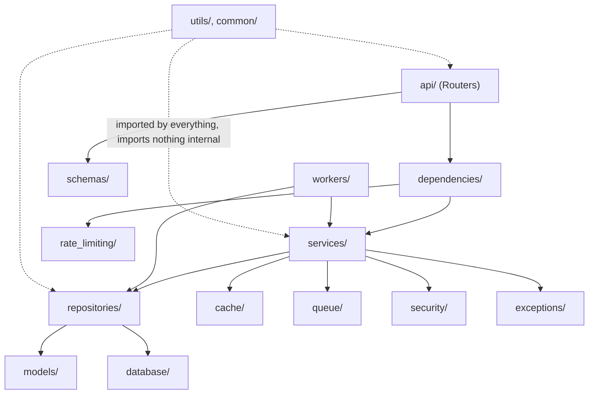
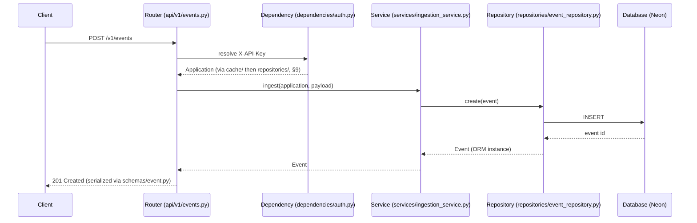
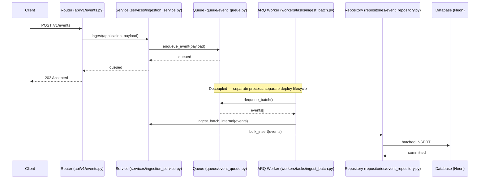

# Backend Folder Structure

**Project:** PulseTrack — Event-Collection & Telemetry Backend
**Version:** 1.0
**Purpose:** The complete, implementation-ready backend project structure — every folder and file justified against a requirement or an explicit engineering trade-off, designed before the first line of application code is written. Consistent with `PulseTrack_PRD.md`, `PulseTrack_SRD.md`, `PulseTrack_API_Design.md`, `architecture.md`, and `PulseTrack_Database_Design.md`.

---

## Table of Contents

1. [Design Principles](#1-design-principles)
2. [High-Level Project Structure](#2-high-level-project-structure)
3. [Folder Responsibilities](#3-folder-responsibilities)
4. [Internal `app` Structure](#4-internal-app-structure)
5. [File Responsibilities](#5-file-responsibilities)
6. [Dependency Flow](#6-dependency-flow)
7. [Request Flow](#7-request-flow)
8. [Background Worker Flow](#8-background-worker-flow)
9. [Module Boundaries](#9-module-boundaries)
10. [Import Rules](#10-import-rules)
11. [Naming Conventions](#11-naming-conventions)
12. [Future Scalability](#12-future-scalability)
13. [Best Practices](#13-best-practices)
14. [Final Recommended Folder Tree](#14-final-recommended-folder-tree)

---

## 1. Design Principles

| Principle | Why it matters for PulseTrack specifically |
|---|---|
| **Separation of Concerns** | The write path (`POST /v1/events`) and the read path (`GET /metrics`) have different latency budgets and different scaling levers (`architecture.md` §8–9). If HTTP parsing, business logic, and SQL lived in the same function, optimizing one path would risk breaking the other. Layering keeps them independently changeable. |
| **Single Responsibility Principle** | A repository that also validated input, or a service that also knew about HTTP status codes, would need to change for two unrelated reasons — a contract change *and* a schema change. Each layer here changes for exactly one reason. |
| **Dependency Direction** | Enforced strictly inward: `api → services → repositories → models/database` (§6). This is what lets `workers/` reuse `services/` without duplicating ingestion logic, and what makes `services/` unit-testable without spinning up FastAPI. |
| **Feature Isolation** | `applications` and `events` are two genuinely independent domains that happen to share infrastructure (the database, the cache). Each domain's files are named and grouped so a reader can find everything about "events" without wading through "applications" code. |
| **Layered Architecture** | Chosen over a feature-folder-per-domain layout because PulseTrack has exactly two domains and heavy shared infrastructure (cache, queue, rate limiting) — a layered structure keeps that shared infrastructure from being duplicated per feature folder, which would happen with only two domains this small. |
| **Clean Code** | Files stay short and single-purpose (§13) not as a style preference but because `rules.md` R-TEST-01/02 require every new endpoint to be independently testable — a 600-line service file with five responsibilities is untestable in isolation. |
| **Scalability** | Phase 2 (Redis, ARQ, rate limiting) must slot into this structure as *new files in existing folders*, not a restructure — validated concretely in §12. |
| **Testability** | Constructor-injected dependencies (§13) mean every service can be tested with fake repositories, no database required, and every repository can be tested against a real Neon branch without spinning up FastAPI. |
| **Reusability** | `security/`, `cache/`, `queue/`, and `rate_limiting/` are framework-agnostic infrastructure wrappers, usable identically from the API process and the worker process — this is precisely what makes `workers/` able to reuse `services/` without a parallel implementation. |
| **Explicit Dependencies** | Every service takes its repository and infrastructure dependencies as constructor arguments, never as global imports reached for mid-function. A reader can determine everything a service touches by reading its `__init__` signature alone. |

---

## 2. High-Level Project Structure

```
pulsetrack/
│
├── app/                    # Application source code (see §4)
├── tests/                  # Test suite, mirrors app/ 1:1 (see §13)
├── alembic/                # Database migrations
├── docs/                   # PRD, SRD, API Design, Architecture, Database Design, this document
├── docker/                 # Dockerfile(s), entrypoint scripts
├── scripts/                # One-off operational scripts (seed data, manual partition creation)
├── .github/
│   └── workflows/          # CI/CD pipeline definitions
├── .env.example
├── pyproject.toml
├── alembic.ini
├── docker-compose.yml
├── render.yaml
└── README.md
```

---

## 3. Folder Responsibilities

### `app/`
**Purpose:** All application source code. **Responsibilities:** everything that runs in production — API, workers, business logic, data access. **Belongs here:** any importable Python module the running services depend on. **Never belongs here:** test files, one-off scripts, or documentation. **Interacts with:** everything — this is the root of the dependency graph in §6. **Future scalability:** internal structure (§4) is what actually absorbs Phase 2 growth; this folder's *existence* doesn't need to change.

### `tests/`
**Purpose:** The test suite. **Responsibilities:** unit tests (services, repositories, utils in isolation) and integration tests (API routes via `httpx.AsyncClient`). **Belongs here:** anything importing `pytest`. **Never belongs here:** application logic "temporarily" written in a test file and never moved. **Interacts with:** mirrors `app/`'s structure exactly, so `app/services/ingestion_service.py` has a corresponding `tests/services/test_ingestion_service.py` — a missing mirror file is immediately visible as a coverage gap. **Future scalability:** new modules in `app/` come with an obligatory mirrored test file (`rules.md` R-TEST-01).

### `alembic/`
**Purpose:** Schema migration history. **Responsibilities:** one file per migration, autogenerated then hand-reviewed (`PulseTrack_Database_Design.md` §11). **Belongs here:** only Alembic-managed revision files and `env.py`. **Never belongs here:** manual DDL run outside a migration — `rules.md` R-DB-03 forbids this outright. **Interacts with:** `app/models/` (the source Alembic diffs against) and `app/database/` (the engine it borrows connection config from). **Future scalability:** Phase 2 partition-creation migrations are hand-written here, not autogenerated (§11 of the Database Design doc already flags why).

### `docs/`
**Purpose:** The project's planning documents — PRD, SRD, API Design, Architecture, Database Design, this folder-structure document, and `rules.md`. **Responsibilities:** none at runtime — purely reference material for contributors and reviewers. **Never belongs here:** anything imported by `app/`. **Interacts with:** cross-referenced by name throughout the codebase's docstrings and this document, but never imported as code.

### `docker/`
**Purpose:** Containerization. **Responsibilities:** one `Dockerfile` capable of building both the API image and the worker image via a build arg or multi-stage target (they share the same dependency set), plus any entrypoint shell scripts. **Never belongs here:** environment-specific secrets — those stay in Render's environment variable store per `rules.md` R-SEC-04.

### `scripts/`
**Purpose:** Operational one-offs that aren't part of the running application and aren't a formal migration — e.g., a manual script to pre-create next month's partition, or a local dev seed-data loader. **Never belongs here:** anything the API or worker imports at runtime — if it's imported at runtime, it belongs in `app/`.

### `.github/workflows/`
**Purpose:** CI/CD. **Responsibilities:** lint (`ruff`), type-check (`mypy --strict`), test (`pytest --cov`), and deploy-trigger steps, per `rules.md` R-TEST-02 and `architecture.md` §7.

---

## 4. Internal `app` Structure

```
app/
├── main.py
├── api/
│   └── v1/
├── core/
├── dependencies/
├── middleware/
├── security/
├── schemas/
├── models/
├── database/
├── repositories/
├── services/
├── cache/
├── queue/
├── rate_limiting/
├── workers/
├── observability/
├── exceptions/
├── utils/
└── common/
```

A few of these deserve an explicit rationale for their granularity — a Staff-level structure resists creating a folder for every noun mentioned in a requirements doc, and resists cramming unrelated concerns into one folder just as much:

- **`core/` absorbs both "config" and "logging."** Both are single-file, app-wide, framework-adjacent concerns (`config.py`, `logging.py`) with no internal substructure of their own. Giving each its own top-level package would mean two one-file folders — that's fragmentation for its own sake, not clarity. If either ever grows multiple files (e.g., per-environment config classes), it graduates to its own package then, not preemptively.
- **`database/` is Postgres-only; `cache/` is Redis-only — deliberately not merged.** They're both "a connection to managed infrastructure," but they have unrelated failure modes, unrelated client libraries, and — critically — `PulseTrack_SRD.md` NFR-REL-02 requires the system to keep working with Redis down and Postgres up, but never the reverse. Merging them into one `infra/` folder would obscure that asymmetry; keeping them separate makes "what still works if X is down" a folder-level question, not a code-reading exercise.
- **`queue/` and `rate_limiting/` are split from `cache/` despite all three sitting on the same Redis instance.** They're split by *role*, not by physical backend, because each has a distinct algorithm and a distinct consumer: `cache/` is read by `services/`, `queue/` is written by `services/` and read by `workers/`, `rate_limiting/` is read by `dependencies/`. A single `redis/` folder would force unrelated call sites to share one module's mental model.
- **`observability/`, not `metrics/`.** This is the most important disambiguation in the whole structure: PulseTrack already has a business concept called "metrics" — the aggregated event counts returned by `GET /v1/applications/{id}/metrics` (`PulseTrack_API_Design.md` §7). A folder literally named `metrics/` for Prometheus scrape data would collide with that term everywhere — imports, log messages, code review comments. Prometheus-facing instrumentation lives in `observability/`; the business aggregation feature lives across the normal layers (`services/aggregation_service.py`, `schemas/metrics.py`, `api/v1/metrics.py`) exactly where any other feature would.
- **No standalone `events/` domain folder.** `Event` is PulseTrack's primary entity, not a cross-cutting concern — it's already fully represented across `models/event.py`, `repositories/event_repository.py`, `services/ingestion_service.py` + `aggregation_service.py`, `schemas/event.py`, and `api/v1/events.py`. A dedicated `events/` folder would either duplicate those five files under a different root or become a junk drawer that breaks the layering everything else follows. `applications` gets the identical treatment for the identical reason — neither domain gets a feature folder, both get first-class citizenship inside every layer.

### Folder-by-folder detail

**`api/v1/`** — HTTP layer only. Routers parse the request, call exactly one service method, and return its result through a schema. No business logic, no direct repository or database access. New API versions (`v2/`) sit alongside `v1/` without touching it, matching the versioning policy in `PulseTrack_API_Design.md` §10.

**`core/`** — `config.py` (the single source of environment-derived settings) and `logging.py` (structured JSON logger setup). Nothing here is business logic; both files are imported by nearly everything else, so they must never import anything from `services/`, `repositories/`, or `api/` themselves — that would create a cycle.

**`dependencies/`** — FastAPI `Depends()` providers: resolving the current `Application` from `X-API-Key`, providing a database session, checking the rate limit. This is the one folder allowed to import both `fastapi` and `services/` — it's the seam where the HTTP framework meets business logic.

**`middleware/`** — ASGI middleware: request-ID assignment/propagation, structured request logging, and the global exception handler that turns a domain exception from `exceptions/` into the standard error envelope from `PulseTrack_API_Design.md` §4.2.

**`security/`** — API key generation (CSPRNG), hashing (SHA-256), and verification. Isolated from `core/` specifically because it's security-sensitive and benefits from being independently auditable — a reviewer or a future security review should be able to read exactly this folder and know everything about how keys are handled, without wading through logging config to find it.

**`schemas/`** — Pydantic request/response models — the literal shape of `PulseTrack_API_Design.md`'s contract. Pure data definitions; no database or business logic imports.

**`models/`** — SQLAlchemy 2.0 ORM models — the literal shape of `PulseTrack_Database_Design.md`'s DDL. `base.py` holds the declarative base and shared mixins (e.g., a `TimestampMixin` for `created_at`/`updated_at`, since both tables need it).

**`database/`** — Postgres connection lifecycle: async engine creation, session factory, the `get_session()` dependency-injectable generator. Deliberately separate from `models/` — models describe *shape*, this describes *connection lifecycle*; they change for different reasons (a new column vs. a pool-size tuning change).

**`repositories/`** — Data access layer. One method per query pattern identified in `PulseTrack_Database_Design.md` §9 (e.g., `get_by_api_key_hash`, `bulk_insert`, `aggregate_by_bucket`). Returns ORM instances or primitives — never a Pydantic schema, never an HTTP concept.

**`services/`** — Business logic. Orchestrates one or more repositories plus infrastructure (`cache/`, `queue/`, `security/`) to fulfill a use case (register an application, ingest an event, compute metrics). This is the layer both `api/` and `workers/` call into — the single place ingestion or aggregation logic is implemented.

**`cache/`** — Generic Redis-backed cache-aside helpers (`get_or_set`, `invalidate`) plus the shared async Redis client factory that `queue/` and `rate_limiting/` also import from, to avoid three separate connection pools to the same Upstash instance. `cache/` itself has zero knowledge of *what* is being cached — it doesn't know what an "application" or an "event" is.

**`queue/`** — The ingestion queue abstraction (`enqueue_event`, `dequeue_batch`) wrapping Redis Streams/Lists. Used by `services/ingestion_service.py` as a producer and by `workers/` as a consumer — the one module both processes share directly.

**`rate_limiting/`** — The fixed-window Redis limiter (`architecture.md` ADR-003 — implemented via an atomic Lua script, `PulseTrack_API_Design.md` §9). Takes an opaque key (the resolved `application_id`) and a limit; has zero knowledge of what an application is beyond that string.

**`workers/`** — ARQ worker process definitions: `worker_settings.py` (the `WorkerSettings` class ARQ's CLI loads) and `tasks/` (the actual job functions, which call into `services/` — never reimplementing ingestion logic).

**`observability/`** — Prometheus-format metrics collection: request counters, latency histograms, queue-depth gauges (`PulseTrack_SRD.md` FR-OBS-03). Deliberately named to avoid colliding with the business "metrics" feature (see disambiguation above).

**`exceptions/`** — The custom exception hierarchy (`AppException` base, `InvalidAPIKeyError`, `ValidationError`, `RateLimitExceededError`, etc.) that `services/` raises and `middleware/error_handler.py` catches and translates to HTTP.

**`utils/`** — Pure, framework-independent helper functions with zero project-internal imports — e.g., date-bucket truncation helpers used by `aggregation_service.py`. If a function imports `fastapi`, `sqlalchemy`, or anything from `app/services/`, it does not belong here.

**`common/`** — Shared enums and constants used across layers (`Granularity` enum, `MAX_METADATA_BYTES` constant) that don't fit `utils/` (pure functions) or `schemas/` (Pydantic models). Kept deliberately narrow — this is the one folder most prone to becoming a junk drawer, so the rule is: enums and constants only, nothing else.

---

## 5. File Responsibilities

| File | Purpose | Dependencies | When executed | Expected size | Framework-independent? |
|---|---|---|---|---|---|
| `main.py` | Instantiate `FastAPI()`, mount routers, register middleware, define the `lifespan` context manager (DB engine + Redis client startup/shutdown) | Everything (it's the assembly point) | Once, at process start (`uvicorn` entrypoint) | Small, <100 lines — wiring only, no logic | No — this *is* the FastAPI entrypoint by design |
| `core/config.py` | `Settings(BaseSettings)` — the single source of `DATABASE_URL`, `REDIS_URL`, `RATE_LIMIT_DEFAULT_PER_MINUTE`, `LOG_LEVEL`, etc. | `pydantic-settings` only | Once, at import time (module-level singleton via `@lru_cache` `get_settings()`) | Small, <80 lines | Yes — no FastAPI or SQLAlchemy import |
| `database/session.py` | `create_async_engine`, `async_sessionmaker`, `get_session()` async-generator dependency | `sqlalchemy`, `core/config.py` | Engine: once at startup. Session: per request/task | Small–medium | Framework-independent of FastAPI (reusable from `workers/`), coupled to SQLAlchemy by design |
| `security/api_key.py` | `generate_api_key()`, `hash_api_key()`, `verify_api_key()` | Stdlib `hashlib`/`secrets` only | Per authenticated request + on creation/rotation | Small, <60 lines | Fully — no FastAPI, no SQLAlchemy; independently unit-testable and reusable from a CLI script |
| `core/logging.py` | `configure_logging()` — structured JSON formatter, request-ID-aware log filter | Stdlib `logging` | Once, at startup (both API and worker processes) | Small | Yes — used identically by `main.py` and `workers/worker_settings.py` |
| `dependencies/auth.py` | `get_current_application()` — resolves `X-API-Key` header to an `Application` via `cache/` then `repositories/` | `fastapi`, `services/application_service.py` | Per authenticated request | Small, <50 lines | No — inherently a FastAPI `Depends()` function, coupled by design |
| `repositories/base.py` | Generic repository base class, typed via `TypeVar` bound to the ORM base | `sqlalchemy`, `models/base.py` | Class defined at import time, instantiated per request/task | Medium | Independent of FastAPI, coupled to SQLAlchemy appropriately |
| `workers/worker_settings.py` | ARQ `WorkerSettings` — registers task functions, Redis connection settings, `max_jobs`, `job_timeout` | `arq`, `core/config.py`, `workers/tasks/` | Loaded by the `arq` CLI as a separate process | Small | Fully independent of FastAPI — this is the separate deployable from `architecture.md` §7 |

---

## 6. Dependency Flow



**Allowed:** `api → dependencies → services → repositories → models/database`, with `services` also reaching sideways into `cache/`, `queue/`, `security/`, and `exceptions/`. `workers` calls `services` and `repositories` directly (bypassing `api`/`dependencies` entirely, since there's no HTTP request to resolve auth from — the worker trusts the queue payload it already validated at enqueue time).

**Never allowed:**
- `api/` calling `repositories/` or `models/` directly — must always go through `services/`.
- `services/` importing anything from `fastapi` — no `Request`, `Depends`, or `HTTPException`. Services raise from `exceptions/`; only `middleware/error_handler.py` translates to HTTP.
- `repositories/` importing anything from `schemas/` — repositories don't know Pydantic exists.
- `models/` or `database/` importing anything from `services/` or `api/` — the persistence layer must never depend upward on business logic.
- Any cycle between `cache/`, `queue/`, or `rate_limiting/` and `services/` — infrastructure is imported by services, never the reverse.

---

## 7. Request Flow



1. **Client → Router:** the router's only job is parsing the request body into a `schemas/event.py` Pydantic model — FastAPI does this automatically from the type annotation.
2. **Router → Dependency Injection:** `Depends(get_current_application)` runs before the handler body, resolving `X-API-Key` to an `Application` (cache-aside through `cache/`, falling back to `repositories/application_repository.py`).
3. **Dependency → Service:** the router calls exactly one method on `services/ingestion_service.py`, passing the resolved `Application` and the validated Pydantic model — never a raw dict, never the request object itself.
4. **Service → Repository:** the service applies any business rules (idempotency check, batch-size ceiling) then delegates the actual write to `repositories/event_repository.py`.
5. **Repository → Database:** the repository issues the parameterized SQLAlchemy statement against the session from `database/session.py`.
6. **Response:** the ORM instance returned up the chain is serialized by FastAPI through the response schema declared on the route — the router never manually builds a `dict` for the response body.

---

## 8. Background Worker Flow



1. **Client → Router → Service:** identical to the synchronous path through step 3 above.
2. **Service → Queue:** in Phase 2, `ingestion_service.py` checks a feature flag (or Redis availability, per NFR-REL-02) and, instead of calling the repository directly, calls `queue/event_queue.py`'s `enqueue_event()`.
3. **Router → Client:** the API returns `202 Accepted` immediately — the client never waits on the database.
4. **Worker → Queue:** `workers/tasks/ingest_batch.py`, running in the separate Render background-worker process (`architecture.md` §7), independently dequeues a batch.
5. **Worker → Service:** critically, the worker task calls back into the **same** `services/ingestion_service.py` — specifically an internal batch-processing method — rather than reimplementing validation or idempotency logic. This is the payoff of the dependency direction in §6: `workers/` is allowed to depend on `services/`, so business logic is written exactly once.
6. **Service → Repository → Database:** the service delegates the actual bulk write to `repositories/event_repository.py`'s `bulk_insert()`, which issues the batched `INSERT` discussed in `PulseTrack_Database_Design.md` §14.

---

## 9. Module Boundaries

| Module | Owns | Explicitly does NOT know about |
|---|---|---|
| **Authentication** | Key generation, hashing, verification, resolving a key to an `Application` (`security/`, `dependencies/auth.py`) | Rate limits, event ingestion, HTTP routing beyond the one dependency function |
| **Applications** | Tenant lifecycle — registration, key rotation, deactivation (`models/application.py` → `api/v1/applications.py`, full stack) | How events are stored or aggregated |
| **Events** | Ingestion and idempotency (`models/event.py` → `api/v1/events.py`, full stack) | Aggregation logic — it stores events, it doesn't summarize them |
| **Metrics (aggregation)** | Turning stored events into bucketed counts (`services/aggregation_service.py`, `schemas/metrics.py`, `api/v1/metrics.py`) | Event *storage* — it reads through `event_repository.py`, never writes |
| **Workers** | Async batch execution (`workers/`) | Nothing business-specific — it's a thin runtime shell around `services/` |
| **Caching** | Generic get/set/invalidate against Redis (`cache/`) | What an "application" or "event" is — operates on opaque keys and values only |
| **Rate Limiting** | The fixed-window algorithm (`rate_limiting/`) | What an application is beyond an opaque identifier string |
| **Logging** | Structured log formatting (`core/logging.py`) | Any business logic whatsoever |
| **Configuration** | All environment-derived settings (`core/config.py`) — the *only* file allowed to read `os.environ` directly; everything else receives a `Settings` object | Nothing else reads the environment directly, anywhere in the codebase |

---

## 10. Import Rules

- **`api/`** may import `schemas/`, `dependencies/`. **Must never** import `repositories/` or `models/` directly.
- **`services/`** may import `repositories/`, `cache/`, `queue/`, `security/`, `exceptions/`. **Must never** import `fastapi` — no `Request`, `Depends`, or `HTTPException` inside a service file.
- **`repositories/`** may import `models/`, `database/`. **Must never** import `schemas/` or know an HTTP status code exists.
- **`schemas/`** may import `pydantic`, `common/`. **Must never** import `models/` or `database/` — a schema has no database session access, ever.
- **`workers/`** may import `services/`, `repositories/`. Reuses the exact service layer the API uses — business logic is never duplicated between the sync API path and the async worker path.
- **`utils/`** and **`common/`** may be imported by anything. **Must themselves import nothing** from `services/`, `repositories/`, `api/`, or `models/` — they sit at the bottom of the graph, which is what makes them safely importable from `workers/`, `scripts/`, and tests alike.
- **`security/`, `cache/`, `queue/`, `rate_limiting/`** are infrastructure — importable by `services/` and `dependencies/`. **Must never** import `services/` or `repositories/` — no upward dependency back into business logic.
- **Routers only orchestrate.** A router function's body should read as: validate happened automatically via the type hint → call one service method → return. If a router has an `if`/`else` branching on business state, that logic belongs in `services/`.

---

## 11. Naming Conventions

| Category | Convention | Example |
|---|---|---|
| Folders | `snake_case`, plural for collections of similar things, singular for a single bounded concern | `repositories/`, `services/` vs. `security/`, `database/` |
| Files | `snake_case`, matching content exactly | `application_repository.py`, not `ApplicationRepo.py` |
| Classes | `PascalCase` | `ApplicationRepository`, `IngestionService`, `EventCreate` |
| Functions | `snake_case`, verb-first | `get_by_id`, `create_application`, `hash_api_key` |
| Variables | `snake_case`, spelled out, no abbreviation of domain terms | `application`, not `app` (reserved for the FastAPI instance itself) |
| Constants | `UPPER_SNAKE_CASE`, defined in `common/constants.py` or as `Settings` fields | `MAX_METADATA_BYTES`, `DEFAULT_RATE_LIMIT_PER_MINUTE` |
| Environment variables | `UPPER_SNAKE_CASE`, matching `Settings` field names via `pydantic-settings`' automatic mapping | `DATABASE_URL`, `REDIS_URL` |
| Database models | Singular class name; SQLAlchemy pluralizes to the table name | `class Application` → table `applications` |
| Pydantic schemas | Suffixed by role — never a bare name reused for both request and response | `ApplicationCreate`, `ApplicationRead`, `EventBatchResponse` — never a single `Application` schema shared between create-input and read-output, which risks leaking `api_key_hash` into a response |
| Repository classes | Suffix `Repository` | `EventRepository` |
| Service classes | Suffix `Service` | `AggregationService` |
| Worker task names | `verb_noun`, `snake_case` — matches ARQ's function-name-as-job-name convention | `insert_event_batch`, never a generic name like `process` that would be ambiguous in a job log |

---

## 12. Future Scalability

| Concern | How this structure absorbs it without a restructure |
|---|---|
| **Redis** | Already fully abstracted behind `cache/`, `queue/`, `rate_limiting/`. Swapping Upstash for self-hosted Redis touches one client factory in `cache/client.py`. |
| **Background Workers** | `workers/` already exists as an isolated, independently-deployable package reusing `services/` — Phase 2 activation means adding task functions, not restructuring. |
| **Batch Processing** | `repositories/event_repository.py`'s `bulk_insert()` is already the seam Phase 2 hooks into — a new call site, not a new architectural layer. |
| **Monitoring / Prometheus** | `observability/` is purpose-built and already isolated from the business `metrics` feature — mounting `/metrics` in `main.py` is a one-line addition. |
| **CI/CD** | `tests/` mirrors `app/` 1:1, so per-module coverage and CI caching (`rules.md` R-TEST-02) work without special-casing any folder. |
| **Docker** | One `Dockerfile` in `docker/` can target either the API or worker entrypoint via a build arg, since both share the same dependency set and `pyproject.toml`. |
| **Caching** | The cache-aside pattern is already centralized in `cache/` — services call one generic interface rather than each reimplementing get-or-set. |
| **Rate Limiting** | Fully isolated in `rate_limiting/`, wired in as one dependency in `dependencies/rate_limit.py` — enabling it touches no existing service code. |
| **Microservice migration** | Not a design goal (`architecture.md` §1 explicitly scopes this as one deployable), but honestly assessed: because `services/` never imports `api/` and `repositories/` never imports `services/`, the `events` domain's service+repository+model trio *could* be lifted into its own deployable with comparatively little untangling — the layering doesn't prevent it, even though enabling it isn't a goal here. |
| **Future analytics** | A hypothetical `services/analytics_service.py` + `repositories/analytics_repository.py` (per `PulseTrack_Database_Design.md` §17) would sit alongside the existing modules without touching ingestion or aggregation — module boundaries already isolate it. |

---

## 13. Best Practices

- **File size:** services and repositories aim for <300 lines. A repository exceeding that on aggregation queries specifically should split into a dedicated file (e.g., `event_aggregation_repository.py`) rather than let one file accumulate every query pattern.
- **Function size:** <40 lines as a soft ceiling — past that, extract a named helper. A long function is usually a sign two responsibilities got merged.
- **Class size:** a service class with more than ~5–7 public methods is a signal it's actually two services wearing one name.
- **Dependency Injection:** constructor injection only — a service receives its repository and infrastructure dependencies as `__init__` arguments, never reaches for a global singleton mid-method. This is what makes injecting a fake repository in a unit test trivial.
- **Error handling:** services raise typed exceptions from `exceptions/`; they never raise `HTTPException` directly (`rules.md` §11's assistant-facing rule generalizes here too — services stay framework-agnostic). Only `middleware/error_handler.py` translates a domain exception into the standard error envelope.
- **Logging:** structured only — no string-concatenated log messages. Every log line carries the `request_id` propagated via `contextvars`, set once by `middleware/` and read by `core/logging.py`'s formatter.
- **Configuration:** all environment access goes through `core/config.Settings`, loaded once via an `@lru_cache`-wrapped `get_settings()`. No module calls `os.environ` directly outside that one file.
- **Testing:** unit tests for `services/` inject fake repositories (no database); unit tests for `repositories/` run against a real Neon dev branch (not mocks, since the whole point is verifying the SQL); integration tests for `api/` use `httpx.AsyncClient` against the real FastAPI app. Coverage floor is 80% on `app/` per `rules.md` R-TEST-02, enforced in CI, not aspirational.

---

## 14. Final Recommended Folder Tree

```
pulsetrack/
│
├── app/
│   ├── main.py
│   │
│   ├── api/
│   │   └── v1/
│   │       ├── __init__.py
│   │       ├── router.py              # aggregates all v1 sub-routers
│   │       ├── applications.py        # POST /applications, GET/PATCH /applications/{id}, key rotation
│   │       ├── events.py              # POST /events, POST /events/batch
│   │       ├── metrics.py             # GET /applications/{id}/metrics
│   │       └── health.py              # GET /health
│   │
│   ├── core/
│   │   ├── config.py
│   │   └── logging.py
│   │
│   ├── dependencies/
│   │   ├── auth.py                    # get_current_application
│   │   ├── db.py                      # get_session wrapper for DI
│   │   └── rate_limit.py              # rate-limit check dependency (Phase 2)
│   │
│   ├── middleware/
│   │   ├── request_id.py
│   │   ├── request_logging.py
│   │   └── error_handler.py
│   │
│   ├── security/
│   │   └── api_key.py                 # generate/hash/verify
│   │
│   ├── schemas/
│   │   ├── common.py                  # ErrorResponse, shared envelope pieces
│   │   ├── application.py
│   │   ├── event.py
│   │   └── metrics.py
│   │
│   ├── models/
│   │   ├── base.py                    # declarative base, TimestampMixin
│   │   ├── application.py
│   │   └── event.py
│   │
│   ├── database/
│   │   └── session.py                 # async engine, sessionmaker, get_session()
│   │
│   ├── repositories/
│   │   ├── base.py
│   │   ├── application_repository.py
│   │   └── event_repository.py
│   │
│   ├── services/
│   │   ├── application_service.py
│   │   ├── ingestion_service.py
│   │   └── aggregation_service.py
│   │
│   ├── cache/
│   │   ├── client.py                  # shared async Redis client factory
│   │   └── cache_aside.py             # get_or_set / invalidate helpers
│   │
│   ├── queue/
│   │   └── event_queue.py             # enqueue_event / dequeue_batch (Phase 2)
│   │
│   ├── rate_limiting/
│   │   └── limiter.py                 # fixed-window Lua-script limiter (Phase 2)
│   │
│   ├── workers/
│   │   ├── worker_settings.py         # ARQ WorkerSettings
│   │   └── tasks/
│   │       └── ingest_batch.py
│   │
│   ├── observability/
│   │   └── prometheus.py              # counters, histograms, /metrics exposition (Phase 2)
│   │
│   ├── exceptions/
│   │   ├── base.py                    # AppException
│   │   ├── auth.py
│   │   └── validation.py
│   │
│   ├── utils/
│   │   └── time_buckets.py            # date_trunc-equivalent helpers for aggregation
│   │
│   └── common/
│       ├── enums.py                   # Granularity, etc.
│       └── constants.py               # MAX_METADATA_BYTES, etc.
│
├── tests/
│   ├── api/
│   ├── services/
│   ├── repositories/
│   └── conftest.py
│
├── alembic/
│   ├── versions/
│   └── env.py
│
├── docs/
│   ├── PulseTrack_PRD.md
│   ├── PulseTrack_SRD.md
│   ├── PulseTrack_API_Design.md
│   ├── architecture.md
│   ├── PulseTrack_Database_Design.md
│   ├── PulseTrack_Folder_Structure.md
│   └── rules.md
│
├── docker/
│   └── Dockerfile
│
├── scripts/
│   └── create_next_partition.py
│
├── .github/
│   └── workflows/
│       └── ci.yml
│
├── .env.example
├── pyproject.toml
├── alembic.ini
├── docker-compose.yml
├── render.yaml
└── README.md
```

---

*End of document.*
