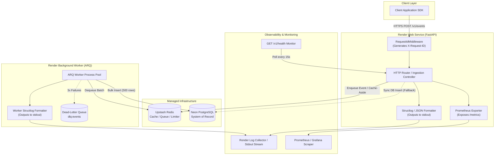
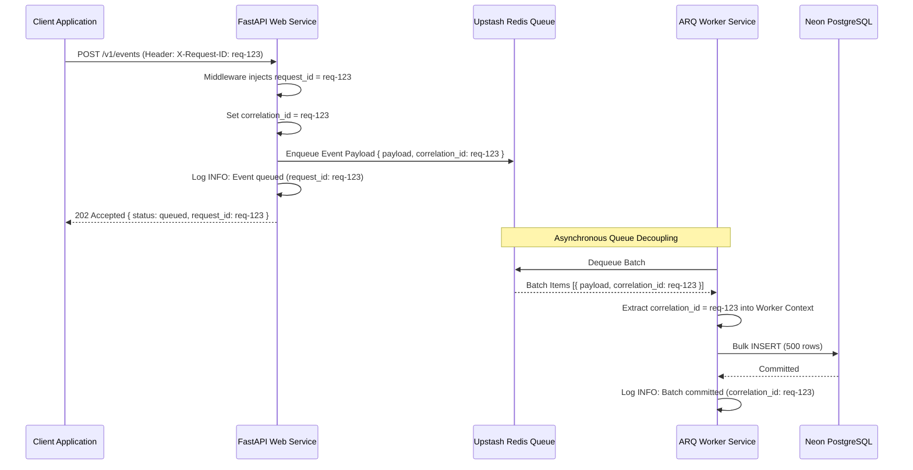
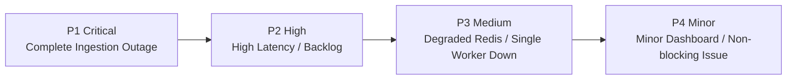

# Monitoring & Logging Design

**Project:** PulseTrack — Event-Collection & Telemetry Backend  
**Author:** Sumukh  
**Version:** 1.0  
**Status:** Approved — Production Observability Architecture  
**Purpose:** Define the complete observability blueprint, structured logging specifications, metric collection schemas, request tracing protocols, alerting thresholds, and SRE incident response runbooks for PulseTrack.  
**Audience:** Site Reliability Engineers (SREs), Platform Engineers, Backend Developers, Security Engineers, and Technical Operators.

---

## Table of Contents

1. [Observability Goals](#1-observability-goals)
2. [Observability Architecture](#2-observability-architecture)
3. [Logging Strategy](#3-logging-strategy)
4. [Log Levels](#4-log-levels)
5. [Logging Standards](#5-logging-standards)
6. [Request Tracing](#6-request-tracing)
7. [Metrics Strategy](#7-metrics-strategy)
8. [Health Checks](#8-health-checks)
9. [Monitoring Dashboards](#9-monitoring-dashboards)
10. [Alerting Strategy](#10-alerting-strategy)
11. [Database Monitoring](#11-database-monitoring)
12. [Redis Monitoring](#12-redis-monitoring)
13. [Worker Monitoring](#13-worker-monitoring)
14. [Security Monitoring](#14-security-monitoring)
15. [Incident Response](#15-incident-response)
16. [Log Retention](#16-log-retention)
17. [Performance Monitoring](#17-performance-monitoring)
18. [Operational Runbooks](#18-operational-runbooks)
19. [Future Enhancements](#19-future-enhancements)
20. [Final Monitoring Checklist](#20-final-monitoring-checklist)

---

## 1. Observability Goals

Observability in PulseTrack provides deep internal state visibility from external telemetry outputs (logs, metrics, and distributed request context). In a high-throughput event collection engine, observability is a primary architectural requirement that guarantees system reliability, write-path availability, and data integrity.

### 1.1 Availability
Ensure continuous operation of the ingestion pipeline (`POST /v1/events`).
- **Goal:** Maintain 99.9% uptime for HTTP ingestion endpoints.
- **Why:** Telemetry backends collect mission-critical telemetry from client SDKs. Ingestion outages result in permanent client telemetry gaps or heavy SDK memory buffering.

### 1.2 Reliability
Guarantee data durability and at-least-once event persistence under component failure.
- **Goal:** Track event loss to zero and monitor queue-to-database processing pipelines. Detect fail-open Redis degradation (NFR-REL-02) instantly when switching to synchronous PostgreSQL writes.
- **Why:** Operational reliability builds trust in aggregation metrics (`GET /v1/applications/{id}/metrics`).

### 1.3 Performance
Enforce strict write-path latency budgets (<50ms p95 for event ingestion).
- **Goal:** Monitor latency histograms at every layer (ASGI middleware, cache lookups, queue enqueues, database inserts).
- **Why:** Ingestion latency directly impacts client application responsiveness and SDK resource usage.

### 1.4 Security Monitoring
Detect authentication breaches, rate limit abuse, invalid API key spikes, and payload anomalies.
- **Goal:** Real-time logging and alerting on tenant security violations.
- **Why:** PulseTrack handles multi-tenant machine traffic; automated abuse detection protects database write paths from DDoS and unauthorized access.

### 1.5 Troubleshooting & Root Cause Analysis
Enable developers and SREs to diagnose production anomalies in seconds using correlated request traces and structured logs.
- **Goal:** Every log message carries a correlated `request_id`, `application_id`, and `correlation_id` across Web and ARQ Worker processes.
- **Why:** Uncorrelated text logs require manual timestamp matching during incidents, extending Mean Time to Resolution (MTTR).

### 1.6 Operational & Business Visibility
Measure system saturation, resource utilization, tenant ingestion volumes, and queue processing throughput.
- **Goal:** Provide real-time operational visibility into queue depths, worker batch sizes, database connection pools, and cache hit ratios.
- **Why:** Operational visibility informs scaling decisions and capacity planning before resource bottlenecks trigger client outages.

---

## 2. Observability Architecture

PulseTrack's observability architecture captures telemetry from both the Web Service (`uvicorn`) and Background Worker Service (`arq`), funneling structured logs to stdout/stderr and exposing Prometheus metrics at `/metrics`.

### 2.1 Telemetry Architecture Diagram



### 2.2 Observability Component Responsibilities

| Component | Telemetry Type | Description & Function |
|---|---|---|
| **`RequestIdMiddleware`** | Context Tracing | Generates UUID `request_id` per HTTP call; injects into Python `contextvars`. |
| **`app/core/logging.py`** | Structured Logs | Configures `structlog` for single-line JSON log formatting to stdout. |
| **`app/observability/prometheus.py`** | Metrics | Registers Prometheus counters, gauges, and histograms; exposes `GET /metrics`. |
| **`app/api/v1/health.py`** | Health Probes | Evaluates live status of API, Neon PostgreSQL, and Upstash Redis connections (`GET /v1/health`). |
| **ARQ Worker Logger** | Asynchronous Logs | Context-aware logger in `workers/tasks/ingest_batch.py` extracting `correlation_id` from queued items. |

---

## 3. Logging Strategy

PulseTrack mandates **100% structured JSON logging** across all environments. Text-based string formatting (`print()` or `%s` concatenation) is strictly forbidden.

### 3.1 Why Structured JSON Logging?
1. **Machine Parsability:** Log aggregators (Render Logs, Datadog, ELK, Loki) parse JSON fields natively without brittle regular expressions.
2. **Context Preservation:** Rich key-value pairs (`application_id`, `duration_ms`, `batch_size`) remain typed and searchable.
3. **Trace Correlation:** Attaching `request_id` to every log line enables instantaneous log filter queries during production incidents.

### 3.2 Standard Log Schema
Every log entry MUST conform to the following JSON schema:

```json
{
  "timestamp": "2026-08-05T12:00:00.123456Z",
  "level": "INFO",
  "logger": "app.services.ingestion_service",
  "message": "Event batch ingested successfully",
  "environment": "production",
  "service": "pulsetrack-api",
  "version": "1.0.0",
  "request_id": "c3a9f0d1-7b8e-4a2f-9c1d-8e3f4a5b6c7d",
  "application_id": "a1b2c3d4-e5f6-7a8b-9c0d-1e2f3a4b5c6d",
  "correlation_id": "c3a9f0d1-7b8e-4a2f-9c1d-8e3f4a5b6c7d",
  "duration_ms": 12.4,
  "status_code": 202,
  "path": "/v1/events",
  "method": "POST"
}
```

### 3.3 Core Log Fields Specification
- **`timestamp`:** ISO 8601 UTC timestamp with microsecond precision (`YYYY-MM-DDTHH:MM:SS.ffffffZ`).
- **`level`:** Log level in uppercase (`DEBUG`, `INFO`, `WARNING`, `ERROR`, `CRITICAL`).
- **`logger`:** Fully qualified Python module path (`app.services.ingestion_service`).
- **`request_id`:** UUID originating from `X-Request-ID` HTTP header or generated by middleware.
- **`application_id`:** Authenticated tenant UUID (omitted if request is unauthenticated).
- **`correlation_id`:** Global trace identifier linking HTTP ingestion requests to background ARQ worker execution.
- **`environment`:** Operating environment tier (`development`, `staging`, `production`).

---

## 4. Log Levels

| Level | Severity | Operational Usage & Criteria | Example Scenario |
|---|---|---|---|
| **`DEBUG`** | Low | Fine-grained diagnostic state for local development. Disabled in production. | Tracing cache key construction: `cache:app_key:a1b2...` |
| **`INFO`** | Normal | Standard operational milestone events. State changes, successful executions. | Application startup, HTTP request completion, worker batch commit. |
| **`WARNING`** | Medium | Unexpected condition or degraded mode; system self-heals or falls back. | Redis unreachable—falling back to sync DB insert (NFR-REL-02); rate limit hit. |
| **`ERROR`** | High | Endpoint request failure or unhandled exception impacting a single client. | Database write failure, invalid payload schema, migration mismatch. |
| **`CRITICAL`** | Emergency | System-wide unrecoverable failure; immediate operator intervention required. | Database connection pool exhausted, unhandled startup crash. |

### 4.1 Log Level Implementation Code Example

```python
import structlog
from app.exceptions.base import RedisUnavailableError

logger = structlog.get_logger(__name__)

async def ingest_event_with_logging(app_id: str, payload: dict) -> str:
    logger.debug("Parsing event payload", application_id=app_id, event_type=payload.get("event_type"))
    try:
        queue_id = await event_queue.enqueue(app_id, payload)
        logger.info("Event queued successfully", application_id=app_id, queue_id=queue_id)
        return queue_id
    except RedisUnavailableError as err:
        logger.warning(
            "Redis unavailable. Degrading to synchronous Postgres insert",
            application_id=app_id,
            error=str(err),
            fallback_active=True,
        )
        return await sync_db_fallback_insert(app_id, payload)
    except Exception as err:
        logger.error("Event ingestion failed fatally", application_id=app_id, error=str(err), exc_info=True)
        raise
```

---

## 5. Logging Standards

### 5.1 Event-Specific Logging Guidelines
- **API Requests:** Log method, path, status code, duration, client IP (masked), and `request_id`.
- **Authentication:** Log success/failure with tenant `application_id` and SHA-256 key prefix (`api_key_hash[:8]`).
- **Database Operations:** Log slow queries (>100ms), transaction rollbacks, and connection pool events.
- **Redis Operations:** Log cache misses, cache invalidations, and connection failure fallbacks.
- **Worker Execution:** Log batch dequeue size, batch processing duration, retry attempts, and DLQ routing.

### 5.2 Strict Masking & Forbidden Log Items
To maintain compliance and security (`Security_Design_Document.md` §14), the following items MUST NEVER be written to log outputs:
- **Plaintext API Keys:** `pt_live_...` or `pt_test_...` raw keys.
- **Database & Redis Credentials:** Passwords, connection string secret tokens.
- **Client Secrets:** Secret signing keys, JWT bearer tokens, `Authorization` header contents.
- **Sensitive Client Metadata / PII:** Unredacted end-user email addresses, passwords, or personal identity numbers embedded in custom `metadata` JSONB fields.

---

## 6. Request Tracing

End-to-end tracing correlates client HTTP requests with async background worker jobs using `request_id` and `correlation_id`.

### 6.1 Distributed Tracing Sequence Diagram



---

## 7. Metrics Strategy

PulseTrack exposes Prometheus metrics at `GET /metrics` via `app/observability/prometheus.py`.

### 7.1 Key Metric Definitions

| Metric Name | Type | Labels | Purpose & Rationale |
|---|---|---|---|
| `pulsetrack_http_requests_total` | Counter | `method`, `path`, `status` | Tracks total HTTP request throughput, traffic spikes, and error rates. |
| `pulsetrack_http_request_duration_seconds` | Histogram | `method`, `path` | Measures API latency distribution (p50, p95, p99). Validates <50ms p95 SLA. |
| `pulsetrack_events_ingested_total` | Counter | `application_id`, `mode` | Counts ingested events by tenant and mode (`queued` vs `sync_inserted`). |
| `pulsetrack_redis_fallback_total` | Counter | `reason` | Tracks Redis fail-open degradation occurrences (NFR-REL-02). |
| `pulsetrack_worker_queue_depth` | Gauge | `queue_name` | Monitors backlogged events in Upstash Redis. Detects worker starvation. |
| `pulsetrack_worker_batch_duration_seconds` | Histogram | `task_name` | Measures processing latency for background database bulk inserts. |
| `pulsetrack_worker_dlq_events_total` | Counter | `reason` | Tracks permanently failed events routed to `dlq:events`. |
| `pulsetrack_db_connection_pool_usage` | Gauge | `state` | Monitors active, idle, and max database connection pool count. |
| `pulsetrack_rate_limit_violations_total` | Counter | `application_id` | Counts rate limit blockages by tenant. |

---

## 8. Health Checks

Health monitoring uses `GET /v1/health` (`app/api/v1/health.py`) for automated Kubernetes/Render liveness and readiness probes.

### 8.1 Health Check Responses

#### Healthy Response (`HTTP 200 OK`)

```json
{
  "status": "healthy",
  "timestamp": "2026-08-05T12:00:00.000Z",
  "version": "1.0.0",
  "components": {
    "api": "online",
    "postgres": "connected",
    "redis": "connected"
  }
}
```

#### Degraded Response (`HTTP 200 OK` — Fail-Open Active)

```json
{
  "status": "degraded",
  "timestamp": "2026-08-05T12:00:00.000Z",
  "version": "1.0.0",
  "components": {
    "api": "online",
    "postgres": "connected",
    "redis": "unreachable"
  },
  "message": "Redis is unreachable. Event ingestion running in fail-open sync mode."
}
```

#### Critical Failure Response (`HTTP 503 Service Unavailable`)

```json
{
  "status": "unhealthy",
  "timestamp": "2026-08-05T12:00:00.000Z",
  "version": "1.0.0",
  "components": {
    "api": "online",
    "postgres": "disconnected",
    "redis": "connected"
  },
  "message": "PostgreSQL database connection failed."
}
```

---

## 9. Monitoring Dashboards

Seven core monitoring dashboards provide operational clarity for SREs and developers.

```
+-----------------------------------------------------------------------+
|                         PULSETRACK API DASHBOARD                      |
+-----------------------------------+-----------------------------------+
|  Ingestion Throughput (req/sec)   |  p95 Ingestion Latency (ms)       |
|  [||||||||||||||||||||] 1,450 rps |  [|||||||||||||.......] 32.4 ms   |
+-----------------------------------+-----------------------------------+
|  Error Rate % (5xx / Total)       |  Redis Fallback Status            |
|  [|...................] 0.02%     |  [  NORMAL / QUEUE ACTIVE  ]      |
+-----------------------------------+-----------------------------------+
```

### 9.1 Dashboard Specifications Matrix

| Dashboard Name | Key Metrics Rendered | Primary Purpose | Refresh Interval |
|---|---|---|---|
| **1. API Ingestion Overview** | Request throughput, p50/p95/p99 latency, 4xx/5xx rates, Redis fallback status | High-level API health & SLA compliance | 10 seconds |
| **2. Database (Neon) Health** | Connection pool utilization, slow query count (>100ms), transaction duration | PostgreSQL performance & pool saturation | 30 seconds |
| **3. Redis & Cache Performance**| Cache hit/miss ratio, key resolution latency, Lua rate limit executions | Redis capacity & cache-aside efficiency | 30 seconds |
| **4. ARQ Worker & Queue** | Queue depth gauge, batch insert latency, retry counter, DLQ depth | Asynchronous worker processing health | 15 seconds |
| **5. Security & Abuse** | Auth failure rate, rate limit violations by tenant, invalid key spikes | Real-time threat & abuse detection | 15 seconds |
| **6. Deployment & CI/CD** | Render deploy status, migration execution time, active build versions | Release tracking & rollback indicators | 60 seconds |
| **7. System Resources** | Render CPU usage %, RAM utilization %, container restart counts | Infrastructure capacity planning | 60 seconds |

---

## 10. Alerting Strategy

Alerts notify engineers of conditions requiring immediate intervention. Severities range from P1 (Critical) to P4 (Minor).

### 10.1 Alert Rules Reference Table

| Alert Name | Severity | Condition / Threshold | Response Time | Action / Escalation |
|---|---|---|---|---|
| `APIOutage` | **P1 Critical** | HTTP 5xx error rate > 5% for 2 mins | Immediate (<5m) | Page On-Call SRE. Check Render logs & Neon DB status. |
| `DatabaseDown` | **P1 Critical** | `/v1/health` reports `postgres: disconnected` | Immediate (<5m) | Page On-Call SRE. Verify Neon compute endpoint. |
| `HighIngestionLatency` | **P2 High** | Ingestion p95 latency > 100ms for 5 mins | < 15 minutes | Check Redis queue latency & DB pool exhaustion. |
| `WorkerQueueBacklog` | **P2 High** | Redis queue depth > 10,000 items for 10 mins | < 15 minutes | Scale Render ARQ worker instances horizontally. |
| `RedisDegradedMode` | **P3 Medium** | `pulsetrack_redis_fallback_total` > 10 in 5 mins | < 1 hour | Check Upstash Redis connectivity & token validity. |
| `DLQEventAccumulation` | **P3 Medium** | Dead-Letter Queue `dlq:events` > 50 items | < 2 hours | Inspect DLQ items for payload schema corruption. |
| `AuthFailureSpike` | **P4 Low** | Auth failures > 100/min for single tenant | Next Business Day| Inspect security dashboard for credential brute-forcing. |

---

## 11. Database Monitoring

Neon PostgreSQL performance is monitored continuously to prevent write-path bottlenecks.

### 11.1 Key Database Metrics
- **Connection Pool Utilization:** $\frac{\text{Active Connections}}{\text{POSTGRES\_POOL\_SIZE}} \times 100$. Alert if $>80\%$.
- **Slow Query Log:** Any query execution exceeding **100ms** is logged as `WARNING` with SQL query pattern and execution time.
- **Partition Coverage:** Verify monthly partition tables exist for the current and upcoming month.

---

## 12. Redis Monitoring

Upstash Redis metrics track caching, rate limiting, and queueing operations.

### 12.1 Key Redis Metrics
- **Cache Hit Ratio:** $\frac{\text{Cache Hits}}{\text{Cache Hits} + \text{Cache Misses}} \times 100$. Target: $>90\%$ for API keys.
- **Queue Depth:** Total pending event payload items in Redis list/stream (`queue:events`).
- **Redis Response Latency:** Ping & command execution time. Alert if $>20\text{ms}$.

---

## 13. Worker Monitoring

ARQ Background Workers execute bulk database insertions from Redis queues.

### 13.1 Key Worker Metrics
- **Batch Processing Duration:** Time to execute a single 500-row `insert(Event).values([...])` statement. Target: $<150\text{ms}$.
- **Retry Rate:** Percentage of worker jobs requiring retries. Alert if retry rate $>2\%$.
- **Dead-Letter Queue (DLQ) Depth:** Item count in `dlq:events`. Alert if depth $>0$.

---

## 14. Security Monitoring

Security monitoring detects unauthorized access, abuse, and injection attacks.

### 14.1 Logged Security Events
1. **Invalid API Key Attempts:** Logged as `WARNING` with caller IP, requested endpoint, and key prefix.
2. **Rate Limit Breaches:** Logged as `WARNING` when a tenant exceeds `RATE_LIMIT_DEFAULT_PER_MINUTE`.
3. **Payload Size Violations:** Logged when request body $>1\text{MB}$ or metadata $>10\text{KB}$.

---

## 15. Incident Response

PulseTrack follows a standard SRE incident lifecycle: **Detection $\rightarrow$ Diagnosis $\rightarrow$ Mitigation $\rightarrow$ Resolution $\rightarrow$ Postmortem**.

### 15.1 Incident Severity Levels



### 15.2 Blameless Postmortem Policy
Within 48 hours of resolving any P1 or P2 incident, the SRE team publishes a blameless postmortem documenting root causes, timeline, impact, and preventive action items.

---

## 16. Log Retention

| Log Category | Environment | Hot Retention | Cold Archival | Compliance / Policy |
|---|---|---|---|---|
| **Application & Access Logs** | Production | 30 Days (Render Logs) | 90 Days (S3/GCS) | Standard operational retention |
| **Security & Auth Audit Logs** | Production | 90 Days | 365 Days | SOC2 / Security Audit compliance |
| **Development Logs** | Local / Dev | 7 Days | None | Ephemeral developer logs |

---

## 17. Performance Monitoring

PulseTrack tracks the **Four Golden Signals of SRE**:

1. **Latency:** Time taken to serve requests (`POST /v1/events` p95 < 50ms).
2. **Traffic:** Demand placed on the system (requests/sec, queued events/sec).
3. **Errors:** Rate of requests that fail (HTTP 5xx percentage < 0.01%).
4. **Saturation:** Resource utilization (Postgres pool usage %, Render CPU %, Redis memory %).

---

## 18. Operational Runbooks

These step-by-step runbooks guide engineers through resolving production incidents.

### 18.1 Runbook: Ingestion High Latency (p95 > 100ms)
1. **Check API Dashboard:** Determine if high latency is in Web Service or external dependencies.
2. **Inspect Upstash Redis Latency:** If Redis latency $>20\text{ms}$, verify if fail-open mode should be triggered manually.
3. **Inspect Neon Database Connections:** If `pulsetrack_db_connection_pool_usage` is $100\%$, scale Render Web Service instances down temporarily or increase Postgres pool bounds.
4. **Scale ARQ Workers:** If queue depth is building up, add Render worker instances.

### 18.2 Runbook: Upstash Redis Unreachable (Fail-Open Verification)
1. **Verify Log Warning:** Confirm logs report `"Redis unavailable. Degrading to synchronous Postgres insert"`.
2. **Check Ingestion Latency:** Expect p95 latency to increase from ~15ms to ~45ms during sync DB write mode.
3. **Verify Upstash Console:** Check Upstash dashboard for region outages or token revocation.
4. **Restore Redis:** Once Upstash recovers, PulseTrack automatically resumes async queueing (`202 Accepted`).

---

## 19. Future Enhancements

As traffic grows beyond Phase 2, PulseTrack's observability architecture will evolve:

1. **OpenTelemetry (OTel) Integration:** Standardize tracing across API and workers using OpenTelemetry SDKs and OTLP exporters.
2. **Self-Hosted Grafana & Prometheus:** Transition from Render stdout logs to a dedicated Grafana Cloud / self-hosted Prometheus stack.
3. **Sentry Error Tracking:** Integrate Sentry for real-time unhandled exception aggregation and stack trace grouping.

---

## 20. Final Monitoring Checklist

Pre-flight checklist for production observability readiness:

- [ ] Structured JSON logging configured in `app/core/logging.py`
- [ ] `X-Request-ID` middleware generating and propagating `request_id`
- [ ] Correlation IDs (`correlation_id`) propagating to ARQ background worker tasks
- [ ] Prometheus metrics endpoint enabled at `GET /metrics`
- [ ] Health check endpoint returning status at `GET /v1/health`
- [ ] Redis fail-open fallback logging and metric counters verified
- [ ] Sensitive data (raw API keys, DB passwords, secrets) strictly masked from logs
- [ ] Alert rules (P1–P4) configured and integration-tested
- [ ] Operational runbooks documented for database, Redis, worker, and API outages
- [ ] Log retention policies configured

---

*End of document.*
