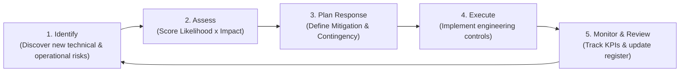
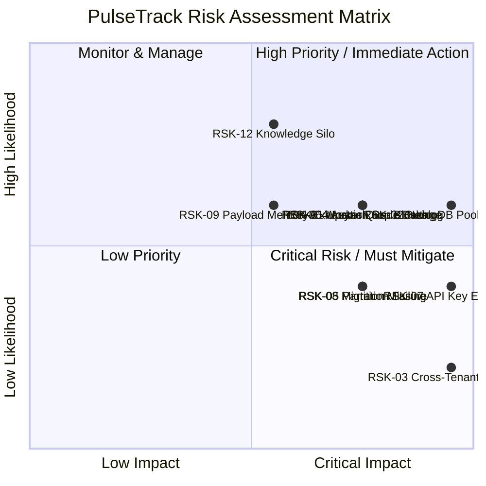

# Risk Register & Risk Management

**Project:** PulseTrack — Event-Collection & Telemetry Backend  
**Author:** Sumukh  
**Version:** 1.0  
**Status:** Approved — Official Project Risk Management Reference  
**Purpose:** Establish the formal risk management framework, quantitative assessment methodology, master risk register, domain-specific risk analyses, response strategies, disaster contingency plans, and RACI ownership matrix for the PulseTrack backend.  
**Audience:** Engineering Managers, Technical Program Managers, Solution Architects, Site Reliability Engineers (SREs), Security Engineers, and Backend Developers.

---

## Table of Contents

1. [Risk Management Overview](#1-risk-management-overview)
2. [Risk Assessment Methodology](#2-risk-assessment-methodology)
3. [Risk Categories](#3-risk-categories)
4. [Master Risk Register](#4-master-risk-register)
5. [Technical Risks](#5-technical-risks)
6. [Database Risks](#6-database-risks)
7. [Redis & Queue Risks](#7-redis--queue-risks)
8. [Security Risks](#8-security-risks)
9. [Performance Risks](#9-performance-risks)
10. [Deployment Risks](#10-deployment-risks)
11. [Operational Risks](#11-operational-risks)
12. [Project Risks](#12-project-risks)
13. [Dependency Risks](#13-dependency-risks)
14. [Risk Matrix](#14-risk-matrix)
15. [Risk Response Plan](#15-risk-response-plan)
16. [Risk Monitoring](#16-risk-monitoring)
17. [Contingency Planning](#17-contingency-planning)
18. [Risk Ownership](#18-risk-ownership)
19. [Risk Review Process](#19-risk-review-process)
20. [Future Risks](#20-future-risks)
21. [Final Risk Checklist](#21-final-risk-checklist)

---

## 1. Risk Management Overview

PulseTrack is a stateless, high-throughput event collection and telemetry backend built with Python 3.12+, FastAPI, SQLAlchemy 2.0 (async), Neon PostgreSQL, Upstash Redis, ARQ background workers, Render, and GitHub Actions.

### 1.1 Risk Philosophy
- **Proactive Identification:** Risks must be identified, evaluated, and mitigated during the pre-implementation phase rather than treated as unexpected production emergencies.
- **Data-Driven Evaluation:** Risk priority is determined using quantitative scoring ($\text{Likelihood} \times \text{Impact}$) rather than subjective impressions.
- **Fail-Open Resiliency:** System design accepts managed infrastructure degradation (e.g., Redis outages) and implements automated fallback paths (NFR-REL-02) to prioritize telemetry ingestion availability.
- **Traceable Ownership:** Every risk has an explicit single owner responsible for monitoring triggers, executing mitigations, and updating risk status.

### 1.2 Risk Lifecycle
The PulseTrack risk management process operates across a continuous five-stage lifecycle:



---

## 2. Risk Assessment Methodology

Risks are evaluated using a standard $5 \times 5$ risk scoring matrix.

### 2.1 Likelihood Scale

| Rating | Classification | Probability | Description |
|---|---|---|---|
| **1** | **Very Low** | $< 10\%$ | Extremely rare; unlikely to occur under normal operating conditions. |
| **2** | **Low** | $10\% - 30\%$ | Unlikely, but possible during specific edge cases or peak loads. |
| **3** | **Medium** | $31\% - 60\%$ | Moderate chance of occurrence during project or production lifecycle. |
| **4** | **High** | $61\% - 85\%$ | Highly likely to occur without explicit proactive engineering controls. |
| **5** | **Very High** | $> 85\%$ | Almost certain to occur during regular operations. |

### 2.2 Impact Scale

| Rating | Classification | Operational & Technical Impact |
|---|---|---|
| **1** | **Very Low** | Minor internal issue; no impact on API SLAs, tenant data, or security posture. |
| **2** | **Low** | Negligible degradation; non-critical endpoint minor delay; no data loss. |
| **3** | **Medium** | Measurable latency increase or localized feature degradation (e.g., cache miss fallback). |
| **4** | **High** | Ingestion pipeline degradation; database pool saturation; tenant rate limit breach. |
| **5** | **Critical** | Complete API ingestion outage; cross-tenant data leak; permanent telemetry loss. |

### 2.3 Risk Scoring & Priority Matrix

$$\text{Risk Score } (S) = \text{Likelihood } (L) \times \text{Impact } (I) \quad (1 \le S \le 25)$$

| Risk Score ($S$) | Priority Level | Action & Threshold Requirement |
|---|---|---|
| **$15 - 25$** | **Critical** | **Immediate Action:** Must be mitigated prior to production launch. Block deployment. |
| **$10 - 14$** | **High** | **High Priority:** Proactive mitigation required in current sprint/phase. |
| **$5 - 9$** | **Medium** | **Managed Risk:** Mitigate or accept with documented operational runbook. |
| **$1 - 4$** | **Low** | **Acceptable:** Monitor periodically; no active code changes required. |

---

## 3. Risk Categories

PulseTrack categorizes risks across 17 technical, operational, and project domains:

1. **Technical Risks:** Software architecture, code modularity, async event loop bugs, type errors.
2. **Architecture Risks:** Coupling between layers, inappropriate abstractions, single points of failure.
3. **Development Risks:** Code complexity, anti-pattern adoption, testing coverage gaps.
4. **Database Risks:** Neon Postgres connection pool exhaustion, slow queries, missing indexes, JSONB bloat.
5. **Performance Risks:** Ingestion latency spikes ($>50\text{ms}$ p95), memory leaks, batch insert delays.
6. **Scalability Risks:** Queue backlogs, worker starvation, connection pool bounds under horizontal autoscale.
7. **Security Risks:** Tenant isolation leaks, raw API key exposure, SQL injection, secret leakage.
8. **Infrastructure Risks:** Managed platform downtime (Render, Neon, Upstash), network partitioning.
9. **Deployment Risks:** Failed Alembic migrations, environment variable validation crashes, render deploy failures.
10. **Testing Risks:** Test suite flakiness, missing integration tests, insufficient coverage ($<80\%$).
11. **Operational Risks:** Alert blackouts, unhandled log spam, slow incident response (MTTR).
12. **Project Management Risks:** Scope creep, schedule slippage, single-developer knowledge silos.
13. **Documentation Risks:** Drift between implementation and architectural specifications.
14. **Dependency Risks:** Upstream breaking changes in FastAPI, SQLAlchemy, Pydantic, or ARQ.
15. **Third-Party Vendor Risks:** Unscheduled outages or rate limits on Neon PostgreSQL or Upstash Redis.
16. **Maintenance Risks:** Technical debt accumulation, outdated dependencies.
17. **Business Risks:** Loss of client telemetry integrity, SLA breaches.

---

## 4. Master Risk Register

The Master Risk Register provides a comprehensive inventory of all identified project risks.

| Risk ID | Title | Category | Affected Components | L | I | Score | Priority | Status | Owner | Trigger | Mitigation Strategy | Contingency Plan | Residual Risk |
|---|---|---|---|---|---|---|---|---|---|---|---|---|---|
| **RSK-01** | Upstash Redis Network Outage | Third-Party / Infra | `app/cache/`, `queue/`, `rate_limiting/` | 3 | 4 | **12** | **High** | Open | Lead SRE | Redis connection timeout / `RedisError` | Implement fail-open fallback to sync Postgres insert (`201 Created`, NFR-REL-02). | Auto-route all ingestion directly to DB; log warning. | Higher DB write latency during outage (~45ms). |
| **RSK-02** | Neon DB Pool Exhaustion | Database | `app/database/session.py`, Repositories | 3 | 5 | **15** | **Critical** | Open | Lead SRE | Connection checkout timeout | Configure `asyncpg` connection pool bounds (`pool_size=10`, `max_overflow=20`). | Scale down Render API instances or increase Postgres max connections. | Requests rejected with HTTP 503 if DB fully maxed. |
| **RSK-03** | Cross-Tenant Data Leak | Security | `app/repositories/`, `services/` | 1 | 5 | **5** | **Medium** | Open | Security Lead | Unscoped SQL query execution | Mandatory `WHERE application_id = :auth_id` on every repository query method. | Immediately revoke API key; audit tenant data; execute security patch. | Zero residual risk assuming 100% query parameterization. |
| **RSK-04** | Blocking I/O on Async Loop | Technical | `app/api/`, `app/services/` | 3 | 4 | **12** | **High** | Open | Lead Dev | Event loop latency spike (>100ms) | Enforce `mypy --strict`, `ruff`, and code review forbidding `requests` or `time.sleep()`. | Identify blocking call via profiler; replace with `httpx` or `asyncio.sleep()`. | Low residual risk with strict code review. |
| **RSK-05** | Monthly Partition Missing | Database | PostgreSQL `events` table | 2 | 4 | **8** | **Medium** | Open | Lead DB Dev | Ingestion insert failure on new month boundary | Pre-create monthly partitions via Alembic migrations and `create_next_partition.py`. | Manually execute `CREATE TABLE events_yYYYYmMM PARTITION OF events...`. | Minimal if automated cron creates partitions 10 days early. |
| **RSK-06** | ARQ Worker Queue Backlog | Scalability | `app/workers/`, Upstash Queue | 3 | 4 | **12** | **High** | Open | DevOps | Queue depth > 10,000 pending items | Autoscale Render Worker Service instances based on queue depth metrics. | Increase ARQ worker `max_jobs` concurrency parameter. | Increased Redis memory utilization during backlog. |
| **RSK-07** | Plaintext API Key Exposure | Security | `app/security/`, Loggers | 2 | 5 | **10** | **High** | Open | Security Lead | Raw API key in logs or database | Store keys exclusively as SHA-256 hashes (`hashlib.sha256`); mask keys in loggers. | Revoke exposed API key immediately; issue new key to client. | Low residual risk with CSPRNG generation & SHA-256 hashing. |
| **RSK-08** | Incompatible Alembic Migration | Deployment | `alembic/versions/`, Render Deploy | 2 | 4 | **8** | **Medium** | Open | Lead Dev | Deploy failure during startup migration | Test `upgrade head` and `downgrade -1` in CI before merge. | Execute `alembic downgrade -1` or deploy previous hotfix release. | Brief deploy window delay during migration rollback. |
| **RSK-09** | Large Payload Memory Exhaustion | Performance | `app/api/v1/events.py` | 3 | 3 | **9** | **Medium** | Open | Lead Dev | Memory spike during request parsing | Limit request body size to 1MB; cap event `metadata` JSONB to 10KB (`MAX_METADATA_BYTES`). | Return HTTP 413 Payload Too Large immediately via Pydantic validator. | Negligible; invalid requests rejected at perimeter. |
| **RSK-10** | Dead-Letter Queue Accumulation | Operational | Upstash Redis `dlq:events` | 2 | 3 | **6** | **Medium** | Open | SRE | `pulsetrack_worker_dlq_events_total` > 50 | Limit worker job retries to 3 attempts with exponential backoff; route failed to DLQ. | Inspect DLQ payload schemas; apply fix script; re-inject into main queue. | Unprocessed invalid payloads stored safely in DLQ. |

---

## 5. Technical Risks

### 5.1 Asynchronous Event Loop Starvation
- **Risk Description:** Executing blocking synchronous functions (e.g., standard `time.sleep()`, synchronous `requests`, heavy CPU calculations) inside FastAPI `async def` route handlers stalls the Uvicorn event loop, blocking all incoming HTTP ingestion traffic across the process.
- **Likelihood:** 3 (Medium) | **Impact:** 4 (High) | **Score:** 12 (High Priority)
- **Mitigation:** Enforce strict coding standards forbidding synchronous I/O. Use `httpx.AsyncClient` for external HTTP requests and `asyncio.sleep` for delays. Perform static analysis via `ruff` and mandatory code review.
- **Contingency:** If event loop stalling occurs in production, profile the event loop using `asyncio` debug mode, isolate the blocking call, and wrap it in `asyncio.to_thread()` or offload to the ARQ worker.

### 5.2 Type Annotation & Schema Drift
- **Risk Description:** Dynamic Python type mismatches between Pydantic request models, ORM entities, and database columns leading to runtime `AttributeError` or `TypeError` crashes during ingestion.
- **Likelihood:** 2 (Low) | **Impact:** 4 (High) | **Score:** 8 (Medium Priority)
- **Mitigation:** Enforce **`mypy --strict`** in the GitHub Actions CI pipeline. Maintain 100% type annotation coverage across all modules.

---

## 6. Database Risks

### 6.1 Neon PostgreSQL Connection Exhaustion
- **Risk Description:** Horizontal autoscaling of Render Web Service instances (1–3 instances) combined with ARQ worker processes exceeding Neon PostgreSQL's max allowed connection ceiling, causing connection timeouts and HTTP 503 errors.
- **Likelihood:** 3 (Medium) | **Impact:** 5 (Critical) | **Score:** 15 (Critical Priority)
- **Mitigation:** Configure explicit pool sizing in `app/database/session.py`:

```python
engine = create_async_engine(
    settings.DATABASE_URL,
    pool_size=10,
    max_overflow=20,
    pool_pre_ping=True,
    pool_recycle=1800,
)
```

- **Contingency:** In an emergency, scale down Render Web Service instance counts or increase Neon max connection parameters.

### 6.2 Monthly Range Partition Missing
- **Risk Description:** The `events` table is range-partitioned by `occurred_at` on a monthly basis. If a new month begins without an existing child partition, PostgreSQL rejects all `INSERT` queries for that month.
- **Likelihood:** 2 (Low) | **Impact:** 4 (High) | **Score:** 8 (Medium Priority)
- **Mitigation:** Automate partition creation via `app/scripts/create_next_partition.py` executed via a cron job on the 20th of every month.

---

## 7. Redis & Queue Risks

### 7.1 Upstash Redis Unavailability (NFR-REL-02)
- **Risk Description:** Upstash Redis network failure or authentication outage preventing event enqueueing, rate limiting, and cache lookups.
- **Likelihood:** 3 (Medium) | **Impact:** 4 (High) | **Score:** 12 (High Priority)
- **Mitigation:** Implement automated **Fail-Open Resiliency** in `IngestionService`:

```python
try:
    await event_queue.enqueue(event_data)
    return EventIngestResponse(status="queued", code=202)
except RedisError as err:
    logger.warning("Redis unavailable. Falling back to sync Postgres insert", error=str(err))
    event_id = await event_repo.create_sync_fallback(event_data)
    return EventIngestResponse(status="stored", id=event_id, code=201)
```

---

## 8. Security Risks

### 8.1 Cross-Tenant Data Access
- **Risk Description:** A query in `app/repositories/` failing to filter by `application_id`, allowing one tenant to read or alter another tenant's events or metrics.
- **Likelihood:** 1 (Very Low) | **Impact:** 5 (Critical) | **Score:** 5 (Medium Priority)
- **Mitigation:** Enforce query-layer tenant scoping on EVERY repository method using the authenticated `Application` UUID resolved from `X-API-Key`.

---

## 9. Performance Risks

### 9.1 Ingestion Write Path Latency Spike (>50ms p95)
- **Risk Description:** Ingestion endpoint (`POST /v1/events`) latency exceeding the 50ms p95 SLA requirement defined in `PulseTrack_SRD.md`.
- **Likelihood:** 3 (Medium) | **Impact:** 3 (Medium) | **Score:** 9 (Medium Priority)
- **Mitigation:** Utilize O(1) Redis cache-aside lookups for API keys (TTL 300s) and asynchronous Redis enqueueing (`202 Accepted`).

---

## 10. Deployment Risks

### 10.1 Environment Variable Validation Crash
- **Risk Description:** Deployment of a new Render service revision failing to start due to missing or malformed environment variables (e.g., `DATABASE_URL`).
- **Likelihood:** 2 (Low) | **Impact:** 4 (High) | **Score:** 8 (Medium Priority)
- **Mitigation:** Use `pydantic-settings` to validate all configuration on process startup (`app/core/config.py`). Fail fast during container initialization.

---

## 11. Operational Risks

### 11.1 Observability Blackout
- **Risk Description:** Failure of Prometheus metric scraping or log collection masking production errors during an incident.
- **Likelihood:** 2 (Low) | **Impact:** 4 (High) | **Score:** 8 (Medium Priority)
- **Mitigation:** Monitor `GET /v1/health` probes continuously via external uptime monitors.

---

## 12. Project Risks

### 12.1 Single-Developer Knowledge Concentration
- **Risk Description:** Key architectural decisions, deployment steps, and recovery procedures locked in a single engineer's head.
- **Likelihood:** 4 (High) | **Impact:** 3 (Medium) | **Score:** 12 (High Priority)
- **Mitigation:** Maintain complete, implementation-ready documentation across all 14 project specifications (PRD, SRD, Architecture, Coding Standards, Deployment Guide, Monitoring Design, Risk Register).

---

## 13. Dependency Risks

### 13.1 Third-Party Managed Platform Outages
- **Risk Evaluation for Managed Infrastructure:**

| Vendor / Library | Dependency Role | Lock-in / Outage Risk | Risk Mitigation |
|---|---|---|---|
| **Neon PostgreSQL** | Primary System of Record | Serverless DB Outage | Standard PostgreSQL DDL; easily portable to AWS RDS / Managed Postgres. |
| **Upstash Redis** | Cache / Queue / Limiter | Serverless Redis Outage | Fail-open DB fallback (NFR-REL-02); standard Redis protocol. |
| **Render** | Web & Worker Compute | Hosting Outage | Multi-stage Docker container buildable on any container runtime (AWS ECS, Fly.io). |
| **FastAPI / SQLAlchemy** | Framework & ORM | Version Breakage | Pin minor version bounds in `pyproject.toml`. |

---

## 14. Risk Matrix

The visual Risk Matrix maps identified risks according to Likelihood vs. Impact.



---

## 15. Risk Response Plan

PulseTrack applies five standardized risk response strategies:

1. **Avoid:** Eliminate the risk by changing design choices (e.g., avoid raw string SQL formatting to eliminate SQL injection).
2. **Reduce (Mitigate):** Implement engineering controls to reduce Likelihood or Impact (e.g., Redis fail-open fallback to reduce outage impact).
3. **Transfer:** Shift risk to managed third parties (e.g., Neon for database backups & PITR; Render for TLS certificate management).
4. **Accept:** Acknowledge residual risk when mitigation cost exceeds risk impact (e.g., accept higher latency during Redis fail-open fallback).
5. **Monitor:** Track metrics and log triggers for low/medium risks without immediate code changes.

---

## 16. Risk Monitoring

- **Weekly Risk Review:** Evaluate open risks and residual scores.
- **Automated Risk Metrics:** Prometheus alerts trigger automatically on key thresholds (e.g., `pulsetrack_db_connection_pool_usage > 80%`).
- **Post-Incident Risk Updates:** Update risk likelihood and impact ratings following any production incident.

---

## 17. Contingency Planning

Detailed step-by-step contingency runbooks exist for major failure scenarios:

### 17.1 Disaster Contingency Runbook Matrix

| Disaster Scenario | Trigger Condition | Step-by-Step Contingency Action |
|---|---|---|
| **Neon DB Crash** | `/v1/health` returns `postgres: disconnected` | 1. Check Neon status page.<br/>2. If database corrupted, initiate Neon Point-In-Time Recovery (PITR) to latest clean timestamp.<br/>3. Update `DATABASE_URL` in Render. |
| **Redis Outage** | Upstash connection timeout | 1. Fail-open automatically routes events to Postgres (`201 Created`).<br/>2. Verify ingestion latency.<br/>3. Restore Upstash token upon recovery. |
| **Worker Crash** | ARQ worker service stopped | 1. Events buffer safely in Upstash Redis queue.<br/>2. Restart Render worker service.<br/>3. Workers resume dequeuing without data loss. |
| **Bad Deployment** | HTTP 5xx error spike after deploy | 1. Open Render Dashboard -> Deploys.<br/>2. Click **Rollback to this deploy** on previous commit.<br/>3. Execute `alembic downgrade -1` if DB schema changed. |

---

## 18. Risk Ownership

Accountability for risk management is assigned via a **RACI Matrix**:

| Category | Lead Dev | Lead SRE / DevOps | Security Lead | Product Owner |
|---|---|---|---|---|
| **Technical & Async Code Risks** | **Accountable** | Consulted | Informed | Informed |
| **Database & Pool Sizing** | Responsible | **Accountable** | Informed | Informed |
| **Redis & Fail-Open Resiliency** | Responsible | **Accountable** | Informed | Informed |
| **Security & Tenant Isolation** | Responsible | Consulted | **Accountable** | Informed |
| **Deployment & CI/CD Pipelines** | Consulted | **Accountable** | Informed | Informed |
| **Project & Roadmap Schedule** | Consulted | Informed | Informed | **Accountable** |

*(Legend: **A** = Accountable, **R** = Responsible, **C** = Consulted, **I** = Informed)*

---

## 19. Risk Review Process

1. **Cadence:** Bi-weekly engineering risk review.
2. **Closure Criteria:** A risk is marked **Closed** when the underlying feature is decommissioned or engineering controls reduce Likelihood and Impact to Low ($S \le 4$).
3. **Change Control:** Architectural changes impacting risk profiles require an updated Architecture Decision Record (ADR).

---

## 20. Future Risks

As PulseTrack scales beyond Roadmap Phase 2:

1. **High Ingestion Volume (>50k events/sec):** Redis queue buffers may hit throughput bounds, requiring migration from Redis to Apache Kafka or AWS Kinesis.
2. **Multi-Region Scaling:** Expanding beyond a single region requires revisiting `BIGINT IDENTITY` for `events.id` (ADR-001) in favor of composite regional keys.
3. **Microservices Decoupling:** Splitting `services/ingestion_service.py` into a separate microservice will introduce distributed network RPC risks between services.

---

## 21. Final Risk Checklist

Pre-flight readiness checklist prior to production launch:

- [ ] All **Critical** ($S \ge 15$) and **High** ($S \ge 10$) risks mitigated or accepted
- [ ] Redis fail-open ingestion fallback (NFR-REL-02) implemented and tested
- [ ] Database connection pool bounds (`asyncpg`) configured and load-tested
- [ ] Mandatory tenant isolation (`WHERE application_id = ...`) verified across all repositories
- [ ] CSPRNG API key generation and SHA-256 key hashing verified
- [ ] Automated monthly database partition creation verified
- [ ] Multi-stage Docker build and non-root execution verified
- [ ] Health check endpoint (`GET /v1/health`) probes active
- [ ] Prometheus metrics (`GET /metrics`) exposing queue and request metrics
- [ ] Disaster recovery contingency runbooks documented and verified
- [ ] Risk owners assigned across all open risks

---

*End of document.*
