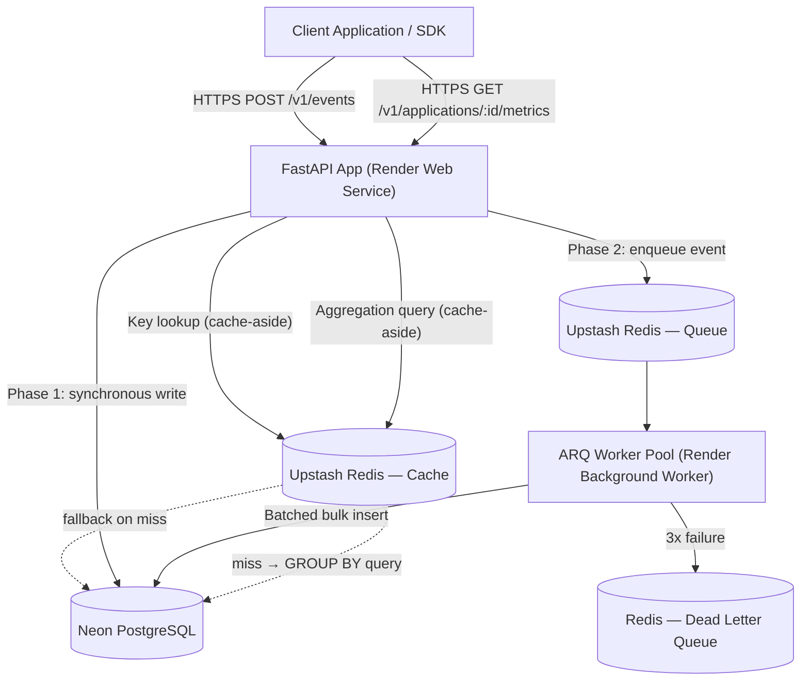
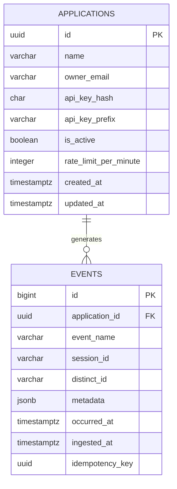

# PulseTrack — Software Requirements Specification (SRD)

**Project:** PulseTrack — Event-Collection & Telemetry Backend
**Author:** Sumukh
**Version:** 1.0
**Status:** Draft
**Companion Document:** `PulseTrack_PRD.md` (defines business rationale, phasing, and API contracts referenced here)
**Format Basis:** IEEE 830 / ISO-IEC-IEEE 29148 conventions, adapted for a portfolio-scale system

---

## 1. Introduction

### 1.1 Purpose
This SRD translates the product intent defined in the PRD into a precise, verifiable engineering specification. It defines *what the system must do* (functional requirements), *how well it must do it* (non-functional requirements), and *how it interfaces* with clients and infrastructure — at a level of detail sufficient for independent implementation and test-case derivation.

### 1.2 Document Conventions
- **Requirement ID scheme:** `FR-<module>-<seq>` for functional requirements, `NFR-<category>-<seq>` for non-functional, `UC-<seq>` for use cases.
- **Priority levels (MoSCoW):**
  - **MUST** — blocking for Phase 1 sign-off.
  - **SHOULD** — Phase 2 core scope; system is incomplete without it but Phase 1 can ship without it.
  - **COULD** — stretch scope, explicitly out of the two defined phases.
- **Phase tag:** Each requirement is tagged `Phase 1` or `Phase 2` per the PRD's scope split.

### 1.3 Intended Audience
Backend engineers implementing the system, QA/test authors deriving test cases, and technical reviewers (recruiters/interviewers) auditing engineering rigor.

### 1.4 Project Scope
PulseTrack is a stateless, horizontally-scalable HTTP API for ingesting and aggregating custom telemetry events on behalf of registered client applications. Out of scope: any frontend dashboard, SDK distribution, or multi-region deployment.

### 1.5 Definitions, Acronyms, Abbreviations

| Term | Definition |
|---|---|
| **Application** | A tenant registered in PulseTrack, identified by an API key, on whose behalf events are ingested |
| **Event** | A single telemetry record (e.g., `button_click`) submitted by a client |
| **Distinct ID** | Client-supplied identifier for a user/session-independent actor (anonymous or authenticated) |
| **Cache-aside** | Pattern where the application checks cache first, falls back to the source of truth on a miss, and populates the cache afterward |
| **DLQ** | Dead-Letter Queue — holds messages that failed processing after exhausting retries |
| **p95 / p99** | 95th / 99th percentile latency across a measured request population |

### 1.6 References
- `PulseTrack_PRD.md` — Sections 3 (Scope), 5 (Data Model), 6 (API Endpoints)
- IEEE 830-1998, *Recommended Practice for Software Requirements Specifications*
- PostgreSQL 16 documentation (JSONB, declarative partitioning)
- ARQ documentation (Redis-based async task queue for Python)

---

## 2. Overall Description

### 2.1 Product Perspective
PulseTrack is a standalone backend service, not a component of a larger existing system. It exposes a single public interface (REST/JSON over HTTPS) and depends on two managed external systems: Neon PostgreSQL (system of record) and Upstash Redis (cache, queue, and rate-limit state store, introduced in Phase 2).

### 2.2 Product Functions (Summary)
1. Register client applications and issue scoped API keys.
2. Authenticate and authorize inbound requests per application.
3. Accept, validate, and persist telemetry events (single and batch).
4. Aggregate stored events into time-bucketed counts on demand.
5. *(Phase 2)* Enforce per-application rate limits.
6. *(Phase 2)* Decouple ingestion latency from persistence latency via an async queue and worker pool.
7. *(Phase 2)* Cache hot reads (key resolution, aggregation results) to reduce database load.

### 2.3 User Classes and Characteristics

| User Class | Description | Technical Proficiency |
|---|---|---|
| **Application Owner** | A developer who registers an application and integrates the ingestion API into their product | High — expects REST/JSON conventions, reads OpenAPI docs |
| **Client Runtime** | The non-human caller (browser SDK snippet, mobile app, backend service) that actually issues ingestion requests | N/A — machine actor, must receive machine-parseable errors |
| **System Operator** | The author, monitoring deployment health, logs, and metrics | High — direct access to Render/Neon/Upstash dashboards |

### 2.4 Operating Environment
- **Runtime:** Python 3.11+, ASGI via Uvicorn/FastAPI
- **Hosting:** Render (Web Service for API, Background Worker for ARQ in Phase 2)
- **Database:** Neon PostgreSQL (managed, serverless, connection pooling via PgBouncer-compatible driver)
- **Cache/Queue:** Upstash Redis (managed, REST + TCP protocol support)
- **Client compatibility:** Any HTTP/1.1+ capable client; no browser or OS constraints since PulseTrack itself ships no frontend

### 2.5 Design and Implementation Constraints
- All database I/O MUST use SQLAlchemy 2.0's async engine (`asyncpg` driver) — no blocking DB calls in the request path.
- The API MUST be stateless: no in-memory session or request state that would prevent horizontal scaling across Render instances.
- Given Upstash's connection-count constraints on lower tiers, Redis connections MUST be pooled/reused rather than opened per-request.
- Schema migrations MUST be managed exclusively through Alembic — no manual DDL against Neon.

### 2.6 Assumptions and Dependencies
- Neon and Upstash free/hobby tiers provide sufficient throughput for demonstration-scale load testing (explicitly *not* production SaaS scale).
- Client applications supply `occurred_at` in valid ISO 8601 with timezone information; the system does not attempt clock-skew correction.
- Network connectivity between Render and both Neon and Upstash is assumed reliable; NFR-REL requirements define behavior when this assumption breaks.

---

## 3. Functional Requirements

### 3.1 Application Management (`FR-APP`)

| ID | Requirement | Priority | Phase |
|---|---|---|---|
| FR-APP-01 | System MUST create an application record via `POST /v1/applications` given a unique `name` and valid `owner_email` | MUST | 1 |
| FR-APP-02 | System MUST generate a cryptographically random API key (≥256 bits entropy) on application creation | MUST | 1 |
| FR-APP-03 | System MUST persist only the SHA-256 hash of the API key; the raw key is returned exactly once and never stored in plaintext | MUST | 1 |
| FR-APP-04 | System MUST reject creation requests with a malformed or already-registered `owner_email` (HTTP 422/409) | MUST | 1 |
| FR-APP-05 | System SHOULD allow key rotation via `POST /v1/applications/{id}/keys/rotate`, immediately invalidating the prior key | SHOULD | 2 |
| FR-APP-06 | System SHOULD support deactivating an application (`is_active=false`) without deleting historical event data | SHOULD | 2 |

### 3.2 Authentication & Authorization (`FR-AUTH`)

| ID | Requirement | Priority | Phase |
|---|---|---|---|
| FR-AUTH-01 | System MUST authenticate every ingestion and metrics request via the `X-API-Key` header | MUST | 1 |
| FR-AUTH-02 | System MUST return HTTP 401 with a structured error body for missing/unrecognized keys | MUST | 1 |
| FR-AUTH-03 | Key-to-application resolution MUST be indexed for O(log n) worst-case Postgres lookup in Phase 1 | MUST | 1 |
| FR-AUTH-04 | System SHOULD cache successful key resolutions in Redis with a bounded TTL (≤5 min) | SHOULD | 2 |
| FR-AUTH-05 | System MUST invalidate any cached key resolution immediately on rotation or deactivation | MUST | 2 |

### 3.3 Event Ingestion (`FR-ING`)

| ID | Requirement | Priority | Phase |
|---|---|---|---|
| FR-ING-01 | System MUST accept a single event via `POST /v1/events` with `event_name` and `occurred_at` required; `session_id`, `distinct_id`, `metadata` optional | MUST | 1 |
| FR-ING-02 | System MUST validate `event_name` as a non-empty string ≤100 characters | MUST | 1 |
| FR-ING-03 | System MUST reject events whose serialized `metadata` exceeds 8KB (HTTP 422) | MUST | 1 |
| FR-ING-04 | System MUST stamp each persisted event with a server-generated `ingested_at`, distinct from client-supplied `occurred_at` | MUST | 1 |
| FR-ING-05 | System MUST return HTTP 201 with the persisted event ID on synchronous success (Phase 1 write path) | MUST | 1 |
| FR-ING-06 | System SHOULD accept `POST /v1/events/batch` for up to 500 events per request, validating and reporting per-item failures independently | SHOULD | 2 |
| FR-ING-07 | System SHOULD enqueue validated events to Redis and return HTTP 202 without waiting on database commit | SHOULD | 2 |
| FR-ING-08 | System SHOULD honor an optional `Idempotency-Key` header; a repeated key for the same application within 24h MUST NOT create a duplicate event | SHOULD | 2 |

### 3.4 Metrics Aggregation (`FR-AGG`)

| ID | Requirement | Priority | Phase |
|---|---|---|---|
| FR-AGG-01 | System MUST expose `GET /v1/applications/{id}/metrics` accepting `event_name`, `start_date`, `end_date`, `granularity` (`hour`\|`day`) | MUST | 1 |
| FR-AGG-02 | System MUST return counts grouped by time bucket in ascending chronological order | MUST | 1 |
| FR-AGG-03 | System MUST return HTTP 400 when `start_date > end_date` | MUST | 1 |
| FR-AGG-04 | System MUST scope every aggregation query to the authenticated application's own `application_id`; cross-tenant access MUST be impossible | MUST | 1 |
| FR-AGG-05 | System SHOULD cache results in Redis keyed by `(application_id, event_name, date_range, granularity)` with a 30–60s TTL | SHOULD | 2 |
| FR-AGG-06 | System SHOULD report cache status (`cache_hit: true|false`) in the response body | SHOULD | 2 |

### 3.5 Rate Limiting (`FR-RL`) — Phase 2

| ID | Requirement | Priority | Phase |
|---|---|---|---|
| FR-RL-01 | System SHOULD enforce a configurable per-application request-rate limit (default 600 req/min) | SHOULD | 2 |
| FR-RL-02 | Rate-limit counters MUST be updated atomically (Lua script or `MULTI`/`EXEC`) to prevent race conditions under concurrency | SHOULD | 2 |
| FR-RL-03 | System MUST return HTTP 429 with a `Retry-After` header when a limit is exceeded | SHOULD | 2 |

### 3.6 Caching Layer (`FR-CACHE`) — Phase 2

| ID | Requirement | Priority | Phase |
|---|---|---|---|
| FR-CACHE-01 | System SHOULD apply cache-aside for key resolution and metrics aggregation | SHOULD | 2 |
| FR-CACHE-02 | System MUST fall back to direct Postgres queries without failing the request if Redis is unreachable | SHOULD | 2 |

### 3.7 Asynchronous Processing (`FR-ASYNC`) — Phase 2

| ID | Requirement | Priority | Phase |
|---|---|---|---|
| FR-ASYNC-01 | Queued events SHOULD be consumed by one or more independent ARQ worker processes | SHOULD | 2 |
| FR-ASYNC-02 | Workers SHOULD batch multiple events into a single bulk-insert operation before committing | SHOULD | 2 |
| FR-ASYNC-03 | Events failing persistence after 3 retries MUST be routed to a DLQ for manual inspection/replay | SHOULD | 2 |

### 3.8 Observability (`FR-OBS`)

| ID | Requirement | Priority | Phase |
|---|---|---|---|
| FR-OBS-01 | Every request MUST be logged in structured JSON with a unique trace ID, method, path, status, and latency | MUST | 1 |
| FR-OBS-02 | System MUST expose `GET /v1/health` reporting API and database connectivity status | MUST | 1 |
| FR-OBS-03 | System SHOULD expose a Prometheus-compatible `GET /metrics` endpoint reporting request counts, latency histograms, and queue depth | SHOULD | 2 |

---

## 4. Use Case Specifications

### UC-1: Register a New Application
- **Actor:** Application Owner
- **Preconditions:** None
- **Main Flow:** Owner submits `name` + `owner_email` → system validates uniqueness → system generates API key → system persists hash + prefix → system returns raw key once.
- **Exception Flow:** Duplicate `owner_email` → HTTP 409 with `code: "email_already_registered"`.
- **Postconditions:** A new `applications` row exists; owner possesses the only copy of the raw key.

### UC-2: Ingest a Telemetry Event (Phase 1 — Synchronous)
- **Actor:** Client Runtime
- **Preconditions:** Caller holds a valid, active API key.
- **Main Flow:** Client sends `POST /v1/events` → middleware resolves key → payload validated against schema → event committed to Postgres → HTTP 201 returned with event ID.
- **Exception Flow:** Invalid key → 401. Oversized `metadata` → 422. DB write failure → 500 with retryable error code.
- **Postconditions:** Event row exists and is immediately queryable via the metrics endpoint.

### UC-2b: Ingest a Telemetry Event (Phase 2 — Asynchronous)
- **Actor:** Client Runtime
- **Preconditions:** Same as UC-2; queue infrastructure is healthy.
- **Main Flow:** Client sends `POST /v1/events` → key resolved via cache → payload validated → event pushed to Redis queue → HTTP 202 returned immediately → ARQ worker later dequeues, batches, and bulk-inserts.
- **Exception Flow:** Redis unreachable → system falls back to UC-2's synchronous path (FR-CACHE-02). Worker insert fails 3x → event moved to DLQ (FR-ASYNC-03).
- **Postconditions:** Event is durably queryable within a bounded delay (not immediately, unlike UC-2).

### UC-3: Retrieve Aggregated Metrics
- **Actor:** Application Owner (via dashboard, script, or `curl`)
- **Preconditions:** Caller holds a valid API key for the application being queried.
- **Main Flow:** Client sends `GET /v1/applications/{id}/metrics?...` → (Phase 2) cache checked → on miss, Postgres `GROUP BY` query executed and bucketed → result returned, optionally cached.
- **Exception Flow:** `start_date > end_date` → 400. Querying another application's ID with a mismatched key → 403.
- **Postconditions:** No state change; read-only operation.

### UC-4: Enforce Rate Limit (Phase 2)
- **Actor:** Client Runtime
- **Preconditions:** Application has an assigned `rate_limit_per_minute`.
- **Main Flow:** Each request atomically increments a Redis counter for the current window → if under limit, request proceeds → if at/over limit, request is rejected.
- **Exception Flow:** Redis unavailable → rate limiting is bypassed (fail-open) and logged, per FR-CACHE-02's graceful-degradation principle.
- **Postconditions:** Counter state reflects the current window's request count.

### UC-5: Recover a Failed Batch Insert (Phase 2)
- **Actor:** System Operator
- **Preconditions:** A worker has exhausted 3 retry attempts on a batch.
- **Main Flow:** Worker moves the failed batch to the DLQ list in Redis → operator inspects DLQ via a CLI/script → operator manually replays or discards.
- **Postconditions:** No data is silently lost; failure is visible and actionable.

---

## 5. External Interface Requirements

### 5.1 User Interfaces
None. PulseTrack ships no frontend. The only human-facing surface is the auto-generated Swagger UI (`/docs`) and ReDoc (`/redoc`) for API exploration.

### 5.2 API Interfaces (Condensed Contract)

| Endpoint | Method | Auth | Phase |
|---|---|---|---|
| `/v1/applications` | POST | None (bootstrap) | 1 |
| `/v1/applications/{id}/keys/rotate` | POST | API Key | 2 |
| `/v1/events` | POST | API Key | 1 |
| `/v1/events/batch` | POST | API Key | 2 |
| `/v1/applications/{id}/metrics` | GET | API Key | 1 |
| `/v1/health` | GET | None | 1 |
| `/metrics` (Prometheus) | GET | Internal/Operator only | 2 |

> Full request/response payload schemas are specified in `PulseTrack_PRD.md`, Section 6. This SRD treats those payloads as the binding interface contract — implementers should treat the PRD's JSON examples as normative.

### 5.3 Software Interfaces

| Dependency | Interface | Notes |
|---|---|---|
| **Neon PostgreSQL** | `asyncpg` via SQLAlchemy 2.0 async engine | Connection pooling required; Neon's serverless auto-suspend means the first query after idle may incur cold-start latency — must be accounted for in NFR-PERF verification |
| **Upstash Redis** | `redis-py` (async) or Upstash REST API | Used for: key cache, rate-limit counters, ingestion queue, aggregation cache, DLQ (all Phase 2) |
| **ARQ** | Python async task queue library, Redis-backed | Runs as a separate Render Background Worker process, decoupled from the API's request/response cycle |
| **Render** | Platform-as-a-Service | Provides process supervision, autoscaling (web service), and environment variable injection for secrets |

### 5.4 Communication Interfaces
- All traffic MUST be served over HTTPS (TLS 1.2+); Render terminates TLS at the edge.
- Request/response bodies MUST use `application/json` exclusively — no XML, form-encoded, or multipart support in scope.
- No WebSocket, gRPC, or streaming interface is in scope for either phase.

---

## 6. Non-Functional Requirements

| ID | Category | Requirement | Target | Verification Method |
|---|---|---|---|---|
| NFR-PERF-01 | Performance | Ingest latency, Phase 1 | p95 < 100ms (sync write incl.) | Load test (Locust/k6) against staging |
| NFR-PERF-02 | Performance | Ingest latency, Phase 2 | p95 < 50ms, p99 < 100ms | Load test; API-response time only, excludes async DB write |
| NFR-PERF-03 | Performance | Aggregation latency | p95 < 200ms (cache miss), p95 < 20ms (cache hit) | Load test with cache warm/cold scenarios |
| NFR-SCAL-01 | Scalability | Sustained throughput | ≥500 events/sec, single instance; ≥2,000 events/sec autoscaled | Sustained load test, 10-minute soak |
| NFR-SCAL-02 | Scalability | Payload limits | `metadata` ≤8KB; batch ≤500 events/request | Boundary/negative test cases |
| NFR-REL-01 | Reliability | Delivery semantics | At-least-once; duplicates resolvable via idempotency key | Chaos test: kill worker mid-batch, verify no loss |
| NFR-REL-02 | Reliability | Redis dependency failure | API continues serving via direct-DB fallback, no 5xx spike | Fault-injection test: block Redis connectivity |
| NFR-AVAIL-01 | Availability | Uptime target | 99.5%, single-region | Uptime monitor (e.g., UptimeRobot) over a 30-day window |
| NFR-SEC-01 | Security | Key storage | API keys hashed (SHA-256) at rest; never logged in plaintext | Code review + log audit |
| NFR-SEC-02 | Security | Transport | TLS-only in production; HTTP requests redirected/rejected | Automated scan (e.g., `curl` over plain HTTP expects redirect/reject) |
| NFR-SEC-03 | Security | Tenant isolation | No query path may return another application's events | Integration test: cross-tenant access attempt returns 403/empty |
| NFR-MAINT-01 | Maintainability | Schema evolution | All schema changes via Alembic migrations, reversible | CI check: migration up/down round-trip |
| NFR-MAINT-02 | Maintainability | Test coverage | ≥80% line coverage on core application logic | `pytest --cov` in CI, threshold gate |
| NFR-PORT-01 | Portability | Environment parity | Local (`docker-compose`) and Render environments behave identically for core flows | Manual/CI smoke test in both environments |

---

## 7. System Architecture Overview

**Component responsibilities:**
- **FastAPI App:** Request validation, authentication, routing; stateless and horizontally scalable.
- **Redis Cache:** Key resolution + aggregation result cache (Phase 2).
- **Redis Queue:** Durable buffer decoupling ingestion acknowledgment from persistence (Phase 2).
- **ARQ Worker Pool:** Independent process(es) performing batched writes and DLQ routing (Phase 2).
- **Neon PostgreSQL:** System of record for `applications` and `events`.

---

## 8. Data Requirements

**Integrity constraints:**
- `events.application_id` MUST reference an existing `applications.id`; deletes cascade (`ON DELETE CASCADE`).
- `applications.api_key_hash` MUST be unique across the table.
- `(application_id, idempotency_key)` MUST be unique where `idempotency_key IS NOT NULL` (Phase 2).

**Retention:** Raw events retained 90 days by default; Phase 2's monthly partitioning allows retention enforcement via `DETACH PARTITION` rather than row-by-row `DELETE`, keeping the operation O(1) relative to partition size.

**Full DDL** is normative in `PulseTrack_PRD.md`, Section 5 — this SRD's ER diagram is descriptive, not a substitute for the DDL.

---

## 9. Other Requirements

- **Licensing:** Repository SHOULD carry an MIT license, consistent with its role as a portfolio/reference project.
- **Privacy-by-design:** The schema does not mandate any PII field; `distinct_id` and `metadata` are opaque to the system and the README should document that PII inclusion is the integrating client's responsibility, not PulseTrack's.
- **Audit logging:** Application creation and key rotation events SHOULD be logged with operator/owner attribution for traceability, even though PulseTrack has no built-in admin UI.

---

## Appendix A: Requirements Traceability Matrix

| Requirement ID | PRD Section | Verified By |
|---|---|---|
| FR-APP-01 – 04 | §3 Phase 1, §6.1 | Integration tests, `test_applications.py` |
| FR-APP-05 – 06 | §3 Phase 2 | Integration tests, `test_key_rotation.py` |
| FR-AUTH-01 – 05 | §3, §6.2 | Auth middleware unit tests |
| FR-ING-01 – 08 | §3, §5, §6.2 | `test_ingestion.py`, load test report |
| FR-AGG-01 – 06 | §3, §6.3 | `test_metrics.py`, cache-hit assertions |
| FR-RL-01 – 03 | §3 Phase 2 | Rate-limit integration test, 429 assertions |
| FR-ASYNC-01 – 03 | §3 Phase 2 | Worker unit tests, chaos test (kill mid-batch) |
| FR-OBS-01 – 03 | §7 Definition of Done | Log inspection, `/health` and `/metrics` smoke tests |
| NFR-PERF-01 – 03 | §4 | Locust/k6 report checked into repo |
| NFR-SEC-01 – 03 | §4 | Code review checklist, cross-tenant test |

---

*End of document.*
