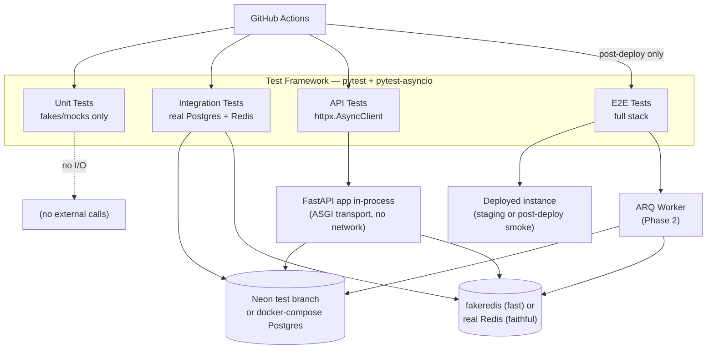
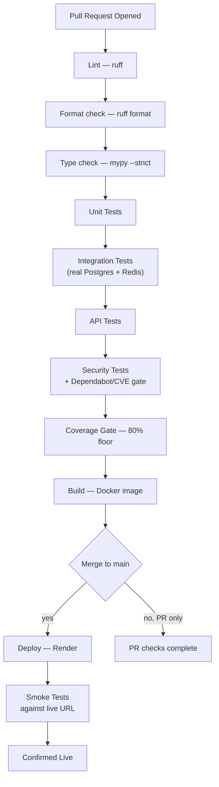

# Testing Strategy

**Project:** PulseTrack — Event-Collection & Telemetry Backend
**Author:** Sumukh
**Version:** 1.0
**Status:** Pre-implementation testing blueprint, consistent with all prior PulseTrack documentation (PRD, SRD, API Design, Architecture, Database Design, Folder Structure, Security Design, Sequence Diagrams, ADRs, Development Roadmap)
**Purpose:** What gets tested, why, how, when, by whom, and what "done" measurably means — before implementation begins, so testing is designed alongside the system rather than retrofitted onto it.

---

## Table of Contents

1. [Testing Objectives](#1-testing-objectives)
2. [Testing Principles](#2-testing-principles)
3. [Testing Scope](#3-testing-scope)
4. [Test Architecture](#4-test-architecture)
5. [Testing Levels](#5-testing-levels)
6. [Unit Testing Strategy](#6-unit-testing-strategy)
7. [Integration Testing Strategy](#7-integration-testing-strategy)
8. [API Testing Strategy](#8-api-testing-strategy)
9. [Database Testing](#9-database-testing)
10. [Redis & Queue Testing](#10-redis--queue-testing)
11. [Worker Testing](#11-worker-testing)
12. [Security Testing](#12-security-testing)
13. [Performance Testing](#13-performance-testing)
14. [Test Data Management](#14-test-data-management)
15. [Test Environment Strategy](#15-test-environment-strategy)
16. [Automation Strategy](#16-automation-strategy)
17. [Test Folder Structure](#17-test-folder-structure)
18. [CI/CD Testing Pipeline](#18-cicd-testing-pipeline)
19. [Coverage Strategy](#19-coverage-strategy)
20. [Test Matrix](#20-test-matrix)
21. [Defect Management](#21-defect-management)
22. [Risks](#22-risks)
23. [Testing Roadmap](#23-testing-roadmap)
24. [Success Criteria](#24-success-criteria)
25. [Final Testing Checklist](#25-final-testing-checklist)

---

## 1. Testing Objectives

| Objective | Why it matters for PulseTrack specifically |
|---|---|
| **Functional correctness** | The product's entire value is that `/metrics` accurately reflects ingested events. A correctness bug here isn't a crash — it's silently wrong numbers, which is worse because nothing signals the failure |
| **Reliability** | `PulseTrack_SRD.md` NFR-REL-01 requires at-least-once delivery; testing must prove this holds under worker crashes and Redis outages, not just under happy-path conditions |
| **Performance** | Concrete, numeric NFR targets exist (`<50ms` p95 ingest, `<200ms` aggregation) — performance testing exists to produce a pass/fail verdict against a real number, not a vague "feels fast" impression |
| **Security** | The Security Design Document's threat model (§3) is a list of specific, named risks — testing exists to turn each one into a verifiable pass/fail, not leave it as a design intention |
| **Scalability** | `PulseTrack_SRD.md` NFR-SCAL-01's 500–2,000 events/sec target is a claim about Roadmap Phase 13's Redis/ARQ additions — testing exists to prove the claim, using the Phase 12 baseline the Development Roadmap explicitly built for this purpose |
| **Regression prevention** | Two-table schema, but a genuinely deep layering (`api → services → repositories → models`) — a change three layers down (e.g. an index tweak) can silently break aggregation correctness without regression tests to catch it |
| **Maintainability** | `PulseTrack_Folder_Structure.md`'s import rules (§10) are only real if tests enforce that a service never accidentally imports FastAPI — some of this is enforced by tests, not just code review |
| **Deployment confidence** | Given a solo developer with no second reviewer, the test suite *is* the second opinion — a green CI run is the closest thing this project has to a code review sign-off |

---

## 2. Testing Principles

| Principle | Why selected for PulseTrack |
|---|---|
| **Shift-left testing** | `rules.md` R-TEST-01 already requires a test with every new endpoint — this document formalizes what was already a stated engineering rule, not a new idea |
| **Test pyramid** | Given the layered architecture (`PulseTrack_Folder_Structure.md` §6), the pyramid shape falls out naturally: many fast unit tests on `services/`/`repositories/`, fewer integration tests through real Postgres/Redis, fewer still end-to-end tests through the full HTTP stack |
| **Automation-first** | A solo developer has no manual QA team — anything not automated effectively doesn't get re-checked after the first time, since there's no one else to run it by hand |
| **Risk-based testing** | Test depth is proportional to blast radius: `security/api_key.py` (§4 of the Security Design Document) gets exhaustive testing; a one-line date-bucket helper in `utils/` gets a handful of cases — not uniform effort everywhere |
| **Continuous testing** | Tests run on every PR (`PulseTrack_Development_Roadmap.md` §14), not batched into a pre-release testing phase — a bug caught the same day it's introduced costs a fraction of one caught a week later, three layers removed from its cause |
| **Repeatability** | A test that passes locally and fails in CI (or vice versa) is worse than useless — it teaches the team to distrust CI, which defeats §16's entire premise. Concretely: no test may depend on wall-clock time without explicit time control, and no test may depend on execution order |
| **Isolation** | Every test owns its own data — one test's `Application` row must never be visible to another test's assertions, which is why §14 specifies transaction-per-test rather than a shared seeded database |
| **Deterministic tests** | `distinct_id`/`session_id` fields tempt tests toward "just generate something random" — random test data without a fixed seed produces flaky, hard-to-reproduce failures; §14 mandates seeded randomness |
| **Fast feedback** | The unit-test layer (§6) must run in well under a minute — this is what actually gets run on every save during development, not just in CI |

---

## 3. Testing Scope

### In Scope
- All application code under `app/` per `PulseTrack_Folder_Structure.md` — routers, services, repositories, models, dependencies, middleware, security, cache, queue, rate limiting, workers.
- Both documented Product Phases — Phase 1 (synchronous MVP) and Phase 2 (Redis/ARQ advanced path) get equal testing rigor, not "Phase 2 tested less because it's newer."
- The full documented API surface (`PulseTrack_API_Design.md`), the full documented schema (`PulseTrack_Database_Design.md`), and every threat named in the Security Design Document's threat model.
- CI/CD pipeline correctness itself — a broken pipeline that reports green incorrectly is as dangerous as an untested feature.

### Out of Scope — and why
| Excluded | Reasoning |
|---|---|
| Neon/Upstash/Render platform internals | Managed-service SLAs are trusted, not re-verified — testing PulseTrack's *use* of Postgres, not Postgres itself |
| Load testing beyond documented NFR targets | Testing far past 2,000 events/sec would validate a scale this project doesn't claim to serve (`architecture.md` §2's explicit portfolio-scale framing) |
| Formal manual penetration testing | Already named out of scope in the Security Design Document §15 — this strategy substitutes a thorough automated adversarial test suite instead |
| Browser/frontend/UI testing | No frontend exists — PulseTrack is API-only |
| Multi-region failover testing | Out of scope per `architecture.md`'s single-region scope boundary — nothing to test that isn't built |

---

## 4. Test Architecture



**Design note:** API tests use FastAPI's ASGI transport directly (`httpx.ASGITransport`), not a real network socket — this makes them fast enough to run on every PR while still exercising the full router → dependency → service → repository chain, unlike unit tests which stop at the service boundary.

---

## 5. Testing Levels

| Level | Purpose | Tools | Scope | Success Criteria |
|---|---|---|---|---|
| **Unit** | Verify one function/class in isolation | `pytest`, `pytest-asyncio`, `unittest.mock` | `services/`, `repositories/` (with faked sessions), `security/`, `utils/` | All pass, <60s total runtime |
| **Integration** | Verify real component-to-component behavior | `pytest`, real Postgres, real/faked Redis | `repositories/` against real Postgres, `cache/`/`queue/`/`rate_limiting/` against Redis | All pass against a fresh schema every run |
| **API** | Verify the HTTP contract end to end | `httpx.AsyncClient` + ASGI transport | Every route in `PulseTrack_API_Design.md` | Response status, shape, and headers match the documented contract exactly |
| **Repository** | Verify SQL correctness specifically | `pytest`, real Postgres (never SQLite — see §9) | Every method in `repositories/` | Query returns correct rows under real constraints/indexes |
| **Service** | Verify business logic with fakes for I/O | `pytest`, fake repositories | `services/` | Business rules (idempotency, validation) hold independent of persistence |
| **Worker** | Verify ARQ job behavior | `pytest`, ARQ's test harness | `workers/tasks/` | Batches insert correctly; retries/DLQ behave per `PulseTrack_SRD.md` FR-ASYNC-03 |
| **Database** | Verify schema-level correctness | `pytest`, Alembic, real Postgres | Constraints, indexes, migrations | Migration applies clean; constraints reject invalid data |
| **Redis** | Verify cache/queue/rate-limit correctness | `pytest`, `fakeredis` + real Redis | `cache/`, `queue/`, `rate_limiting/` | TTLs expire correctly; atomicity holds under concurrency |
| **System** | Verify the whole deployed system | Manual + scripted smoke checks | Full Render deployment | All documented endpoints respond correctly against production config |
| **End-to-End** | Verify a full user-relevant flow | `httpx` against a live/staging URL | Register → ingest → aggregate | The Sequence Diagram Document's flows (§3.1–3.6) each pass as a single test |
| **Smoke** | Fast post-deploy sanity check | `httpx`, ~5 critical requests | `/health`, register, ingest, metrics | All pass within 30 seconds of deploy |
| **Regression** | Prevent previously-fixed bugs from returning | Every bug fix ships a test | Whatever the bug touched | The specific failing case now passes, permanently |
| **Performance** | Verify NFR targets under load | Locust or k6 | Ingestion and aggregation endpoints | p95/p99 within `PulseTrack_SRD.md` §6 targets |
| **Security** | Verify threat-model mitigations hold | `pytest` + targeted adversarial cases | Auth, tenant isolation, injection resistance | Every Security Design Document §3 threat has a corresponding passing test |
| **Chaos** | Verify graceful degradation, not just happy paths | `pytest` with dependency fault injection | Redis-down, worker-crash-mid-batch scenarios | System behaves exactly as `architecture.md` §9 documents — degraded, never down |

---

## 6. Unit Testing Strategy

| Target | Approach |
|---|---|
| **Services** | Inject fake repositories (plain Python classes satisfying the repository interface, not a mocking framework's `MagicMock` for business logic) — a fake makes intent explicit and catches interface drift a loose mock wouldn't |
| **Repositories** | *Not* fully unit-testable in the pure sense — a repository's entire job is producing correct SQL, so its meaningful tests are integration tests (§7) against real Postgres. Only trivial logic (e.g. query-parameter assembly) is unit-tested in isolation |
| **Utilities** | Pure functions, no mocking needed at all — `utils/time_buckets.py`'s date-truncation logic gets straightforward input/output cases |
| **Security** | `security/api_key.py`'s hash/verify functions tested against fixed, known vectors — this is the highest-value-per-line-of-test-code module in the codebase given its blast radius |
| **Validation** | Every Pydantic schema gets boundary-value tests: `event_name` at exactly 100 chars (pass) and 101 (fail), `metadata` at exactly 8KB (pass) and over (fail) — boundary values catch off-by-one errors generic "valid input" tests miss |
| **Business logic** | Idempotency-key dedup logic, batch-size ceiling enforcement — tested with fake repositories so the test asserts the *decision* the service makes, not the database's behavior |
| **Configuration** | `core/config.py`'s `Settings` class tested for required-field validation — a missing `DATABASE_URL` should fail loudly at startup, and that failure mode itself is worth a test |
| **Dependency Injection** | `dependencies/auth.py` tested by calling the dependency function directly with a faked repository, not by spinning up a full FastAPI app — this is what keeps it a *unit* test rather than an integration test |
| **Logging** | The redaction filter (Security Design §11) is tested by asserting a raw API key string never appears in a captured log record — a genuinely security-relevant unit test, not a formality |
| **Workers** | Task function logic tested with a faked repository and a hand-constructed batch payload, independent of an actual Redis queue |
| **Cache** | `cache/cache_aside.py`'s get-or-set logic tested against `fakeredis` — fast, deterministic, no network |
| **Exception handling** | Every custom exception in `exceptions/` tested to confirm `middleware/error_handler.py` translates it to the exact documented status code and error `code` field |
| **Mocks vs. fakes** | Fakes (real objects with test-only behavior) preferred over mocks (`MagicMock`) wherever a fake is feasible — a fake breaks visibly when an interface changes; a loose mock silently keeps "working" against a contract that no longer exists |
| **Fixtures** | Shared `pytest` fixtures for a valid `Application`, a valid `Event` payload, and a faked repository — defined once in `tests/conftest.py`, not duplicated per test file |
| **Coverage goal** | ≥85% on `services/` and `security/` specifically (higher than the project-wide floor, per §19's risk-based reasoning) |

---

## 7. Integration Testing Strategy

| Interaction | What's verified |
|---|---|
| **API ↔ Database** | A `POST /events` call through the full stack results in a real row in Postgres with correct values — not just that the service *called* the repository |
| **API ↔ Redis** | Key-resolution cache-aside actually populates and is read from Redis on a second identical request (Phase 2) |
| **API ↔ Worker** | An event posted through `POST /events` (async path) is enqueued, and a running worker instance consumes and persists it — the one test that proves Roadmap Phase 13's split-deployable design (`architecture.md` §3) actually works end to end |
| **Worker ↔ Database** | A worker consuming a hand-inserted queue message performs the correct batched insert |
| **Authentication flow** | Register → receive key → authenticate with it → rotate it → confirm the old key now fails — the full lifecycle in one test, mirroring Sequence Diagram Document §3.2 and §3.8 |
| **Metrics aggregation** | Ingest N events with known `event_name`/`occurred_at` values, query `/metrics`, assert exact bucket counts — not just "a response came back" |
| **Queue processing** | End-to-end: enqueue → worker dequeues → batch insert → event is visible via `/metrics` within a bounded delay |

**Test data management for integration tests:** each test function runs inside its own database transaction, rolled back at teardown — this is what makes "isolation" (§2) practically achievable without needing to truncate tables between every test, which would be far slower across a full suite.

---

## 8. API Testing Strategy

- **Every endpoint** in `PulseTrack_API_Design.md` gets at minimum: one success case, one auth-failure case, one validation-failure case.
- **Validation:** every documented field constraint (length, type, required/optional) gets a boundary test — see §6's example for `event_name`/`metadata`.
- **Authentication:** missing key, malformed key, unknown key, inactive-application key — all asserted to return the *identical* `401` body, per the Security Design Document §12's side-channel concern.
- **Authorization:** cross-tenant access attempts on `GET /applications/{id}` return `403`, per `PulseTrack_SRD.md` NFR-SEC-03.
- **Error responses:** every documented error code in `PulseTrack_API_Design.md` §4.3 has a test producing it and asserting the exact envelope shape.
- **Headers:** `X-Request-Id` present on every response; `Retry-After` present specifically on `429` responses (Phase 2).
- **Pagination:** not currently implemented by any endpoint (`PulseTrack_API_Design.md` §10 reserves the convention for a future list endpoint) — no pagination tests exist yet; this is a documented absence, not a gap.
- **Rate limiting:** Phase 2 — a burst past the configured limit returns `429`; a burst *at* the limit succeeds; the atomicity claim (§9 of the API Design Document) is verified specifically under concurrent requests, not sequential ones.
- **Idempotency:** Phase 2 — a repeated `Idempotency-Key` within the 24h window returns the original event with `idempotent_replay: true`, not a duplicate row.
- **Response schema validation:** every response is validated against its Pydantic response model — a field silently added or removed from a response should fail a test, not just go unnoticed.
- **OpenAPI validation:** the live `/openapi.json` FastAPI generates is diffed against the hand-authored fragment in `PulseTrack_API_Design.md` Appendix A on every PR, catching contract drift between the two.

---

## 9. Database Testing

| Area | Test approach |
|---|---|
| **Schema validation** | A migration test applies every Alembic revision from empty to head and asserts the resulting schema matches `PulseTrack_Database_Design.md`'s DDL column-for-column |
| **Constraints** | Each constraint in `PulseTrack_Database_Design.md` §8 gets a negative test — inserting a duplicate `owner_email`, a zero `rate_limit_per_minute`, an empty `event_name` — asserting the database rejects it, not just the API layer |
| **Indexes** | `EXPLAIN ANALYZE` assertions on the aggregation query confirm `idx_events_app_name_time` is actually used, not silently ignored by the planner — a real, specific test the Database Design Document §9 explicitly flagged as needing post-implementation validation |
| **Relationships** | Cascade delete tested: deleting an application (the rare hard-delete path) removes its events, per the documented `ON DELETE CASCADE` |
| **Transactions** | A simulated mid-batch failure confirms partial writes roll back rather than leaving a half-committed batch |
| **Rollback** | Every Alembic migration's `downgrade()` is exercised at least once in CI, per `rules.md` R-DB-03 |
| **Migrations** | Tested against a real Neon dev branch (or `docker-compose` Postgres locally) — never SQLite, since SQLite has no JSONB, no GIN index, and no declarative partitioning, so a passing SQLite test would prove nothing about the features that actually matter here |
| **Partitioning** (Phase 2) | A test creates two monthly partitions, inserts events spanning both, and confirms a date-bounded query only touches the relevant partition (via `EXPLAIN`'s partition-pruning output) |
| **Bulk inserts** | Worker batch-insert tested for both correctness (all rows present) and that it issues one statement, not N — asserted via query-count instrumentation, not just timing |
| **Performance** | Aggregation query latency measured against a seeded dataset of realistic size (tens of thousands of rows) — not just against the handful of rows a functional test creates, which would never surface an index problem |

---

## 10. Redis & Queue Testing

| Behavior | Test approach |
|---|---|
| **Caching (hit/miss)** | First request populates the cache (miss, confirmed via a Redis inspection call); second identical request hits it (confirmed by asserting zero additional Postgres queries were issued) |
| **Cache expiration** | A cache entry's TTL is set to a short value in the test environment; after sleeping past it (or using a fake clock), the next request is confirmed to miss and repopulate |
| **Queue insertion** | `POST /events` (Phase 2 async path) results in exactly one message in the queue, with the correct payload shape |
| **Queue consumption** | A worker instance run against a pre-populated queue consumes and processes every message, leaving the queue empty |
| **Retries** | A repository method is faked to fail twice then succeed; the worker's retry logic is confirmed to retry exactly twice before succeeding, not immediately DLQ-ing a transient failure |
| **Dead Letter Queue** | A repository method faked to always fail confirms the job lands in the DLQ after exactly 3 attempts (`PulseTrack_SRD.md` FR-ASYNC-03), not before and not after |
| **Rate limiting** | Sequential requests up to the limit succeed; the next one returns `429`; **concurrent** requests at the boundary are the more important test — this is what actually proves the Lua script's atomicity (`PulseTrack_API_Design.md` §9), which a sequential test cannot |
| **Graceful degradation** | Redis connection deliberately blocked (via a faked client raising a connection error) — auth is confirmed to still succeed via Postgres fallback, while rate limiting is confirmed to fail open, per the Security Design Document §9's explicit split between the two |

---

## 11. Worker Testing

- **Batch processing:** a worker run against a queue with 500 messages (the documented batch ceiling) processes them as one bulk operation, not 500 individual ones.
- **Bulk inserts:** correctness verified by row count and content, not just "no exception was raised."
- **Retries:** covered in §10 — restated here because it's as much a worker-behavior test as a queue-behavior test; both angles matter.
- **Failure recovery:** a worker process killed mid-batch (simulated via an injected exception after partial processing) leaves no half-committed state — the transaction boundary is the unit of recovery.
- **Queue consumption concurrency:** two worker instances running against the same queue never process the same message twice — verified by seeding a queue and confirming the sum of both workers' processed counts equals the queue size exactly, no more.
- **Idempotency (worker side):** re-processing an already-persisted event (simulated by re-delivering the same message) doesn't create a duplicate row, exercising the same `(application_id, idempotency_key)` constraint the API-layer idempotency test exercises from the other direction.

---

## 12. Security Testing

Directly operationalizes the Security Design Document's threat model (§3) and testing strategy (§15) into concrete test cases — this section doesn't re-derive the reasoning, it turns it into pass/fail.

| Threat category | Test |
|---|---|
| **Authentication** | Missing/invalid/inactive key → identical `401` (§8); valid key → succeeds |
| **Authorization** | Cross-tenant access → `403`, verified with two real applications, not mocked identity |
| **API keys** | Raw key never persisted (assert only hash+prefix in DB); raw key never in any `GET` response body |
| **SQL Injection** | SQL metacharacters (`'; DROP TABLE events; --`) submitted in every string field, confirmed stored/queried as literal data |
| **Command Injection** | No test needed — no code path shells out to the OS (Security Design §3's "None — no attack surface" finding is itself verified by a static grep-based CI check for `subprocess`/`os.system` calls, not a dynamic test) |
| **JSON Injection** | Deeply nested / malformed JSON in `metadata` confirmed to either parse safely or be rejected by Pydantic, never crash the process |
| **Replay attacks** | A captured, valid request replayed with the same `Idempotency-Key` produces the idempotent-replay response, not a duplicate — the one replay scenario PulseTrack actually defends against |
| **Brute force** | 256-bit keyspace makes this untestable by exhaustion (correctly) — instead, test that the auth-failure path doesn't leak timing information distinguishing "key doesn't exist" from "key exists but wrong" (constant-time comparison, per §4 of the Security Design Document) |
| **Rate limiting** | Covered in §10 |
| **Input validation** | Every field's boundary values (§6, §8) |
| **Sensitive data exposure** | Raw `metadata` never appears in a log line at `INFO` level (assert on captured log output); error responses never contain a stack trace string |
| **Secrets management** | A CI step scans the repository for committed secrets (GitHub secret scanning, per Security Design §10) — not a `pytest` test, but a pipeline gate |
| **Tenant isolation** | The single most-tested property in this document — every data-returning endpoint gets a dedicated cross-tenant test, not just the application-read endpoint |
| **Dependency vulnerabilities** | Dependabot + a CI step failing the build on any Critical/High CVE in a pinned dependency (Security Design §13) |

---

## 13. Performance Testing

| Test type | What it validates | Target |
|---|---|---|
| **Load testing** | Sustained throughput at expected volume | ≥500 events/sec single instance (`PulseTrack_SRD.md` NFR-SCAL-01) |
| **Stress testing** | Behavior *beyond* the documented limit — does it degrade gracefully or fall over? | No crash; `429`s and increased latency are acceptable, data corruption is not |
| **Spike testing** | Sudden burst from baseline to peak load | Rate limiter (Phase 2) engages correctly; no request is silently dropped without a `429` |
| **Soak testing** | Sustained moderate load over an extended period | No memory growth, no connection leak, no gradually degrading latency over a multi-hour run |
| **Benchmark testing** | The Development Roadmap's M5-vs-M6 comparison — Phase 1 synchronous vs. Phase 2 async ingestion latency, same hardware, same load profile | A measured, checked-in delta, not an assertion |
| **Concurrency testing** | Correctness under parallel requests, not just throughput | Rate-limiter atomicity (§10), no duplicate idempotent inserts under concurrent identical requests |
| **Latency measurement** | p50/p95/p99, not just averages | p95 <100ms (Phase 1) / <50ms (Phase 2), per `PulseTrack_SRD.md` NFR-PERF-01/02 |
| **Throughput measurement** | Sustained events/sec | ≥500/sec single instance, ≥2,000/sec autoscaled (NFR-SCAL-01) |
| **Worker performance** | Batch processing rate | Batches of up to 500 processed within a bounded time, keeping queue depth stable under sustained load |
| **Database performance** | Aggregation query latency at realistic data volume | p95 <200ms cache-miss (NFR-PERF-03), validated against a seeded dataset, not a near-empty test table |
| **Redis performance** | Cache-aside overhead itself doesn't become the bottleneck it exists to prevent | Cache-hit aggregation p95 <20ms (NFR-PERF-03) |

---

## 14. Test Data Management

- **Fixtures:** `pytest` fixtures for the common cases — a valid `Application`, a valid `Event`, an authenticated test client — defined once in `tests/conftest.py` and composed per test.
- **Factories:** lightweight factory functions (not a full `factory_boy` dependency unless the fixture set grows large enough to justify it — per `rules.md` R-DEP-02's "justify new dependencies" rule) producing valid model instances with sensible defaults, overridable per test.
- **Seed data:** performance tests (§13) seed a realistic-volume dataset via the bulk-insert path itself — dogfooding the same code path production would use, not a separate seeding shortcut that could mask a bulk-insert bug.
- **Mock data:** used only at the unit-test boundary (§6) — anything touching real Postgres or Redis uses real data, never a mocked query result, since a mocked result can't catch a wrong SQL query.
- **Database reset:** transaction-per-test rollback (§7) for integration tests; a fresh Neon branch (or truncated `docker-compose` instance) for the full suite's CI run.
- **Isolation:** every test's data is scoped to that test's own transaction or its own uniquely-generated `Application` — no test relies on another test having run first.
- **Repeatability:** a fixed random seed for any test using `faker`-style random data generation — a flaky failure must be reproducible by re-running with the same seed, not "sometimes it just fails."
- **Random data:** used deliberately, not by default — e.g. fuzzing `metadata` payload shapes for the JSON-injection tests (§12), always seeded (§2).

---

## 15. Test Environment Strategy

| Environment | Purpose | Database | Redis |
|---|---|---|---|
| **Local** | Day-to-day development | `docker-compose` Postgres | `fakeredis` or local Redis container |
| **CI** | Every PR | Fresh Neon branch or `docker-compose` Postgres in the GitHub Actions runner | `fakeredis` for speed; a real Redis container for the specific tests validating atomicity/TTL behavior fakeredis can't fully replicate |
| **Staging** | **Not currently a separate documented environment** — named explicitly rather than assumed. Given solo/portfolio scale, Render's production deployment doubles as the target for post-deploy smoke tests, per the Development Roadmap's Phase 10 | Production Neon | Production Upstash |
| **Production smoke tests** | Post-deploy sanity check only — never destructive, never a full test suite run against real tenant data | Production (read-only + a disposable test application created and cleaned up per run) | Production |

**Environment parity:** `docker-compose`'s local Postgres is the same major version as Neon's; this is what makes local test results trustworthy predictors of CI/production behavior, per the Development Roadmap §12's risk entry about environment drift.

**Test containers:** for any test needing a real (not faked) Redis — specifically the rate-limiter atomicity and TTL-expiration tests — a `testcontainers`-managed Redis instance in CI is preferred over `fakeredis` for exactly those specific test cases, since atomicity is precisely the property a simplified in-memory fake is least likely to faithfully replicate.

---

## 16. Automation Strategy

- **`pytest`** as the sole test runner — no secondary framework, keeping the tooling surface minimal.
- **`pytest-asyncio`** for every async test — `rules.md` R-TEST-03 already forbids manual `asyncio.run()` inside tests; this is that rule's enforcement mechanism.
- **Coverage** via `pytest-cov`, gated in CI at the §19 thresholds — not just reported, *enforced* (a PR that drops coverage fails, per `rules.md` R-TEST-02).
- **Mocking** via `unittest.mock` for the rare cases a fake isn't practical (e.g. patching `datetime.now()` for TTL-expiration tests) — used sparingly, per §6's fakes-over-mocks preference.
- **GitHub Actions** runs the full pipeline (§18) on every PR and on merge to `main`.
- **Automatic test execution** — no test is ever run manually as a release gate; if it's not automated, it's not part of the release process.
- **Pre-commit hooks** run `ruff` and `mypy` locally before a commit is even created — catching the cheapest-to-fix errors before they reach CI at all.
- **Quality gates** — detailed in §13 of the Development Roadmap and restated here as a testing-specific view in §25.

---

## 17. Test Folder Structure

Mirrors `app/` 1:1, exactly as `PulseTrack_Folder_Structure.md` §3 already specifies for `tests/`, extended here with the categories this document's scope requires:

```
tests/
├── conftest.py                 # shared fixtures — app client, DB session, faked repositories
├── unit/
│   ├── services/
│   ├── repositories/           # only the non-SQL logic — see §6
│   ├── security/
│   ├── utils/
│   └── schemas/                # boundary-value validation tests
├── integration/
│   ├── repositories/           # the real SQL correctness tests — see §9
│   ├── cache/
│   ├── queue/
│   └── rate_limiting/
├── api/
│   ├── test_applications.py
│   ├── test_events.py
│   ├── test_metrics.py
│   └── test_health.py
├── workers/
│   └── test_ingest_batch.py
├── security/
│   ├── test_tenant_isolation.py    # the most heavily populated file in this whole tree
│   ├── test_injection.py
│   └── test_auth_side_channel.py
├── performance/
│   ├── locustfile.py               # or k6 script, per Development Roadmap Phase 12/13
│   └── seed_data.py
├── e2e/
│   └── test_full_lifecycle.py      # register → ingest → aggregate, against a live/staging URL
├── factories/
│   └── model_factories.py          # §14's lightweight factory functions
└── helpers/
    └── assertions.py                # shared custom assertions, e.g. assert_error_envelope()
```

**What belongs where — the one rule that keeps this tree honest:** a test's *folder* is determined by what it talks to, not what feature it's about. A tenant-isolation test for events lives in `security/`, not `api/events/`, because its defining characteristic is the security property it verifies, not the endpoint it happens to call.

---

## 18. CI/CD Testing Pipeline



**Why this order, specifically:** lint and type-check run before any test executes because they're an order of magnitude cheaper — failing fast on a formatting error shouldn't cost a full integration-test run's worth of CI minutes. Security tests run before the coverage gate because a security regression is a harder failure than a coverage dip — it should block the build on its own, not get lumped into a single aggregate "tests passed" signal.

---

## 19. Coverage Strategy

| Layer | Target | Why this number, not the project-wide default |
|---|---|---|
| **Overall (`app/`)** | ≥80% | The floor already established in `rules.md` R-TEST-02 |
| **`security/`** | ≥95% | Highest blast radius in the codebase per the Security Design Document — under-testing this module is the single worst place to under-test |
| **`services/`** | ≥85% | Business logic — where idempotency, validation, and tenant-scoping decisions actually live |
| **`repositories/`** | ≥75% (integration, not unit) | Lower *unit*-coverage expectation is correct here, since the meaningful tests are integration tests against real Postgres, not line-coverage of query-building code |
| **`utils/`** | ≥90% | Pure functions are cheap to fully cover — there's no excuse for a gap here |
| **`workers/`** | ≥80% | Matches the overall floor — worker logic is business-logic-adjacent but not as high-risk as auth |
| **`api/` (routers)** | Covered via API tests (§8), not unit tests | Routers are intentionally thin (`PulseTrack_Folder_Structure.md` §10) — there's little router-specific logic to unit-test in isolation; the API test layer already exercises every line |

**Why 80% overall, not 100%:** 100% line coverage is achievable but not efficient — it pushes effort into testing trivial getters and `__repr__` methods at the same rate as testing tenant-isolation logic, which directly contradicts the risk-based principle in §2. The differentiated targets above are the actual coverage strategy; 80% is a floor, not a goal.

---

## 20. Test Matrix

| Requirement | Feature | Test Type | Priority | Automation | Owner |
|---|---|---|---|---|---|
| FR-APP-01–04 | Application registration | API, Unit | High | Automated | Developer |
| FR-AUTH-01–05 | API key auth + cache invalidation | Unit, Integration, Security | **Critical** | Automated | Developer |
| FR-ING-01–05 | Single event ingestion (sync) | API, Integration | **Critical** | Automated | Developer |
| FR-ING-06–08 | Batch ingestion + idempotency | API, Integration, Worker | High | Automated | Developer |
| FR-AGG-01–06 | Metrics aggregation | API, Integration, Database | **Critical** | Automated | Developer |
| FR-RL-01–03 | Rate limiting | Integration, Performance, Security | High | Automated | Developer |
| FR-CACHE-01–02 | Cache-aside + graceful degradation | Integration, Chaos | High | Automated | Developer |
| FR-ASYNC-01–03 | Worker processing, retry, DLQ | Worker, Integration | High | Automated | Developer |
| FR-OBS-01–03 | Logging, health, Prometheus | Unit, Integration | Medium | Automated | Developer |
| NFR-SEC-01–03 | Key hashing, TLS, tenant isolation | Security | **Critical** | Automated | Developer |
| NFR-PERF-01–03 | Latency targets | Performance | High | Automated (Locust/k6) | Developer |
| NFR-SCAL-01 | Throughput targets | Performance | High | Automated | Developer |
| NFR-REL-01–02 | At-least-once delivery, Redis fallback | Chaos, Integration | High | Automated | Developer |
| API Design §4.3 | Error envelope shape (all codes) | API | High | Automated | Developer |
| Database Design §7 | Index usage | Database | Medium | Automated (`EXPLAIN`) | Developer |
| Database Design §10 | Partitioning + retention | Database | Medium | Automated | Developer |

*Solo-developer note on "Owner":* every row's owner is the same person by necessity — the column is retained because it's what a real test matrix looks like, and because "Automated" in the next column is the column doing the actual work of substituting for a larger team's division of labor.

---

## 21. Defect Management

Adapted for a solo developer — the structure of a real defect process, without the overhead a team-scale tool would add:

| Severity | Definition | Example | Response |
|---|---|---|---|
| **Critical** | Data corruption, cross-tenant leak, auth bypass | A tenant-isolation test fails | Fix before any other work continues, regardless of what else is in progress |
| **High** | Feature broken, NFR target missed | Aggregation returns wrong counts | Fix before the current phase (Development Roadmap §5) is considered closed |
| **Medium** | Edge case broken, non-blocking | A specific boundary-value validation gap | Fix within the current phase, doesn't block phase closure |
| **Low** | Cosmetic, doesn't affect behavior | An inconsistent log message | Batched into a cleanup pass |

**Lifecycle:** GitHub Issues, labeled by severity — `bug:critical`, `bug:high`, etc. — opened the moment a test fails and the cause isn't immediately obvious/fixable in the same sitting. **Reporting:** the failing test itself is the report — a bug without a reproducing test isn't considered triaged yet. **Verification:** closed only when the regression test (§2) added for it passes in CI, not on developer say-so. **Regression tracking:** every closed bug's test stays in the suite permanently — `tests/`'s size over time is partly a running log of every mistake this project didn't repeat twice.

---

## 22. Risks

| Risk | Why it's real for PulseTrack specifically | Mitigation |
|---|---|---|
| **Flaky tests** | Async code + real I/O (Postgres, Redis) is inherently more flake-prone than pure synchronous unit tests | Transaction-per-test isolation (§7), seeded randomness (§14), no wall-clock-dependent assertions without explicit time control |
| **Slow tests** | Integration tests against real Postgres are meaningfully slower than unit tests — if the full suite gets too slow, it stops running on every save | Strict pyramid shape (§2) — most tests are fast unit tests; the slow integration/API layer stays small and targeted |
| **Shared state** | Async request handling means two tests running concurrently against a shared dev database could interfere | Transaction rollback per test (§7); CI runs against an isolated branch, never a shared persistent dev database |
| **External dependencies** | Neon and Upstash being unavailable would block CI entirely if tests depend on them directly | `fakeredis` for most Redis tests decouples CI from Upstash's actual uptime; Postgres tests still need a real instance, which is why `docker-compose` (not a hosted dependency) backs CI, not the shared Neon dev branch, for routine runs |
| **Performance bottlenecks in test infrastructure itself** | A load test measuring the *test client's* limits, not the server's, produces a misleading result | Run load-generation from adequately provisioned infrastructure, separate from the system under test (Development Roadmap §12's risk entry, restated here) |
| **Environment drift** | `docker-compose` Postgres and Neon could silently diverge in version or extension availability | Pin the `docker-compose` Postgres image to the same major version Neon runs; re-verify this pin periodically, not just once at project start |

---

## 23. Testing Roadmap

Aligned explicitly with `PulseTrack_Development_Roadmap.md` — this section adds the testing-specific detail that roadmap's own §10 summarized at a higher level:

| Roadmap Phase | Testing activity introduced |
|---|---|
| Phase 1 (Project Setup) | CI skeleton: lint + type-check only — no tests exist yet, correctly |
| Phase 2 (Core Infra) | First smoke test: `/health` returns `200` |
| Phase 3 (Database Layer) | Migration tests, constraint tests (§9) |
| Phase 4 (Authentication) | Unit tests for `security/api_key.py`; integration tests for auth failure modes — the first *security-critical* test coverage in the project |
| Phase 5 (Applications) | First full API tests (§8) |
| Phase 6 (Ingestion) | Integration tests for the sync write path; first tenant-isolation tests |
| Phase 7 (Metrics) | Aggregation correctness tests; first `EXPLAIN`-based index-usage test |
| Phase 8 (Observability Polish) | Log-redaction tests (§6) |
| Phase 9 (Testing Hardening) | Coverage gate enforced; full security adversarial suite (§12); regression suite consolidated |
| Phase 10 (Deployment) | First smoke tests against a live URL |
| Phase 12 (Performance Baseline) | First load test — Product Phase 1's baseline number |
| Phase 13 (Product Phase 2) | Redis/queue/worker tests (§10, §11); rate-limiter atomicity test; partition tests; final comparative load test |

---

## 24. Success Criteria

| Metric | Target |
|---|---|
| Overall coverage | ≥80%, with `security/` ≥95% (§19) |
| Test pass rate | 100% on `main` at all times — a red `main` blocks all further merges |
| Critical/High defect count | Zero open at any phase-close (§13 of the Development Roadmap) |
| Performance targets | All `PulseTrack_SRD.md` §6 NFRs met, measured not asserted (§13) |
| Regression rate | Zero previously-fixed bug ever reopens — enforced structurally by §21's permanent-regression-test policy |
| Deployment readiness | Every item in §25 checked before a production deploy |
| CI runtime | Full pipeline (§18) completes in under 10 minutes — fast enough to not discourage frequent merges |

---

## 25. Final Testing Checklist

Pre-deployment, every release:

- [ ] All unit tests pass
- [ ] All integration tests pass (real Postgres + Redis, not fakes, for the final pre-deploy run)
- [ ] All API tests pass, response schemas validated
- [ ] Security test suite complete — every Security Design Document §3 threat has a passing test
- [ ] Performance targets met — latest load test report checked against `PulseTrack_SRD.md` §6 NFRs
- [ ] Coverage targets met — overall ≥80%, `security/` ≥95%
- [ ] Zero open Critical or High severity defects
- [ ] Smoke tests pass against the newly deployed instance
- [ ] Cross-tenant isolation test explicitly re-verified (not just "part of the suite" — confirmed passing in this run)
- [ ] Rate-limiter atomicity confirmed under concurrent load (Phase 2 only)
- [ ] Worker DLQ behavior confirmed (Phase 2 only)
- [ ] `EXPLAIN`-verified index usage on the aggregation query still holds after any schema change
- [ ] Documentation updated if this release changed any tested contract
- [ ] CI pipeline itself green, including the coverage and security-scan gates — not manually bypassed

---

*End of document.*
