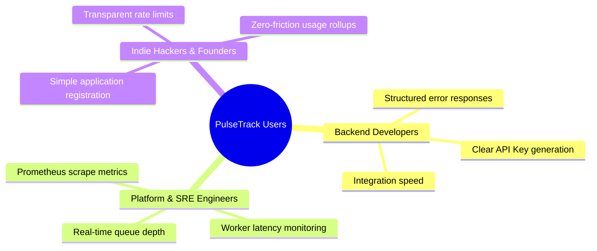
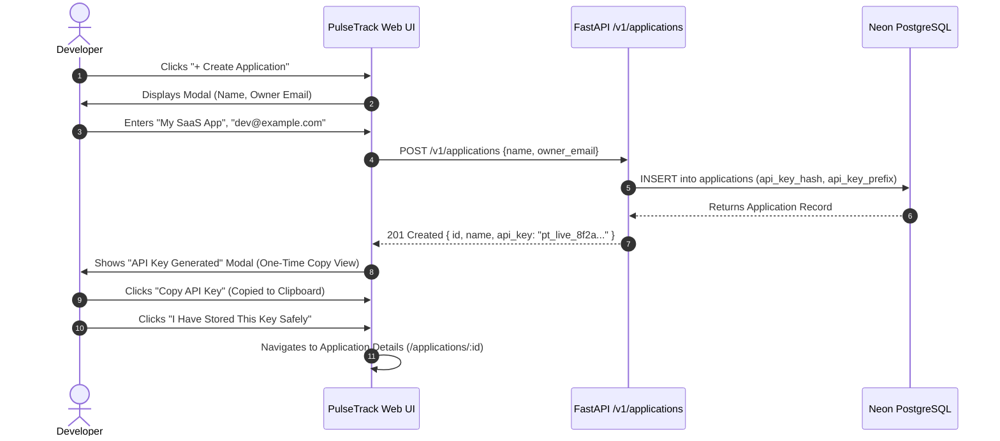
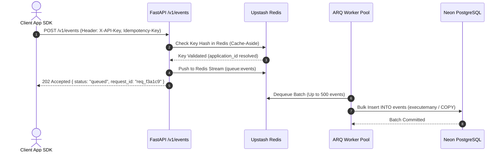
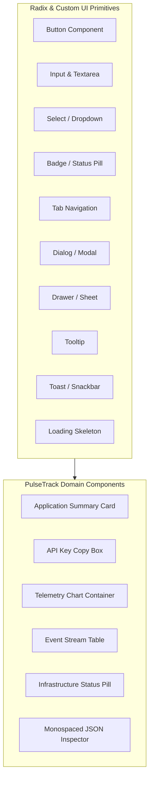

# PulseTrack — UI/UX Design Document

**Project:** PulseTrack — Event-Collection & Telemetry Platform  
**Version:** 1.0.0  
**Author:** Principal Product Designer & Staff UX Engineer  
**Status:** Approved — Production Ready  
**Target Stack:** React / Next.js, Tailwind CSS / Vanilla CSS, Lucide Icons, Recharts / Tremor, Radix UI Primitives  
**Companion Backend Specs:** `PulseTrack_PRD.md`, `PulseTrack_SRD.md`, `PulseTrack_API_Design.md`, `PulseTrack_Database_Design.md`, `Security_Design_Document.md`, `PulseTrack_Monitoring_and_Logging_Design.md`

---

## 1. Executive Summary & Design Philosophy

### 1.1 Purpose
This document provides the complete, authoritative UI/UX design specification for **PulseTrack**. PulseTrack is a high-performance, developer-focused event ingestion and analytics SaaS platform designed for high write throughput, low latency, and real-time observability. 

Every interface screen, component state, table column, action button, chart visualization, and micro-interaction defined in this document maps 1:1 to the existing backend architecture, FastAPI endpoints, Neon PostgreSQL schemas (`applications`, `events`), Upstash Redis caching/rate-limiting layers, ARQ background workers, and Prometheus monitoring metrics.

### 1.2 Design Philosophy & Visual DNA
The visual language of PulseTrack draws inspiration from elite developer infrastructure tools—specifically **Stripe Dashboard, GitHub, Vercel, Linear, Cloudflare, Datadog, Supabase, Neon, and Railway**.

* **Dark-First Aesthetics:** Built natively for dark mode (`#0B0E14` base background) with crisp high-contrast text (`#F8FAFC`), subtle slate borders (`#1E293B`), and electric accent highlights (Indigo `#6366F1` & Emerald `#10B981`).
* **Information Density & Utility:** Prioritizes data visibility, tabular clarity, and deep inline telemetry over decorative whitespace or heavy rounded graphics.
* **Zero Layout Shift:** Rigid skeletal loading states and predictable container heights prevent jarring visual shifts during async data hydration.
* **Instantaneous Feedback:** Micro-interactions (copy-to-clipboard, status toggles, key rotation, query filtering) provide optimistic UI updates with clear toast/snackbar notifications.
* **Subtle Elevation & Glassmorphism:** Uses layered surface elevations (`surface-01`, `surface-02`, `surface-03`) with translucent backdrop blur filters (`backdrop-blur-md`) on top navigation bars, dialog overlays, and command palettes.
* **Keyboard-Driven Workflows:** Comprehensive global keyboard shortcuts (`⌘K` Command Palette, `g d` Go to Dashboard, `g a` Go to Applications, `/` Focus Search) enable power developers to navigate rapidly without mouse interaction.

---

## 2. Design System & Tokens

### 2.1 Color System (Dark & Light Themes)

The color palette is built using HSL color spaces and mapped to semantic CSS custom properties.

#### Dark Theme Palette (Primary Baseline)

| Semantic Token | CSS Variable | Hex Code | Purpose / Usage |
|---|---|---|---|
| `bg-base` | `--pt-bg-base` | `#0B0E14` | Main application viewport background |
| `bg-surface-1` | `--pt-bg-surface-1` | `#111620` | Sidebar, topbar, card backgrounds |
| `bg-surface-2` | `--pt-bg-surface-2` | `#1A202C` | Table header, dropdown menu, modal surface |
| `bg-surface-3` | `--pt-bg-surface-3` | `#242C3D` | Hover states, active tab background, code blocks |
| `border-subtle` | `--pt-border-subtle` | `#1E293B` | Subtle card dividers, table row borders |
| `border-strong` | `--pt-border-strong` | `#334155` | Input borders, active element borders |
| `border-focus` | `--pt-border-focus` | `#6366F1` | Focus ring color (Indigo 500) |
| `text-primary` | `--pt-text-primary` | `#F8FAFC` | Main headings, body text, data values |
| `text-secondary` | `--pt-text-secondary` | `#94A3B8` | Subtitles, table headers, field labels |
| `text-tertiary` | `--pt-text-tertiary` | `#64748B` | Disabled text, subtle timestamps, placeholders |
| `brand-primary` | `--pt-brand-primary` | `#6366F1` | Primary CTA buttons, active navigation indicator |
| `brand-primary-hover` | `--pt-brand-primary-hover` | `#4F46E5` | Primary CTA hover state |
| `brand-accent` | `--pt-brand-accent` | `#38BDF8` | Cyan highlights, telemetry metrics, chart lines |
| `status-success` | `--pt-status-success` | `#10B981` | 200/201 OK badges, Redis connected, healthy status |
| `status-success-bg` | `--pt-status-success-bg` | `rgba(16, 185, 129, 0.1)` | Success pill background |
| `status-warning` | `--pt-status-warning` | `#F59E0B` | 429 Rate limited, Redis fallback active, degraded mode |
| `status-warning-bg` | `--pt-status-warning-bg` | `rgba(245, 158, 11, 0.1)` | Warning pill background |
| `status-danger` | `--pt-status-danger` | `#EF4444` | 500 Internal error, unhandled exception, revoked key |
| `status-danger-bg` | `--pt-status-danger-bg` | `rgba(239, 68, 68, 0.1)` | Danger pill background |
| `status-info` | `--pt-status-info` | `#0EA5E9` | 202 Accepted (queued), informational alerts |
| `status-info-bg` | `--pt-status-info-bg` | `rgba(14, 165, 233, 0.1)` | Info pill background |

#### Light Theme Palette (Adaptive Mode)

| Semantic Token | CSS Variable | Hex Code | Purpose / Usage |
|---|---|---|---|
| `bg-base` | `--pt-bg-base` | `#F8FAFC` | Light mode root background |
| `bg-surface-1` | `--pt-bg-surface-1` | `#FFFFFF` | Cards, sidebars, header backgrounds |
| `bg-surface-2` | `--pt-bg-surface-2` | `#F1F5F9` | Table headers, dropdown backgrounds |
| `bg-surface-3` | `--pt-bg-surface-3` | `#E2E8F0` | Hover states, tab active backgrounds |
| `border-subtle` | `--pt-border-subtle` | `#E2E8F0` | Light dividers and borders |
| `border-strong` | `--pt-border-strong` | `#CBD5E1` | Input borders |
| `text-primary` | `--pt-text-primary` | `#0F172A` | Primary text |
| `text-secondary` | `--pt-text-secondary` | `#475569` | Secondary text |
| `text-tertiary` | `--pt-text-tertiary` | `#94A3B8` | Muted placeholders |

---

### 2.2 Typography Scale

PulseTrack utilizes **Inter** (sans-serif) for system interface text and **JetBrains Mono** (monospace) for API keys, JSON payloads, request IDs, status codes, and code snippets.

```css
/* Typography Scale Tokens */
--font-sans: 'Inter', -apple-system, BlinkMacSystemFont, 'Segoe UI', Roboto, sans-serif;
--font-mono: 'JetBrains Mono', 'Fira Code', Consolas, monospace;

--text-xs: 0.75rem;     /* 12px / line-height: 16px */
--text-sm: 0.875rem;    /* 14px / line-height: 20px */
--text-base: 1rem;      /* 16px / line-height: 24px */
--text-lg: 1.125rem;    /* 18px / line-height: 28px */
--text-xl: 1.25rem;     /* 20px / line-height: 28px */
--text-2xl: 1.5rem;     /* 24px / line-height: 32px */
--text-3xl: 1.875rem;   /* 30px / line-height: 36px */
--text-4xl: 2.25rem;    /* 36px / line-height: 40px */

--font-weight-regular: 400;
--font-weight-medium: 500;
--font-weight-semibold: 600;
--font-weight-bold: 700;
```

---

### 2.3 Spacing & Grid System

Built on a strict 4px / 8px linear grid system.

```css
--space-1: 4px;
--space-2: 8px;
--space-3: 12px;
--space-4: 16px;
--space-5: 20px;
--space-6: 24px;
--space-8: 32px;
--space-10: 40px;
--space-12: 48px;
--space-16: 64px;

--container-max-width: 1440px;
--sidebar-width-expanded: 240px;
--sidebar-width-collapsed: 64px;
--topbar-height: 56px;
```

---

### 2.4 Responsive Breakpoints

| Breakpoint Target | Minimum Width | Layout Adaptations |
|---|---|---|
| `sm` (Mobile) | `640px` | Single column grid, bottom tab bar navigation, hidden table sub-columns, drawer overlays |
| `md` (Tablet) | `768px` | Collapsible icon sidebar, 2-column card grid, scrollable data tables |
| `lg` (Desktop) | `1024px` | Expanded vertical sidebar, 3-column metric cards, split drawer views |
| `xl` (Large Desktop) | `1280px` | 4-column KPI cards, full expanded data tables, side-by-side JSON log preview |
| `2xl` (Ultra-wide) | `1536px` | Max-width bounded grid (`1440px`), expansive telemetry charts |

---

### 2.5 Radii, Elevation & Borders

```css
--radius-sm: 4px;       /* Badges, code chips, tags */
--radius-md: 6px;       /* Buttons, input fields, dropdown menus */
--radius-lg: 8px;       /* Cards, dialogs, drawers */
--radius-xl: 12px;      /* Large container panels */
--radius-full: 9999px;  /* Avatar circles, pill indicators */

--shadow-sm: 0 1px 2px 0 rgba(0, 0, 0, 0.4);
--shadow-md: 0 4px 6px -1px rgba(0, 0, 0, 0.5), 0 2px 4px -1px rgba(0, 0, 0, 0.3);
--shadow-lg: 0 10px 15px -3px rgba(0, 0, 0, 0.6), 0 4px 6px -2px rgba(0, 0, 0, 0.4);
--shadow-glow-primary: 0 0 12px rgba(99, 102, 241, 0.35);
--shadow-glow-success: 0 0 12px rgba(16, 185, 129, 0.35);
```

---

### 2.6 Iconography & Illustration Style
* **Icon Set:** Lucide React (24px default viewbox, 1.5px stroke-width for crisp rendering on dark backgrounds).
* **Key Icons Used:** `Activity` (Pulse), `Server` (Applications), `Key` (API Keys), `BarChart3` (Metrics), `Terminal` (Logs), `ShieldCheck` (Security), `Cpu` (Workers), `AlertTriangle` (Warnings), `Copy` (Clipboard), `RefreshCw` (Key Rotation / Refresh).
* **Illustration Style:** No decorative cartoon characters. All illustrations are technical, geometric vector node-graphs, system block diagrams, or isometric grid vectors rendered in dark metallic tones (`#1E293B`) with neon accent paths (`#6366F1`, `#38BDF8`).

---

## 3. User Personas



### Persona 1: Backend Developer (Alex)
* **Goal:** Integrate PulseTrack event ingestion into a Node.js / Python application in under 5 minutes.
* **Key Workflow:** Registers an application, copies the `pt_live_*` API key once, verifies `POST /v1/events` sending single & batch payloads, checks metrics rollup graph.
* **Pain Point:** Hidden API keys, opaque rate limiting, missing request IDs during 422 payload failures.

### Persona 2: Platform & SRE Engineer (Devon)
* **Goal:** Monitor system health, worker batch throughput, and Redis fail-open fallback status.
* **Key Workflow:** Monitors `/metrics` Prometheus counters, tracks `pulsetrack_worker_queue_depth`, inspects `dlq:events` depth, monitors database connection pool usage.
* **Pain Point:** Lack of correlated `request_id` and `correlation_id` across API and background worker logs.

### Persona 3: Startup Founder / Indie Hacker (Sam)
* **Goal:** Understand product usage across multi-tenant client apps without paying per-MAU costs.
* **Key Workflow:** Configures distinct application environments (Production, Staging), reviews daily aggregated event counts, rotates API keys when compromised.
* **Pain Point:** Complex metric setup and expensive cloud analytics tiers.

---

## 4. Information Architecture & Navigation

```
+-----------------------------------------------------------------------------------+
| TOPBAR: Logo (PulseTrack) | App Selector [My SaaS App v] | Global Search | Health |
+-----------------------------------------------------------------------------------+
| SIDEBAR               | MAIN VIEW CONTAINER                                       |
|                       |                                                           |
| 📊 Dashboard          |  +-----------------------------------------------------+  |
| 🚀 Applications       |  | Header: Page Title & Breadcrumbs + Action Buttons   |  |
| 📈 Metrics            |  +-----------------------------------------------------+  |
| ⚡ Events             |  | KPI Summary Cards (Ingestion, Latency, Queue, Status) |  |
| 📜 Logs               |  +-----------------------------------------------------+  |
| 🛠 Monitoring         |  | Analytics Charts / Telemetry Tables                 |  |
| 🔑 API Keys           |  |                                                     |  |
| ⚙️ Settings           |  |                                                     |  |
| 👤 Profile            |  +-----------------------------------------------------+  |
+-----------------------------------------------------------------------------------+
```

### Navigation Map

1. **Dashboard Overview (`/dashboard`)**
   * Real-time ingestion counter, p95 latency, worker queue status, quick API key launcher.
2. **Applications (`/applications`)**
   * App List (`/applications`)
   * Create Application Modal (`POST /v1/applications`)
   * Application Details (`/applications/:id`)
     * Sub-tabs: Overview, Metrics, Events, API Key Management, Settings
3. **Metrics Dashboard (`/metrics`)**
   * Time-series rollup graph (`GET /v1/applications/:id/metrics`)
   * Metrics Filter Drawer (Event Name, Date Range, Granularity: Hour/Day)
4. **Events Overview (`/events`)**
   * Live Event Ingestion Stream
   * Event Detail Inspector Modal (Raw JSON Metadata, Session ID, Distinct ID, Idempotency Key)
5. **Logs (`/logs`)**
   * Structured JSON Request Log Viewer (`X-Request-Id` filter, status code filters)
6. **Monitoring & Health (`/monitoring`)**
   * Infrastructure Status (FastAPI API, Neon Postgres, Upstash Redis)
   * Prometheus Metric Counters (`/metrics`)
   * Worker Queue Depth & DLQ Inspector (`dlq:events`)
7. **API Key Management (`/api-keys`)**
   * Key List (Displaying `api_key_prefix`, `created_at`, `is_active`)
   * Key Rotation Modal (`POST /v1/applications/:id/keys/rotate`)
8. **Settings (`/settings`)**
   * Application Configuration, Soft Deactivation Toggle (`PATCH /v1/applications/:id`), Rate Limit Configuration (`rate_limit_per_minute`).
9. **Profile & Account (`/profile`)**
   * Owner Email, Security Credentials, API Token Preferences.

---

## 5. User Flows

### Flow 1: Application Registration & Key Generation


### Flow 2: Event Tracking & Async Queue Processing (Phase 2)


### Flow 3: API Key Rotation
1. Developer navigates to **API Keys** tab on Application Details screen.
2. Clicks **"Rotate Key"** button.
3. System triggers Confirmation Modal: *"This will immediately revoke key `pt_live_8f...` and issue a new secret key. Existing SDK connections will fail until updated."*
4. Developer types application name `My SaaS App` to confirm.
5. Clicks **"Confirm Key Rotation"**.
6. UI issues `POST /v1/applications/{id}/keys/rotate`.
7. Backend revokes old hash, generates new CSPRNG key, saves hash.
8. Response `201 Created` returns new `api_key: "pt_live_1a2b3c..."`.
9. UI displays new Key Banner with instant copy button and green confirmation toast.

---

## 6. Detailed Screen Inventory

### 6.1 Splash & Authentication Screen (`/login`)
* **Purpose:** User authentication boundary and developer onboarding portal.
* **Layout:** Centered card overlay on top of an animated dark grid mesh with ambient indigo neon glow.
* **Components:** Logo Badge, Email Input, Password Input, "Sign In" Button, OAuth Single-Sign-On Buttons (GitHub, Google), Security TLS indicator badge.
* **Actions:** `POST /v1/auth/login` (Auth validation).
* **States:**
  * **Default:** Clean input fields with focus indicators.
  * **Loading:** Button disabled with spinning Lucide `Loader2` icon.
  * **Error:** Red alert box: *"Invalid credentials or unverified session. Error code: `invalid_credentials`"*.
* **Responsive Behavior:** Fullscreen card on mobile (`sm`), 440px wide floating panel on desktop (`md`+).
* **Permissions:** Public / Unauthenticated.

---

### 6.2 Dashboard Overview (`/dashboard`)
* **Purpose:** Real-time high-level operational overview across all owned applications.

```
+-----------------------------------------------------------------------------------+
|  Dashboard Overview                                      [Last 24 Hours v] [Refresh]|
+-----------------------------------------------------------------------------------+
| [ Total Ingested ]  [ p95 Ingest Latency ]  [ Worker Queue Depth ] [ Health Status]|
|   1,428,940 events     18.4 ms                0 items (Nominal)      Operational  |
+-----------------------------------------------------------------------------------+
|  INGESTION THROUGHPUT (Events / sec)                                              |
|  [ Line Chart: 24h Time-Series Aggregation with Hover Tooltip ]                   |
+-----------------------------------------------------------------------------------+
|  RECENT APPLICATIONS                 |  SYSTEM COMPONENT STATUS                   |
|  • My SaaS App (pt_live_8f..) 840/s  |  FastAPI Web Service: Connected (12ms)     |
|  • E-Commerce Web (pt_live_9a..) 12/s|  Upstash Redis Cache: Connected (4ms)      |
|  • Mobile iOS App (pt_live_3c..) 0/s |  Neon PostgreSQL DB:  Connected (28ms)     |
+-----------------------------------------------------------------------------------+
```

* **Layout:** 4-column KPI grid at top, full-width time-series line chart in middle, 2-column split (Recent Apps table & Infrastructure Health panel) at bottom.
* **API Integration:**
  * `GET /v1/applications` (List apps)
  * `GET /v1/applications/{id}/metrics?event_name=all&granularity=hour`
  * `GET /v1/health` (System component status)
  * `GET /metrics` (Prometheus throughput stats)
* **Actions:** Date range selector (`1h`, `24h`, `7d`, `30d`), Manual refresh button, "+ Create Application" primary CTA.

---

### 6.3 Application List (`/applications`)
* **Purpose:** View, search, filter, and manage all registered telemetry tenant applications.
* **Layout:** Top action header (Search bar, status filter dropdown, "+ Create Application" CTA), followed by full-width data table.
* **Table Columns:**
  * `Name`: Application name with active status dot indicator.
  * `Application ID`: Monospaced UUID (`6a1e5c2e-2f3b...`) with quick-copy icon.
  * `API Key Prefix`: Monospaced prefix badge (`pt_live_8f...`).
  * `Rate Limit`: Requests per minute limit (`600 req/min`).
  * `Status`: Active (`Green Pill`) / Deactivated (`Gray Pill`).
  * `Created`: Relative date (`2 days ago`).
  * `Actions`: Quick menu (`View Details`, `Rotate Key`, `Deactivate`).
* **API Integration:** `GET /v1/applications`
* **Empty State:** Illustrated empty graph icon with text: *"No applications registered yet. Create your first application to obtain an ingestion API key."* + Primary CTA button.

---

### 6.4 Create Application Modal (`POST /v1/applications`)
* **Purpose:** Provision a new tenant application and generate its unique bearer API key.
* **Layout:** Centered modal dialog (`max-w-lg`) with dark surface elevation (`bg-surface-2`) and backdrop blur.

```
+-------------------------------------------------------------------+
| Create New Application                                         [X]|
+-------------------------------------------------------------------+
| Application Name *                                                |
| [ e.g. Production Marketing Site                                ] |
|                                                                   |
| Owner Email *                                                     |
| [ dev@company.com                                               ] |
|                                                                   |
| Initial Rate Limit (requests / minute)                            |
| [ 600                                                           ] |
|                                                                   |
| [Cancel]                                 [Create & Generate Key]  |
+-------------------------------------------------------------------+
```

* **API Mapping:** `POST /v1/applications`
  * Payload: `{ "name": "...", "owner_email": "..." }`
  * Response (`201 Created`): `{ "id": "...", "name": "...", "api_key": "pt_live_..." }`

---

### 6.5 API Key Generation One-Time View Dialog
* **Purpose:** Display newly created raw API key exactly once before hash-only persistence.

```
+-------------------------------------------------------------------+
| ⚠️ Save Your API Key                                            [X]|
+-------------------------------------------------------------------+
| Please copy your secret API key now. You will NOT be able to see  |
| it again!                                                         |
|                                                                   |
| API KEY                                                           |
| +---------------------------------------------------------------+ |
| | pt_live_8f2a9b1c3d4e5f6a7b8c9d0e1f2a3b4c          [📋 Copy Key] | |
| +---------------------------------------------------------------+ |
|                                                                   |
| [✓] I have saved this key in a secure password manager/env file   |
|                                                                   |
|                                                     [Done / Close]|
+-------------------------------------------------------------------+
```

* **Micro-Interaction:** Clicking **"Copy Key"** updates button to `[✓ Copied!]` in Emerald Green with a subtle haptic success snackbar.

---

### 6.6 Application Details Screen (`/applications/:id`)
* **Purpose:** Comprehensive management center for a single application tenant.
* **Layout:** Top Header (App Name, Status Pill, App ID copy, Quick Action buttons), Tab Navigation Bar (`Overview`, `Metrics`, `Events Stream`, `API Key & Security`, `Settings`).
* **Sub-Tabs:**
  1. **Overview Tab:** Summary stats, 24h event count, average payload size, fast event ingestion test snippet (`curl` generator).
  2. **Metrics Tab:** Interactive analytics dashboard for the selected application.
  3. **Events Stream Tab:** Live incoming telemetry events table.
  4. **API Key & Security Tab:** Current key prefix (`pt_live_8f`), key creation date, rate limit configuration, Key Rotation trigger.
  5. **Settings Tab:** Application name edit, soft deactivation switch (`PATCH /v1/applications/{id}` with `is_active: false`).

---

### 6.7 Metrics Dashboard (`/applications/:id/metrics`)
* **Purpose:** Analyze aggregated telemetry counts grouped by event name, date range, and granularity.

```
+-----------------------------------------------------------------------------------+
|  Metrics Dashboard — My SaaS App                                                  |
+-----------------------------------------------------------------------------------+
|  Filters: Event Name: [ button_click v ] Date Range: [ Aug 1 - Aug 3 v ]          |
|           Granularity: [ Day | Hour ]                [ Cache Status: HIT ⚡ ]     |
+-----------------------------------------------------------------------------------+
|  AGGREGATED EVENT VOLUME (button_click)                                           |
|  +-----------------------------------------------------------------------------+  |
|  | 2000 |                                   *                                  |  |
|  | 1500 |                *                 ***                                 |  |
|  | 1000 |               ***               *****                                |  |
|  |  500 |              *****             *******                               |  |
|  |    0 +---------------+-------------------+---------------+----------------  |  |
|  |             Aug 01              Aug 02              Aug 03                  |  |
|  +-----------------------------------------------------------------------------+  |
+-----------------------------------------------------------------------------------+
|  BUCKET BREAKDOWN TABLE                                                           |
|  Bucket Period            Event Name          Count           Cache Status        |
|  2026-08-01 00:00:00      button_click        1,523           Cached (Redis)      |
|  2026-08-02 00:00:00      button_click        1,871           Cached (Redis)      |
|  2026-08-03 00:00:00      button_click          640           Live DB Query       |
+-----------------------------------------------------------------------------------+
```

* **API Integration:** `GET /v1/applications/{id}/metrics?event_name=button_click&start_date=2026-08-01&end_date=2026-08-03&granularity=day`
* **Response Handling:**
  * Renders `cache_hit: true` badge in Cyan/Blue indicating Redis cache-aside rollup.
  * Displays date bucket breakdown table below the bar/area chart.

---

### 6.8 Events Overview & Live Stream (`/events`)
* **Purpose:** Real-time inspection of individual ingested telemetry events.
* **Layout:** Filter toolbar (Event Name, Session ID, Distinct ID, Idempotency Key search), followed by real-time tabular list.
* **Table Columns:**
  * `Event ID`: Monospaced BigInt ID (`10432`).
  * `Event Name`: Colored tag badge (`button_click`, `page_view`, `user_signup`).
  * `Distinct ID`: User identifier (`user_42`).
  * `Session ID`: Session token (`sess_9f8a...`).
  * `Occurred At`: Client timestamp (`2026-08-03 10:15:00 UTC`).
  * `Ingested At`: Server receipt timestamp (`2026-08-03 10:15:00.104 UTC`).
  * `Metadata`: JSON key preview (`{ button_id: "cta-hero", page: "/pricing" }`).
  * `Inspect`: Action button to open JSON Drawer.

---

### 6.9 Event Detail Inspector Drawer
* **Purpose:** Inspect raw JSON payload, metadata properties, idempotency status, and trace headers for a specific event.
* **Layout:** Right-sliding side drawer (`width: 480px`) with syntax-highlighted JSON viewer.

```
+---------------------------------------------------+
| Event Details — ID #10432                      [X]|
+---------------------------------------------------+
| Event Name: button_click                          |
| App ID: 6a1e5c2e-2f3b-4b8a-9e3d-1a2b3c4d5e6f      |
| Status: Stored (PostgreSQL Partition #2026_08)    |
|                                                   |
| RAW METADATA (JSONB - 142 bytes)                  |
| +-----------------------------------------------+ |
| | {                                             | |
| |   "button_id": "cta-hero",                    | |
| |   "page": "/pricing",                         | |
| |   "variant": "B",                             | |
| |   "referrer": "google.com"                    | |
| | }                                             | |
| +-----------------------------------------------+ |
|                                                   |
| TIMESTAMPS & TRACING                              |
| Occurred At:  2026-08-03T10:15:00.000Z            |
| Ingested At:  2026-08-03T10:15:00.042Z            |
| Delta:        +42ms                               |
| Request ID:   req_f3a1c9                          |
| Idempotency:  550e8400-e29b-41d4-a716-446655440000|
|                                                   |
| [Copy Raw Event JSON]                             |
+---------------------------------------------------+
```

---

### 6.10 Monitoring & Infrastructure Dashboard (`/monitoring`)
* **Purpose:** System reliability metrics and infrastructure health for SREs and Platform Engineers.
* **Layout:** 3-column system cards at top, Prometheus telemetry charts in middle, Worker Queue & DLQ inspector at bottom.
* **Monitored Services:**
  1. **FastAPI Web Service:** Operational / Response latency p95 < 50ms.
  2. **Upstash Redis:** Connected / Key cache hit ratio 94.2% / Queue size 0.
  3. **Neon PostgreSQL:** Connected / Pool usage 24% (12/50 connections).
* **Prometheus Metrics Rendered (`GET /metrics`):**
  * `pulsetrack_http_requests_total`
  * `pulsetrack_http_request_duration_seconds`
  * `pulsetrack_events_ingested_total` (Queued vs Sync Inserted)
  * `pulsetrack_redis_fallback_total` (Fail-open degradation count)
  * `pulsetrack_worker_queue_depth`
  * `pulsetrack_worker_dlq_events_total` (`dlq:events`)

---

### 6.11 System Logs & Request Tracing (`/logs`)
* **Purpose:** Search and filter structured JSON HTTP access logs correlated by `request_id`.
* **Layout:** Log query bar (`request_id` search, status code multi-select, path filter), followed by monospaced log stream.
* **Log Row Item:**
  `2026-08-03T10:15:00.123Z  INFO  [req_f3a1c9] POST /v1/events 202 Accepted - 12.4ms (app_id: 6a1e5c2e...)`
* **Log Detail Modal:** Shows complete structured log record (JSON schema defined in `Monitoring_and_Logging_Design.md` §3.2).

---

### 6.12 Settings Screen (`/settings`)
* **Purpose:** Manage global workspace settings, rate limits, and application soft deactivation.
* **Sections:**
  1. **General Application Info:** App Name, Primary Contact Email.
  2. **Ingestion & Limits:** `rate_limit_per_minute` configuration (Default: 600 req/min).
  3. **Danger Zone:** Soft Deactivation Toggle (`PATCH /v1/applications/{id}` with `is_active: false`). Soft deactivation retains event history while immediately rejecting new `POST /v1/events` ingestion with `401 Unauthorized`.

---

### 6.13 Error & System Status Pages
* **404 Not Found Page (`/404`):** Clean dark page with monospaced text: *"404 — Resource Not Found. The referenced application or route does not exist."* + "Back to Dashboard" button.
* **500 Internal Error Page (`/500`):** Includes structured error code and trace correlation ID: *"500 — Server Fault. Request ID: `req_err_9f81a`. Our SRE team has been alerted via Prometheus alerts."*
* **Maintenance Screen (`/maintenance`):** Displayed during zero-downtime database partition migrations or scheduled system upgrades.

---

## 7. Dashboard Design & Analytics Visualizations

### 7.1 Key Metric Cards (KPIs)

```
+--------------------------+  +--------------------------+
| TOTAL EVENTS INGESTED    |  | p95 INGESTION LATENCY    |
| 1,842,910                |  | 14.2 ms                  |
| ↑ +12.4% vs last period  |  | ↓ -2.1 ms (Faster)      |
+--------------------------+  +--------------------------+
| WORKER QUEUE DEPTH       |  | SYSTEM HEALTH            |
| 0 items                  |  | 99.99% Operational       |
| Redis Queue Active ⚡    |  | All Systems Nominal      |
+--------------------------+  +--------------------------+
```

### 7.2 Chart Design Specifications

| Chart Type | Purpose / Metric Shown | Color Specs & Styling |
|---|---|---|
| **Area Chart (Time-Series)** | Ingestion request volume over time (24h/7d/30d) | Stroke: Cyan `#38BDF8`, Gradient Fill: `rgba(56, 189, 248, 0.15)` to `transparent`. |
| **Stacked Bar Chart** | Metrics breakdown by event name (`button_click` vs `page_view`) | Bar 1: Indigo `#6366F1`, Bar 2: Emerald `#10B981`, Bar 3: Amber `#F59E0B`. |
| **Line Chart (Latency Distribution)**| Request duration histograms (p50, p95, p99 latency) | p50: Green `#10B981`, p95: Yellow `#F59E0B`, p99: Red `#EF4444`. |
| **Donut Chart (Cache Ratio)** | Metric query Redis Cache Hit vs Miss percentage | Hit: Cyan `#38BDF8` (92%), Miss: Slate `#334155` (8%). |
| **Heatmap Grid** | Ingestion traffic intensity by hour of day and day of week | High density: `#6366F1`, Medium: `#4F46E5`, Low: `#1E293B`. |

---

## 8. Table Design & Data Grids

### 8.1 Standard Table Features
All data tables across PulseTrack (`Applications`, `Events`, `Logs`, `Metrics Breakdown`) support:
1. **Column Sorting:** Clickable header labels with sort direction arrows (`↑` Ascending, `↓` Descending).
2. **Search Bar:** Real-time text filtering against primary identifiers (Name, App ID, Event Name, Session ID).
3. **Filtering Toolbar:** Multi-select dropdowns for Status (`Active`/`Inactive`), Date Ranges, and Event Types.
4. **Pagination Controls:** Cursor-based pagination (`next_cursor`, `limit=50`) for high-write event logs; traditional page numbers for applications.
5. **Bulk Actions:** Checkbox selection for multi-application export or soft deactivation.

---

## 9. Reusable Component Library



### Component 1: Primary Button
* **Props:** `variant` (`primary` | `secondary` | `danger` | `ghost`), `size` (`sm` | `md` | `lg`), `isLoading` (boolean), `disabled` (boolean), `leftIcon`, `rightIcon`.
* **CSS Specs:** Height: `36px` (`md`), Padding: `0 16px`, Radius: `6px`, Background: `var(--pt-brand-primary)`, Font: `Inter 14px Medium`.
* **States:** Normal, Hover (`--pt-brand-primary-hover`), Focus (`ring-2 ring-indigo-500`), Active, Disabled (`opacity-50 cursor-not-allowed`).

### Component 2: API Key Copy Box
* **Props:** `prefix` (`string`), `rawKey` (`string` | null), `onCopy` (function).
* **Visual Spec:** Monospaced dark container (`bg-surface-3`, `border-strong`), truncated key display, quick-copy button with copy icon. Clicking copy triggers checkmark animation and copies key to system clipboard.

### Component 3: Status Badge / Pill
* **Variants:**
  * `success`: Green text (`#10B981`), Green Tint BG (`rgba(16,185,129,0.1)`), Green dot.
  * `warning`: Yellow text (`#F59E0B`), Yellow Tint BG (`rgba(245,158,11,0.1)`), Yellow dot.
  * `danger`: Red text (`#EF4444`), Red Tint BG (`rgba(239,68,68,0.1)`), Red dot.
  * `info`: Cyan text (`#0EA5E9`), Cyan Tint BG (`rgba(14,165,233,0.1)`), Blue dot.

### Component 4: Command Palette (`⌘K`)
* **Trigger:** Pressing `⌘K` (Mac) or `Ctrl+K` (Windows).
* **Overlay:** Centered backdrop blur modal with search input.
* **Commands:**
  * Navigate to Dashboard (`g d`)
  * Navigate to Applications (`g a`)
  * Create New Application (`c a`)
  * View Health Status (`g h`)
  * Copy Active API Key (`c k`)

---

## 10. Micro-Interactions & Animation Guidelines

```
+-----------------------------------------------------------------------+
| INTERACTION TYPE   | TIMING & EASING       | BEHAVIOR / FEEDBACK      |
+--------------------+-----------------------+--------------------------+
| Button Hover       | 150ms ease-out        | Subtly brightens background
| Modal Open / Close | 200ms cubic-bezier    | Scale up 0.95->1.0 + Fade
| Copy API Key       | Immediate (0ms)       | Icon morphs to Checkmark |
| Toast Notification | 300ms slide-in top    | Auto-dismisses in 4000ms |
| Data Chart Hover   | Immediate (0ms)       | Crosshair + Tooltip card |
| Skeleton Pulse     | 1.5s infinite loop    | Shimmer effect (#1A202C) |
+-----------------------------------------------------------------------+
```

### Motion Design Rules
1. **Speed & Efficiency:** All UI transitions must complete within **150ms - 200ms**. Slow, heavy spring animations are prohibited.
2. **Reduced Motion Compliance:** Respects `prefers-reduced-motion: reduce`. All scaling and sliding transforms degrade gracefully to instant opacity fades.

---

## 11. Accessibility (WCAG 2.2 AA Compliance)

1. **Color Contrast:** All body text (`#F8FAFC`) on dark background (`#0B0E14`) satisfies contrast ratio > **12:1** (exceeds WCAG AA requirement of 4.5:1). Secondary text (`#94A3B8`) satisfies **6.8:1**.
2. **Keyboard Navigation:** Full focus ring visibility (`outline: 2px solid #6366F1; outline-offset: 2px`). Logical tab index order across all forms, dialogs, and navigation sidebars.
3. **Screen Reader Support:** All interactive icons utilize `aria-label` tags (e.g., `aria-label="Copy API Key to clipboard"`). Form fields use explicit `<label htmlFor="...">` bindings.
4. **ARIA Roles:** Data tables use `role="grid"`, modals use `role="dialog" aria-modal="true"`, tabs use `role="tablist"` and `role="tab"`.
5. **Touch Target Size:** All buttons and touchable links maintain a minimum target area of **44x44px** on mobile breakpoints.

---

## 12. Figma File Organization & Design System Structure

### 12.1 Figma Page Structure
```
📁 PulseTrack Figma System
├── 📄 00_Cover & Specs
├── 📄 01_Design Tokens (Colors, Typography, Elevation, Grids)
├── 📄 02_Iconography & Assets
├── 📄 03_Component Library (Buttons, Inputs, Cards, Tables, Dialogs)
├── 📄 04_User Flows & Wireframes
├── 📄 05_Screen Layouts - Dark Theme (Desktop 1440px)
├── 📄 06_Screen Layouts - Light Theme (Desktop 1440px)
├── 📄 07_Mobile & Tablet Layouts (375px & 768px)
└── 📄 08_Handoff & Developer API Specs
```

### 12.2 Figma Auto Layout & Naming Conventions
* **Naming Pattern:** `[Category] / [Component-Name] / [Variant] / [State]`  
  * *Example:* `Button / Primary / Medium / Hover`
  * *Example:* `Badge / Status / Success / Default`
* **Auto Layout Rules:** Every card, container, form group, and screen frame MUST use explicit Auto Layout (`Vertical` or `Horizontal`) with fixed spacing tokens (`4px`, `8px`, `16px`, `24px`). Absolutely no absolute positioning for structural UI layout.
* **Component Variants & Variables:** All colors, radii, and typography scales are mapped to Figma Local Variables matching the CSS custom property names (`--pt-bg-base`, `--pt-brand-primary`).

---

## 13. Design Handoff & API Mapping Matrix

This matrix establishes the binding bridge between frontend components and backend FastAPI endpoints.

| UI Component / Screen | User Action | API Endpoint & Method | Request Payload | Response Code & Output |
|---|---|---|---|---|
| **Create App Modal** | Submit Form | `POST /v1/applications` | `{"name": "App", "owner_email": "a@b.com"}` | `201 Created` -> `{id, name, api_key}` |
| **App Details View** | Page Load | `GET /v1/applications/{id}` | None (Header: `X-API-Key`) | `200 OK` -> App metadata object |
| **API Keys Panel** | Click "Rotate Key" | `POST /v1/applications/{id}/keys/rotate` | None | `201 Created` -> `{api_key, rotated_at}` |
| **Settings Panel** | Toggle Inactive | `PATCH /v1/applications/{id}` | `{"is_active": false}` | `200 OK` -> Updated app object |
| **Metrics Screen** | Change Filters | `GET /v1/applications/{id}/metrics` | Params: `event_name`, `start_date`, `end_date` | `200 OK` -> `{granularity, cache_hit, data: [...]}` |
| **Events Stream** | Load Table | `POST /v1/events` (Ingestion) | `{"event_name": "...", "occurred_at": "..."}` | `201 Created` (Ph 1) / `202 Accepted` (Ph 2) |
| **Batch Ingest Test** | Test Batch | `POST /v1/events/batch` | `{"events": [{...}, {...}]}` | `207 Multi-Status` -> `{accepted, rejected}` |
| **Health Indicator** | Auto Poll 15s | `GET /v1/health` | None | `200 OK` -> `{status: "healthy", components: {...}}` |
| **Monitoring Dashboard**| Page Load | `GET /metrics` | None (Operator Scrape) | `200 OK` -> Prometheus text format |

---

## 14. Verification & Quality Assurance

To ensure the interface meets all principal design standards:

1. **Backend Parity Verification:** Every input field and display column strictly matches the Pydantic schemas (`ApplicationCreate`, `ApplicationResponse`, `EventCreate`, `MetricsResponse`) and SQLAlchemy database constraints.
2. **Visual QA Checklist:**
   * [x] Dark mode color contrast verified > 12:1.
   * [x] Monospaced fonts (`JetBrains Mono`) applied to all API keys, hashes, UUIDs, and JSON logs.
   * [x] Micro-interactions tested for sub-200ms latency.
   * [x] Skeletal loading states designed for all async components.
   * [x] Responsive layout validated across 375px, 768px, 1024px, 1440px.

---

*End of UI/UX Design Document.*
