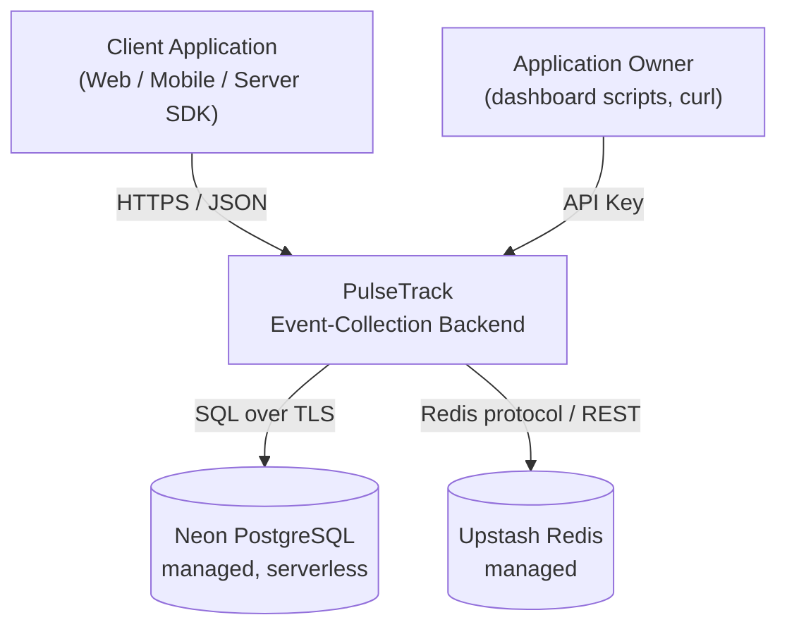
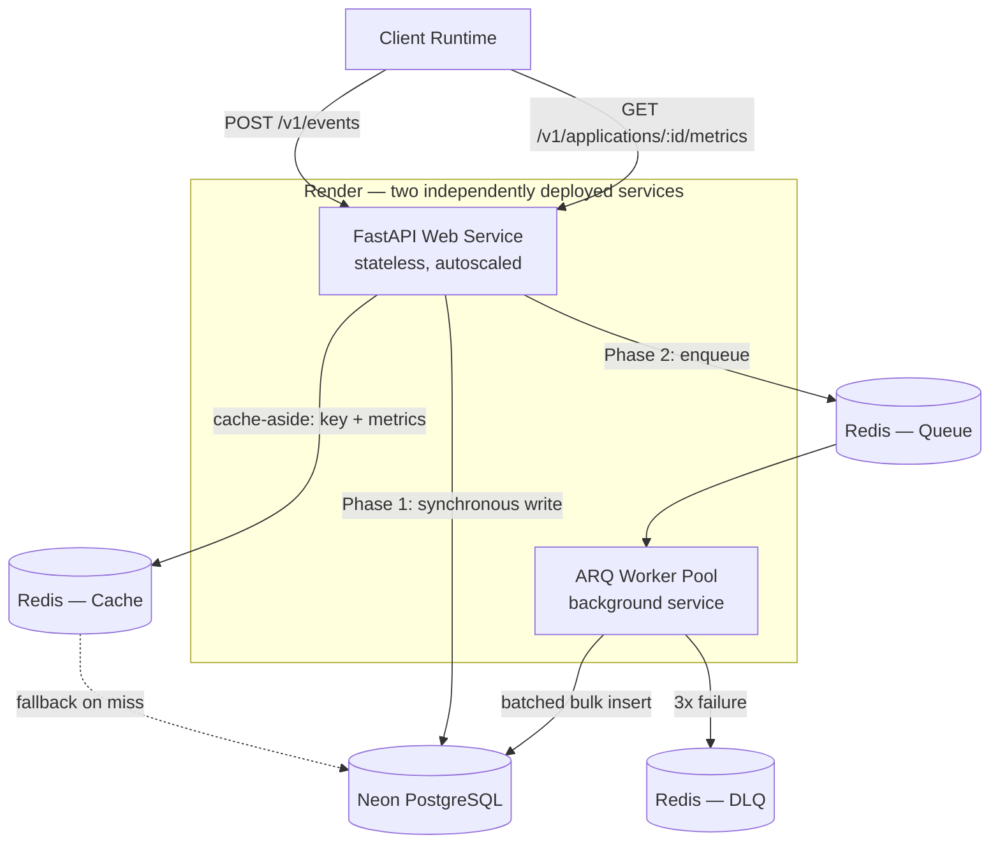
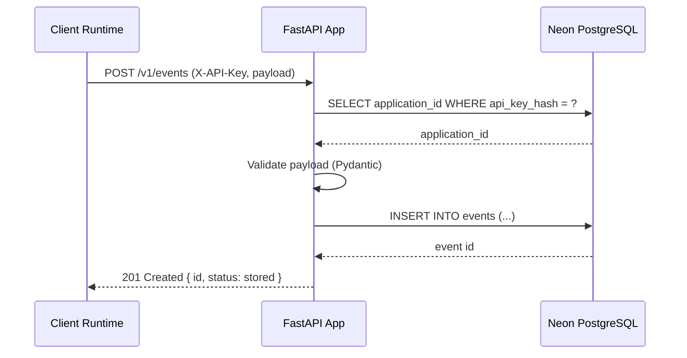
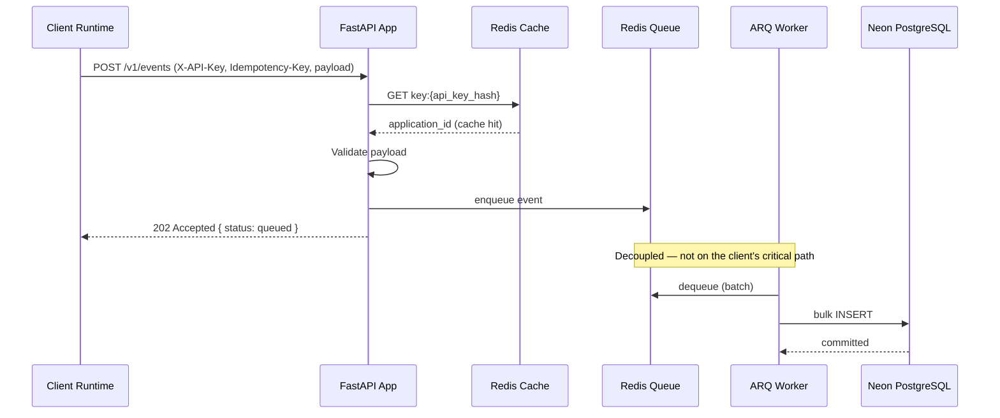
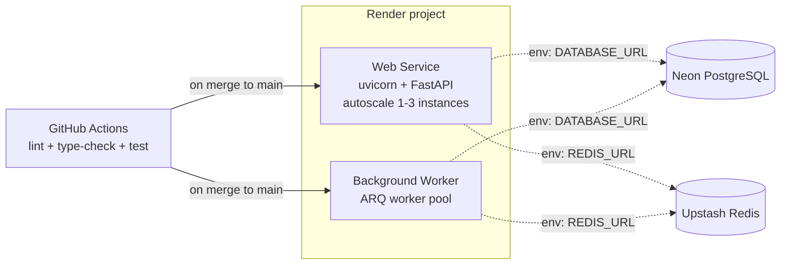

# PulseTrack — Architecture

**Project:** PulseTrack — Event-Collection & Telemetry Backend
**Author:** Sumukh
**Companion Documents:** `PulseTrack_PRD.md` (scope), `PulseTrack_SRD.md` (requirements), `PulseTrack_API_Design.md` (interface contract)
**Purpose of this document:** How the system is actually put together — components, data flow, deployment topology, and the reasoning behind the structural decisions. Where the PRD says *what* and the SRD says *how well*, this document says *how*.

---

## 1. Architectural Style

PulseTrack is a **stateless, layered service** with a hard separation between the request-serving path and the background-processing path, introduced deliberately in Phase 2. It is not a microservices system — there is one deployable API and one deployable worker, sharing a single database — because splitting further would add operational surface area a portfolio-scale ingestion system doesn't need to justify.

**Guiding principles:**
- **Write path is the critical path.** Every architectural choice (async queue, batching, caching) exists to keep `POST /v1/events` fast, because that's the endpoint under the most load.
- **Read path can be eventually consistent.** Aggregation via `/metrics` tolerates a short cache TTL; nothing in the product requires read-after-write strong consistency.
- **Degrade, don't fail.** Any single dependency (Redis) going down should narrow functionality, not take down ingestion (see §10).
- **Two processes, one codebase.** The API and the worker share models, schemas, and DB session logic — no duplicated business logic between them.

---

## 2. System Context



PulseTrack has exactly two external dependencies, both fully managed: **Neon** (system of record) and **Upstash** (cache, queue, rate-limit state — Phase 2). There is no owned infrastructure below the application layer, which is itself a deliberate scope decision for a project meant to demonstrate application-layer engineering, not infra ops.

---

## 3. Logical Architecture



| Component | Responsibility | Scales by |
|---|---|---|
| **FastAPI Web Service** | Auth, validation, routing, cache-aside reads, sync/async write dispatch | Horizontal — stateless, add Render instances |
| **ARQ Worker Pool** | Dequeues events, batches, bulk-inserts, retries, DLQ routing | Horizontal — add worker processes; each pulls independently from the shared queue |
| **Redis (Cache role)** | Key resolution cache, aggregation result cache | Vertical (Upstash-managed) |
| **Redis (Queue role)** | Durable ingestion buffer decoupling client latency from DB write latency | Vertical (Upstash-managed) |
| **Neon PostgreSQL** | System of record for `applications` and `events`; source of truth for aggregation | Vertical + read-side connection pooling |

**Why the API and worker are separate deployables, not one process with a background thread:** an in-process background task competes with the ASGI event loop for the same CPU and dies with the web dyno on every deploy/restart. A separate Render service gives the worker its own lifecycle, its own scaling knob, and survives API redeploys without dropping in-flight batches.

---

## 4. Request Flow

### 4.1 Phase 1 — Synchronous Ingestion



Every step is on the client's critical path. This is intentionally the simplest possible correct implementation — Phase 1 exists to prove the data model and contract are right before optimizing.

### 4.2 Phase 2 — Asynchronous Ingestion



The client-perceived latency in 4.2 is bounded by cache lookup + enqueue — both sub-millisecond operations against Redis — instead of a full Postgres round-trip. This is the single biggest lever in the system for hitting the <50ms p95 target in `PulseTrack_SRD.md` §6.

---

## 5. Technology Stack & Rationale

| Layer | Choice | Why | Alternative considered |
|---|---|---|---|
| Web framework | **FastAPI** | Native `async`/`await`, Pydantic-based validation, auto-generated OpenAPI | Flask — sync-first, would block the event loop on I/O |
| ORM | **SQLAlchemy 2.0 (async)** | Explicit async support via `asyncpg`, mature migration story via Alembic | Raw `asyncpg` — less boilerplate at small scale, but no schema-as-code |
| Database | **Neon PostgreSQL** | Serverless, branchable (dev/test branches off prod schema), native JSONB + declarative partitioning | Supabase — more built-in features than the project needs |
| Cache & queue | **Upstash Redis** | Serverless, REST-compatible (plays well with Render's ephemeral connections), usage-based free tier | Self-hosted Redis — added ops burden with no benefit at this scale |
| Async task queue | **ARQ** | `asyncio`-native, Redis-backed, minimal config surface | Celery — heavier, broker+backend split, friction against an async-first codebase |
| Hosting | **Render** | Git-push deploys, supports both a web service and a background worker under one project | Fly.io / AWS ECS — more control than needed, more ops overhead |
| Migrations | **Alembic** | Standard for SQLAlchemy, autogenerates from ORM models | Manual DDL — not reproducible, error-prone |

---

## 6. Data Architecture

Full schema and constraints are normative in `PulseTrack_PRD.md` §5 and visualized in the project's ERD. Architecturally relevant decisions:

- **`events.id` is `BIGINT IDENTITY`, not `UUID`** — preserves insert locality on the primary key's B-tree under high write volume. Cost: event IDs aren't globally unique across a hypothetical future multi-region deployment; accepted because PulseTrack is explicitly single-region.
- **`events` is range-partitioned by `occurred_at` (monthly, Phase 2)** — keeps each partition's indexes small (faster time-bounded aggregation) and makes retention enforcement an O(1) `DETACH PARTITION` instead of a row-scanning `DELETE`.
- **`metadata JSONB` with a GIN index** — schemaless custom properties without migrations, at the cost of GIN index write overhead versus a fully normalized column set. Accepted because the whole point of the field is client-defined flexibility.

---

## 7. Deployment Topology



- **Web Service:** Autoscaled 1–3 instances behind Render's load balancer; stateless, so any instance can serve any request.
- **Background Worker:** A separate Render service type (no public port), running one or more ARQ worker processes against the same Redis queue.
- **Secrets:** `DATABASE_URL`, `REDIS_URL`, and any signing keys are injected as Render environment variables — never committed to the repository.
- **CI/CD:** GitHub Actions runs lint (`ruff`), type-check (`mypy`), and `pytest` on every PR; merges to `main` trigger Render's auto-deploy for both services independently.

---

## 8. Scalability Strategy

| Dimension | Phase 1 approach | Phase 2 approach |
|---|---|---|
| **Write throughput** | Bounded by synchronous Postgres commits, one row at a time | Queue absorbs bursts; workers batch-insert, amortizing per-row commit cost |
| **Read throughput** | Every metrics call hits Postgres | Redis cache-aside absorbs repeated queries within the TTL window |
| **Horizontal scale** | Add Render web instances (stateless, safe immediately) | Add both web instances and worker processes independently — the queue naturally load-balances across workers |
| **Database growth** | Single unpartitioned table | Monthly partitions bound per-partition index size as data grows |

---

## 9. Resilience & Fault Tolerance

- **Redis unavailable →** the API falls back to direct Postgres queries for key resolution and metrics (feature-flagged, per `PulseTrack_SRD.md` NFR-REL-02). Ingestion degrades from `202` async to `201` sync rather than failing outright.
- **Worker crash mid-batch →** ARQ's retry mechanism re-attempts the job; after 3 failures the batch is moved to a Redis-backed DLQ for manual inspection rather than silently dropped.
- **Client-side retries →** an optional `Idempotency-Key` on `POST /v1/events` means a retried request after a timed-out response doesn't create a duplicate event.
- **Neon cold start →** since Neon can suspend an idle compute endpoint, the connection pool is configured to tolerate and retry the first query's added latency after idle rather than surfacing it as a client-facing error.

---

## 10. Security Architecture

- **API keys** are generated with a CSPRNG, hashed with SHA-256 at rest, and returned in plaintext exactly once (creation or rotation) — see `PulseTrack_API_Design.md` §3.
- **Tenant isolation** is enforced at the query layer: every event and metrics query is scoped by the `application_id` resolved from the caller's own key, not a client-supplied ID taken at face value.
- **Transport** is TLS-only in production; Render terminates TLS at the edge.
- **No mandatory PII** in the schema — `distinct_id` and `metadata` are opaque to PulseTrack, pushing data-sensitivity decisions to the integrating client.
- **Secrets** live only in Render's environment variable store, never in source control.

---

## 11. Observability Architecture

- **Structured logging:** every request logged as JSON with a `request_id`, method, path, status, and latency (Phase 1).
- **Health check:** `GET /v1/health` reports API, Postgres, and Redis connectivity independently, returning `200` even in a degraded-but-serving state so uptime monitors don't false-alarm on a graceful fallback.
- **Metrics scrape:** `GET /metrics` (Phase 2) exposes request counts, latency histograms, and queue depth in Prometheus format for anyone who wants to point Grafana at it.
- **Correlation:** the same `request_id` a client sees in an error response is what appears in server logs, closing the loop for debugging without needing server access.

---

## 12. Repository Structure

```
pulsetrack/
├── app/
│   ├── main.py                 # FastAPI app instantiation, router mounting
│   ├── api/v1/
│   │   ├── applications.py
│   │   ├── events.py
│   │   └── metrics.py
│   ├── core/
│   │   ├── config.py            # env-based settings
│   │   ├── security.py          # API key hashing/verification
│   │   └── logging.py           # structured JSON logger setup
│   ├── db/
│   │   ├── session.py           # async engine + session factory
│   │   └── models.py            # SQLAlchemy 2.0 ORM models
│   ├── services/
│   │   ├── ingestion.py         # sync + async write paths
│   │   ├── aggregation.py       # metrics query logic
│   │   └── rate_limit.py        # Redis token-bucket logic (Phase 2)
│   ├── workers/
│   │   └── arq_worker.py        # ARQ task definitions, batching logic
│   └── schemas/                 # Pydantic request/response models
├── alembic/                     # migration scripts
├── tests/
├── docker-compose.yml           # local Postgres for dev parity
├── pyproject.toml
├── render.yaml                  # web service + worker service definitions
└── README.md
```

---

## 13. Architecture Decision Records

| ID | Decision | Rationale (one line) |
|---|---|---|
| ADR-001 | `BIGINT IDENTITY` over `UUID` for `events.id` | Insert locality at high write volume; single-region deployment makes global uniqueness unnecessary |
| ADR-002 | Start synchronous (Phase 1), defer queueing to Phase 2 | Prove correctness of the data model and contract before optimizing for concurrency |
| ADR-003 | Fixed-window over sliding-window rate limiting | O(1) memory, one Redis round-trip; boundary bursting accepted as a documented trade-off |
| ADR-004 | Static API keys over OAuth2 | No delegated-access use case exists; static keys are the simpler correct choice |
| ADR-005 | ARQ over Celery for async processing | `asyncio`-native, avoids broker/backend split friction in an async-first codebase |
| ADR-006 | Soft delete only for `applications` | Destroying telemetry history has no legitimate low-friction use case |
| ADR-007 | Cache-aside over write-through for Redis | Simpler failure mode — a cache miss degrades to a DB read, never blocks a write |
| ADR-008 | Fail-open on Redis unavailability | Availability of ingestion is prioritized over the performance benefit Redis provides |
| ADR-009 | Separate Render services for API and worker | Independent scaling and deploy lifecycle; a worker crash or redeploy can't take down ingestion |

---

## 14. Evolution Path (Beyond Phase 2)

Explicitly out of scope for both phases, listed here to show the design was bounded on purpose rather than by omission:

- **Multi-region deployment** — would require moving off a single Neon primary, revisiting the `BIGINT` PK decision (ADR-001), and geo-aware routing.
- **Materialized rollup tables** — for aggregation at a scale where even a cached `GROUP BY` becomes too slow, pre-aggregated hourly/daily rollups updated by the worker would replace live queries.
- **Streaming ingestion (Kafka/Kinesis)** — if throughput requirements exceed what a Redis-backed queue can durably buffer.
- **Webhook delivery** — real-time push of events to a client-registered URL, turning PulseTrack from pull-only analytics into an event bus.

---

*End of document.*
