# Sequence Diagram Design Document

**Project:** PulseTrack - Event-Collection & Telemetry Backend  
**Author:** Sumukh  
**Version:** 1.0  
**Status:** Draft - Pre-Implementation Design Reference  
**Purpose:** Document the major backend workflows for PulseTrack using implementation-oriented Mermaid sequence diagrams that align with the PRD, SRD, API Design Document, Architecture Document, backend folder structure, Security Design Document, and Database Design Document.

---

## Table of Contents

1. [Introduction](#1-introduction)
2. [Participants](#2-participants)
3. [Sequence Diagrams](#3-sequence-diagrams)
   1. [Application Registration](#31-application-registration)
   2. [Application Authentication](#32-application-authentication)
   3. [Single Event Ingestion - Phase 1](#33-single-event-ingestion---phase-1)
   4. [Single Event Ingestion - Phase 2](#34-single-event-ingestion---phase-2)
   5. [Batch Event Ingestion - Phase 2](#35-batch-event-ingestion---phase-2)
   6. [Metrics Retrieval](#36-metrics-retrieval)
   7. [Rate Limiting - Phase 2](#37-rate-limiting---phase-2)
   8. [API Key Rotation - Phase 2](#38-api-key-rotation---phase-2)
   9. [Application Deactivation - Phase 2](#39-application-deactivation---phase-2)
   10. [Worker Processing Flow - Phase 2](#310-worker-processing-flow---phase-2)
   11. [Redis Failure and Graceful Degradation - Phase 2](#311-redis-failure-and-graceful-degradation---phase-2)
   12. [Database Failure](#312-database-failure)
   13. [Health Check](#313-health-check)
   14. [Logging Flow](#314-logging-flow)
   15. [Request ID Generation](#315-request-id-generation)
   16. [Error Handling](#316-error-handling)
   17. [Deployment Startup](#317-deployment-startup)
   18. [Shutdown Flow](#318-shutdown-flow)
   19. [Background Cache Refresh](#319-background-cache-refresh)
   20. [Future Architecture Flow](#320-future-architecture-flow)
4. [Cross-Cutting Implementation Notes](#4-cross-cutting-implementation-notes)

---

## 1. Introduction

### 1.1 Purpose of Sequence Diagrams

These sequence diagrams describe how PulseTrack components interact at runtime. They are intended to help implementers understand request flow, authentication, authorization, validation, database access, Redis cache and queue behavior, worker processing, failure handling, request correlation, and lifecycle events before code is written.

The diagrams are not feature proposals. They represent the documented PulseTrack architecture:

- Phase 1: synchronous, correctness-first ingestion using FastAPI, Pydantic, SQLAlchemy 2 async, and Neon PostgreSQL.
- Phase 2: Redis-backed API key caching, rate limiting, async queueing, ARQ workers, batch ingestion, idempotency, metrics caching, partitioning, DLQ handling, and Prometheus metrics.

Database interactions in this document follow the Database Design Document's two-entity model: `applications` as the tenant/authentication boundary and `events` as the append-only telemetry fact table. The diagrams assume the documented constraints, indexes, Phase 2 partitioning strategy, and Alembic-managed migration workflow.

### 1.2 How to Read the Diagrams

Each diagram follows request time from top to bottom. Solid arrows are synchronous calls that block the caller. Dashed arrows are returns. Open asynchronous arrows are used for queueing or lifecycle signals where the caller does not wait for downstream persistence.

The diagrams use:

- `alt` for mutually exclusive branches.
- `opt` for optional behavior.
- `loop` for repeated behavior.
- `activate` / `deactivate` bars to show active execution.
- Notes to call out security, consistency, or performance constraints.

### 1.3 Notation Used

| Notation | Meaning |
|---|---|
| `->>` | Synchronous call |
| `-->>` | Return value or response |
| `-)` | Asynchronous dispatch or queue handoff |
| `alt` | Conditional branch |
| `opt` | Optional path |
| `loop` | Repeated behavior |
| `activate` / `deactivate` | Component is actively processing |

### 1.4 Design Assumptions

- FastAPI route modules live under `app/api/v1/`.
- Security helpers live in `app/core/security.py`.
- Environment-driven configuration lives in `app/core/config.py`.
- Structured logging lives in `app/core/logging.py`.
- Database sessions live in `app/db/session.py`.
- SQLAlchemy models live in `app/db/models.py`.
- Business logic lives in `app/services/`.
- ARQ worker logic lives in `app/workers/arq_worker.py`.
- Neon PostgreSQL is the system of record.
- Upstash Redis is introduced in Phase 2 for cache, queue, rate-limit state, and DLQ.
- Render hosts the FastAPI web service and, in Phase 2, a separate background worker service.

### 1.5 System Boundaries

PulseTrack exposes a REST/JSON HTTPS API. It does not include a dashboard UI, OAuth login, WebSocket, gRPC, raw event export endpoint, Kubernetes deployment, self-hosted Redis, multi-region failover, or full PII detection inside event metadata.

---

## 2. Participants

| Participant | Responsibility |
|---|---|
| Client / SDK | External caller that registers applications, sends events, and queries metrics over HTTPS/JSON |
| Render Edge | Production TLS termination and routing to the FastAPI web service |
| FastAPI App | ASGI application that mounts middleware and versioned routers |
| Request ID Middleware | Generates or propagates `X-Request-Id` and places it in request context |
| Logging Middleware | Emits structured JSON logs with route, status, latency, request ID, and safe tenant context |
| Authentication Middleware | Reads `X-API-Key`, hashes it, resolves active application identity, and rejects invalid callers |
| Rate Limit Service | Phase 2 Redis-backed per-application fixed-window limiter |
| FastAPI Router | Endpoint handler in `app/api/v1/` that receives validated route/query/body inputs |
| Validation Layer | Pydantic schemas that validate field types, lengths, timestamps, batch size, and metadata size |
| Application Service | Business logic for application creation, lookup, rotation, and deactivation |
| Ingestion Service | Business logic for single and batch event ingestion, idempotency, queueing, and synchronous writes |
| Aggregation Service | Metrics query and cache orchestration |
| Repository Layer | Database access functions using SQLAlchemy async sessions |
| SQLAlchemy Session | Async transaction/session boundary backed by `asyncpg` |
| Neon PostgreSQL | System of record for `applications` and `events`; enforces unique keys, foreign keys, check constraints, and Phase 2 partitioned event storage |
| Redis Cache | Phase 2 cache-aside store for key resolution and metrics results |
| Redis Queue | Phase 2 ingestion queue consumed by ARQ workers |
| Redis Rate Limit Store | Phase 2 fixed-window counters manipulated atomically |
| Redis DLQ | Phase 2 dead-letter queue for failed batches after retry exhaustion |
| ARQ Worker | Background worker process that consumes queued events and writes batches to PostgreSQL |
| Metrics Collector | Phase 2 Prometheus-style request, latency, queue depth, and failure metrics |
| Configuration | Environment-based settings for database, Redis, runtime mode, and feature flags |
| Alembic / Migration Runner | Applies reviewed schema migrations, including hand-written Phase 2 partition DDL where needed |
| GitHub Actions | CI/CD pipeline running lint, type-check, tests, and deployment triggers |
| Render Web Service | Deployable FastAPI service |
| Render Background Worker | Deployable ARQ worker service in Phase 2 |

---

## 3. Sequence Diagrams

### 3.1 Application Registration

**Purpose:** Create a new application and return a one-time-visible API key.

**Preconditions:** Caller has a valid JSON body containing `name` and `owner_email`. No API key is required because this endpoint bootstraps the first credential.

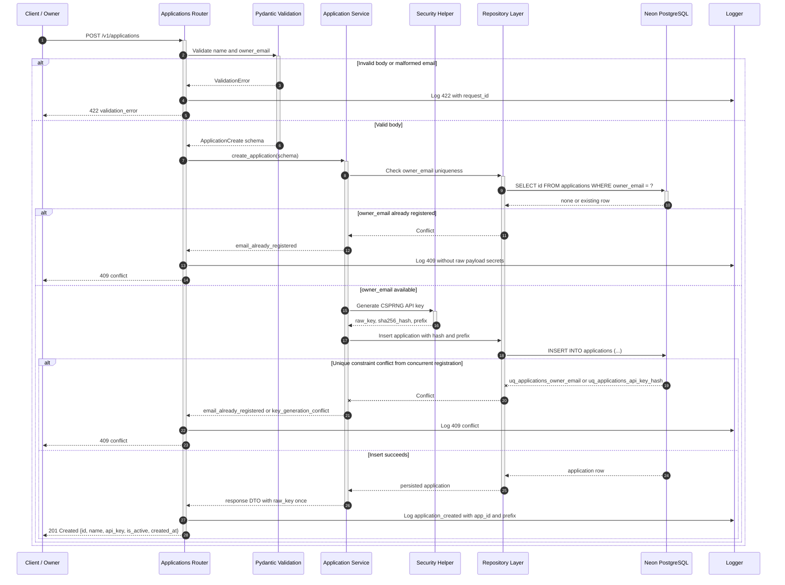
```mermaid
sequenceDiagram
    autonumber
    participant C as Client / Owner
    participant R as Applications Router
    participant V as Pydantic Validation
    participant S as Application Service
    participant Sec as Security Helper
    participant Repo as Repository Layer
    participant DB as Neon PostgreSQL
    participant Log as Logger

    C->>+R: POST /v1/applications
    R->>+V: Validate name and owner_email
    alt Invalid body or malformed email
        V-->>R: ValidationError
        R->>Log: Log 422 with request_id
        R-->>C: 422 validation_error
    else Valid body
        V-->>-R: ApplicationCreate schema
        R->>+S: create_application(schema)
        S->>+Repo: Check owner_email uniqueness
        Repo->>+DB: SELECT id FROM applications WHERE owner_email = ?
        DB-->>-Repo: none or existing row
        alt owner_email already registered
            Repo-->>S: Conflict
            S-->>R: email_already_registered
            R->>Log: Log 409 without raw payload secrets
            R-->>C: 409 conflict
        else owner_email available
            S->>+Sec: Generate CSPRNG API key
            Sec-->>-S: raw_key, sha256_hash, prefix
            S->>Repo: Insert application with hash and prefix
            Repo->>DB: INSERT INTO applications (...)
            alt Unique constraint conflict from concurrent registration
                DB--xRepo: uq_applications_owner_email or uq_applications_api_key_hash
                Repo--xS: Conflict
                S-->>R: email_already_registered or key_generation_conflict
                R->>Log: Log 409 conflict
                R-->>C: 409 conflict
            else Insert succeeds
                DB-->>Repo: application row
                Repo-->>-S: persisted application
                S-->>-R: response DTO with raw_key once
                R->>Log: Log application_created with app_id and prefix
                R-->>-C: 201 Created {id, name, api_key, is_active, created_at}
            end
        end
    end
```

**Main Flow:** The router validates the body, the service checks email uniqueness, generates a high-entropy API key, stores only the SHA-256 hash and prefix, and returns the raw key once.

**Alternative Flow:** Duplicate `owner_email` returns `409 Conflict`.

**Failure Flow:** Validation errors return `422`; database uniqueness conflicts return `409`; database failures return the standard error envelope with a `request_id`.

**Postconditions:** A row exists in `applications`; the owner possesses the only returned copy of the raw API key.

**Implementation Notes:** API key generation belongs in `app/core/security.py`; database writes go through SQLAlchemy async sessions; raw keys must not be logged. The database enforces unique `owner_email`, unique `api_key_hash`, and positive `rate_limit_per_minute`.

**Design Discussion:** This workflow is intentionally unauthenticated because it creates the initial credential. The security control is not pre-authentication; it is one-time raw key disclosure, hashed storage, uniqueness checks, structured logging, and future rotation/deactivation.

---

### 3.2 Application Authentication

**Purpose:** Resolve `X-API-Key` into an active `application_id` for every protected route.

**Preconditions:** Request targets a protected endpoint such as event ingestion, metrics, application read, key rotation, or deactivation.

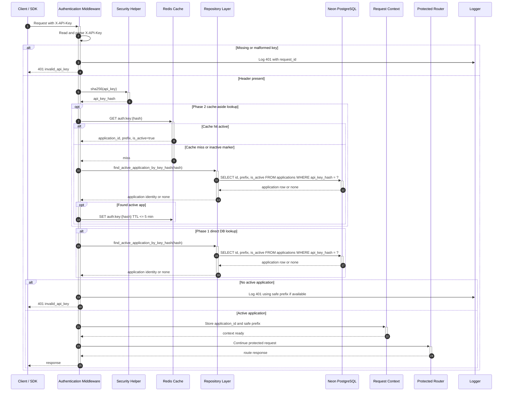
```mermaid
sequenceDiagram
    autonumber
    participant C as Client / SDK
    participant MW as Authentication Middleware
    participant Sec as Security Helper
    participant Cache as Redis Cache
    participant Repo as Repository Layer
    participant DB as Neon PostgreSQL
    participant Ctx as Request Context
    participant R as Protected Router
    participant Log as Logger

    C->>+MW: Request with X-API-Key
    MW->>MW: Read and parse X-API-Key
    alt Missing or malformed key
        MW->>Log: Log 401 with request_id
        MW-->>C: 401 invalid_api_key
    else Header present
        MW->>+Sec: sha256(api_key)
        Sec-->>-MW: api_key_hash
        opt Phase 2 cache-aside lookup
            MW->>+Cache: GET auth:key:{hash}
            alt Cache hit active
                Cache-->>MW: application_id, prefix, is_active=true
            else Cache miss or inactive marker
                Cache-->>-MW: miss
                MW->>+Repo: find_active_application_by_key_hash(hash)
                Repo->>+DB: SELECT id, prefix, is_active FROM applications WHERE api_key_hash = ?
                DB-->>-Repo: application row or none
                Repo-->>-MW: application identity or none
                opt Found active app
                    MW->>Cache: SET auth:key:{hash} TTL <= 5 min
                end
            end
        end
        alt Phase 1 direct DB lookup
            MW->>+Repo: find_active_application_by_key_hash(hash)
            Repo->>+DB: SELECT id, prefix, is_active FROM applications WHERE api_key_hash = ?
            DB-->>-Repo: application row or none
            Repo-->>-MW: application identity or none
        end
        alt No active application
            MW->>Log: Log 401 using safe prefix if available
            MW-->>C: 401 invalid_api_key
        else Active application
            MW->>+Ctx: Store application_id and safe prefix
            Ctx-->>-MW: context ready
            MW->>+R: Continue protected request
            R-->>-MW: route response
            MW-->>-C: response
        end
    end
```

**Main Flow:** Middleware hashes the key, resolves it to an active application, stores identity in request context, and forwards the request.

**Alternative Flow:** Phase 2 uses Redis cache-aside first; Phase 1 goes directly to PostgreSQL.

**Failure Flow:** Missing, malformed, unknown, or inactive keys fail closed with `401`.

**Postconditions:** Protected route code can rely on resolved `application_id`; it must still enforce route-level authorization for path IDs.

**Implementation Notes:** Cache entries must not store raw keys. Rotation and deactivation must invalidate cached key mappings.

**Design Discussion:** Authentication is centralized so endpoint handlers cannot forget key verification. The application identity comes from the key, not client-supplied IDs.

---

### 3.3 Single Event Ingestion - Phase 1

**Purpose:** Store one telemetry event synchronously and return `201 Created` only after the database commit succeeds.

**Preconditions:** Caller has a valid active API key. Payload includes `event_name` and timezone-aware `occurred_at`; metadata is at most 8KB.

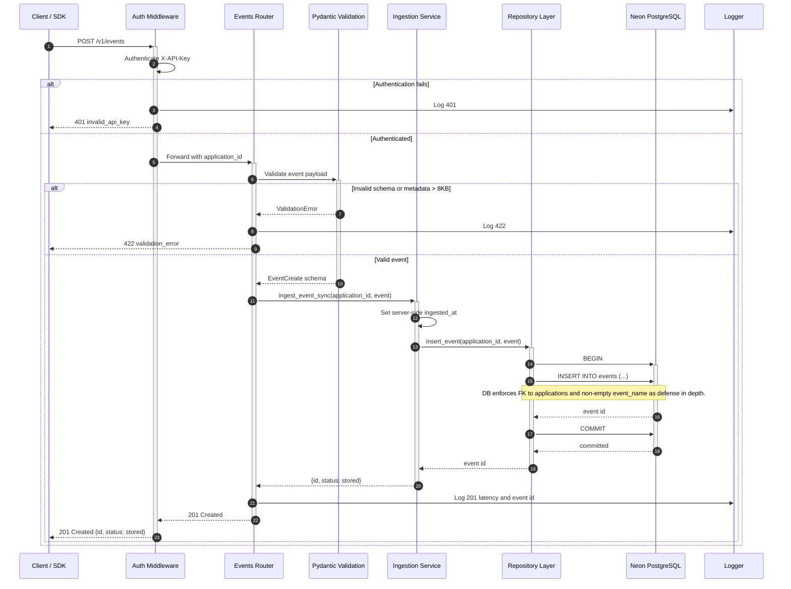
```mermaid
sequenceDiagram
    autonumber
    participant C as Client / SDK
    participant MW as Auth Middleware
    participant R as Events Router
    participant V as Pydantic Validation
    participant S as Ingestion Service
    participant Repo as Repository Layer
    participant DB as Neon PostgreSQL
    participant Log as Logger

    C->>+MW: POST /v1/events
    MW->>MW: Authenticate X-API-Key
    alt Authentication fails
        MW->>Log: Log 401
        MW-->>C: 401 invalid_api_key
    else Authenticated
        MW->>+R: Forward with application_id
        R->>+V: Validate event payload
        alt Invalid schema or metadata > 8KB
            V-->>R: ValidationError
            R->>Log: Log 422
            R-->>C: 422 validation_error
        else Valid event
            V-->>-R: EventCreate schema
            R->>+S: ingest_event_sync(application_id, event)
            S->>S: Set server-side ingested_at
            S->>+Repo: insert_event(application_id, event)
            Repo->>+DB: BEGIN
            Repo->>DB: INSERT INTO events (...)
            Note over Repo,DB: DB enforces FK to applications and non-empty event_name as defense in depth.
            DB-->>Repo: event id
            Repo->>DB: COMMIT
            DB-->>-Repo: committed
            Repo-->>-S: event id
            S-->>-R: {id, status: stored}
            R->>Log: Log 201 latency and event id
            R-->>-MW: 201 Created
            MW-->>-C: 201 Created {id, status: stored}
        end
    end
```

**Main Flow:** Authentication succeeds, Pydantic validates the event, service stamps `ingested_at`, repository inserts into PostgreSQL, and the API returns the persisted ID.

**Alternative Flow:** None for persistence in Phase 1; the write is synchronous.

**Failure Flow:** Authentication returns `401`; validation returns `422`; database write failure returns `500` with request ID and no false success.

**Postconditions:** On `201`, the event row exists and is immediately queryable by metrics.

**Implementation Notes:** The event's `application_id` must come from auth context. Clients cannot supply tenant identity. The database design adds a second layer of protection through the `events.application_id` foreign key and `ck_events_event_name_not_empty` check constraint.

**Design Discussion:** Phase 1 optimizes correctness and implementation clarity over latency. It proves the schema, auth, validation, and aggregation path before async queueing is introduced.

---

### 3.4 Single Event Ingestion - Phase 2

**Purpose:** Accept one event quickly by validating and enqueueing it for background persistence.

**Preconditions:** Redis is available for the normal async path. Caller has a valid active API key. Optional `Idempotency-Key` is a UUID.

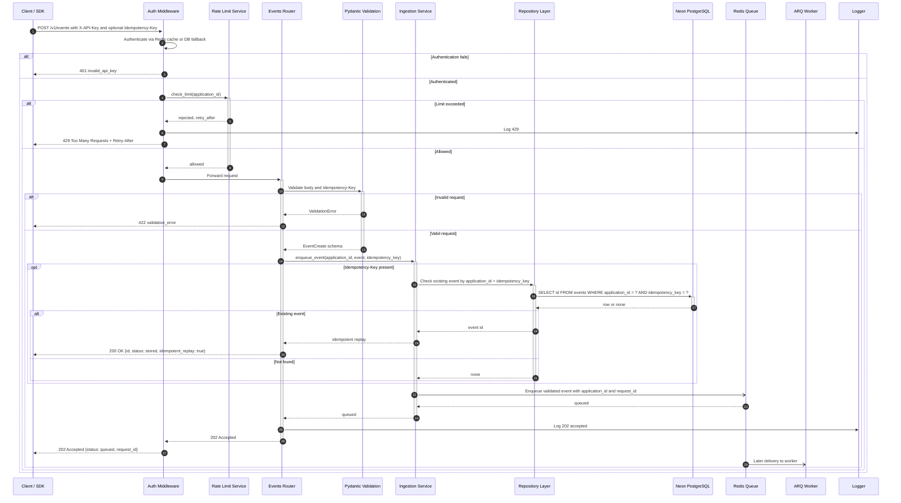
```mermaid
sequenceDiagram
    autonumber
    participant C as Client / SDK
    participant MW as Auth Middleware
    participant RL as Rate Limit Service
    participant R as Events Router
    participant V as Pydantic Validation
    participant S as Ingestion Service
    participant Repo as Repository Layer
    participant DB as Neon PostgreSQL
    participant Queue as Redis Queue
    participant W as ARQ Worker
    participant Log as Logger

    C->>+MW: POST /v1/events with X-API-Key and optional Idempotency-Key
    MW->>MW: Authenticate via Redis cache or DB fallback
    alt Authentication fails
        MW-->>C: 401 invalid_api_key
    else Authenticated
        MW->>+RL: check_limit(application_id)
        alt Limit exceeded
            RL-->>MW: rejected, retry_after
            MW->>Log: Log 429
            MW-->>C: 429 Too Many Requests + Retry-After
        else Allowed
            RL-->>-MW: allowed
            MW->>+R: Forward request
            R->>+V: Validate body and Idempotency-Key
            alt Invalid request
                V-->>R: ValidationError
                R-->>C: 422 validation_error
            else Valid request
                V-->>-R: EventCreate schema
                R->>+S: enqueue_event(application_id, event, idempotency_key)
                opt Idempotency-Key present
                    S->>+Repo: Check existing event by application_id + idempotency_key
                    Repo->>+DB: SELECT id FROM events WHERE application_id = ? AND idempotency_key = ?
                    DB-->>-Repo: row or none
                    alt Existing event
                        Repo-->>S: event id
                        S-->>R: idempotent replay
                        R-->>C: 200 OK {id, status: stored, idempotent_replay: true}
                    else Not found
                        Repo-->>-S: none
                    end
                end
                S-)Queue: Enqueue validated event with application_id and request_id
                Queue-->>S: queued
                S-->>-R: queued
                R->>Log: Log 202 accepted
                R-->>-MW: 202 Accepted
                MW-->>C: 202 Accepted {status: queued, request_id}
                Queue-)W: Later delivery to worker
            end
        end
    end
```

**Main Flow:** Authentication and rate limiting pass, the request validates, and the event is queued with server-resolved `application_id`.

**Alternative Flow:** An idempotent replay with an already persisted event returns `200 OK`.

**Failure Flow:** Invalid key returns `401`; rate limit returns `429`; validation returns `422`; Redis queue failure falls back as shown in the Redis failure diagram.

**Postconditions:** On `202`, the event has been accepted for asynchronous persistence but may not yet exist in PostgreSQL.

**Implementation Notes:** The response must not claim the event is stored. Worker processing owns the eventual database insert.

**Design Discussion:** This moves database commit latency off the client path, targeting lower p95 latency while preserving at-least-once delivery semantics. Final duplicate protection is still backed by the database partial unique index on `(application_id, idempotency_key) WHERE idempotency_key IS NOT NULL`, so retries remain safe even under concurrent workers.

---

### 3.5 Batch Event Ingestion - Phase 2

**Purpose:** Accept up to 500 events in one request, validate each item, and enqueue only valid events.

**Preconditions:** Caller is authenticated and allowed by the rate limiter. Request body contains an `events` array with at most 500 items.

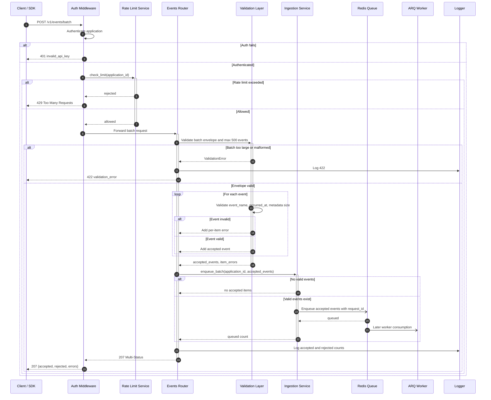
```mermaid
sequenceDiagram
    autonumber
    participant C as Client / SDK
    participant MW as Auth Middleware
    participant RL as Rate Limit Service
    participant R as Events Router
    participant V as Validation Layer
    participant S as Ingestion Service
    participant Queue as Redis Queue
    participant W as ARQ Worker
    participant Log as Logger

    C->>+MW: POST /v1/events/batch
    MW->>MW: Authenticate application
    alt Auth fails
        MW-->>C: 401 invalid_api_key
    else Authenticated
        MW->>+RL: check_limit(application_id)
        alt Rate limit exceeded
            RL-->>MW: rejected
            MW-->>C: 429 Too Many Requests
        else Allowed
            RL-->>-MW: allowed
            MW->>+R: Forward batch request
            R->>+V: Validate batch envelope and max 500 events
            alt Batch too large or malformed
                V-->>R: ValidationError
                R->>Log: Log 422
                R-->>C: 422 validation_error
            else Envelope valid
                loop For each event
                    V->>V: Validate event_name, occurred_at, metadata size
                    alt Event invalid
                        V-->>R: Add per-item error
                    else Event valid
                        V-->>R: Add accepted event
                    end
                end
                V-->>-R: accepted_events, item_errors
                R->>+S: enqueue_batch(application_id, accepted_events)
                alt No valid events
                    S-->>R: no accepted items
                else Valid events exist
                    S-)Queue: Enqueue accepted events with request_id
                    Queue-->>S: queued
                    Queue-)W: Later worker consumption
                    S-->>-R: queued count
                end
                R->>Log: Log accepted and rejected counts
                R-->>-MW: 207 Multi-Status
                MW-->>C: 207 {accepted, rejected, errors}
            end
        end
    end
```

**Main Flow:** The API validates the batch envelope and each item, enqueues valid events, and returns accepted/rejected counts.

**Alternative Flow:** A mixed-validity batch returns `207 Multi-Status` with per-item errors rather than failing all valid events.

**Failure Flow:** Auth, rate limit, malformed envelope, or oversized batch fail before queueing.

**Postconditions:** Only valid events are queued. Invalid events are reported by index.

**Implementation Notes:** The API applies one authenticated `application_id` to every accepted item.

**Design Discussion:** Partial success is appropriate for high-frequency clients because one malformed event should not discard hundreds of valid events.

---

### 3.6 Metrics Retrieval

**Purpose:** Return tenant-scoped time-bucketed counts for an event name, using PostgreSQL in Phase 1 and cache-aside in Phase 2.

**Preconditions:** Caller has a valid API key. Path application ID matches authenticated application ID. Query includes `event_name`, `start_date`, `end_date`, and optional `granularity`.

```mermaid
sequenceDiagram
    autonumber
    participant C as Client / Owner
    participant MW as Auth Middleware
    participant R as Metrics Router
    participant V as Query Validation
    participant AuthZ as Authorization Check
    participant S as Aggregation Service
    participant Cache as Redis Cache
    participant Repo as Repository Layer
    participant DB as Neon PostgreSQL
    participant Log as Logger

    C->>+MW: GET /v1/applications/{id}/metrics
    MW->>MW: Authenticate API key
    alt Auth fails
        MW-->>C: 401 invalid_api_key
    else Authenticated
        MW->>+R: Forward with application_id
        R->>+V: Validate event_name, dates, granularity
        alt start_date > end_date
            V-->>R: semantic error
            R-->>C: 400 invalid_date_range
        else Query valid
            V-->>-R: MetricsQuery
            R->>+AuthZ: Compare path id to authenticated application_id
            alt Cross-tenant path id
                AuthZ-->>R: denied
                R->>Log: Log 403 cross_tenant_attempt
                R-->>C: 403 forbidden
            else Authorized
                AuthZ-->>-R: allowed
                R->>+S: get_metrics(application_id, query)
                opt Phase 2 cache lookup
                    S->>+Cache: GET metrics:{application_id}:{query_hash}
                    alt Cache hit
                        Cache-->>S: cached result
                        S-->>R: result with cache_hit=true
                        R-->>C: 200 OK
                    else Cache miss
                        Cache-->>-S: miss
                    end
                end
                S->>+Repo: aggregate_counts(application_id, query)
                Repo->>+DB: SELECT date_bucket, count FROM events WHERE application_id = ? GROUP BY bucket
                Note over Repo,DB: Uses idx_events_app_name_time; Phase 2 partition pruning narrows occurred_at ranges.
                DB-->>-Repo: ordered buckets
                Repo-->>-S: aggregation result
                opt Phase 2 cache store
                    S->>Cache: SET metrics cache TTL 30-60s
                end
                S-->>-R: result with cache_hit=false
                R->>Log: Log 200 metrics query
                R-->>-MW: 200 OK
                MW-->>C: 200 OK {event_name, granularity, cache_hit, data}
            end
        end
    end
```

**Main Flow:** The router validates the query, authorizes tenant scope, checks cache in Phase 2, and falls back to a PostgreSQL aggregation query.

**Alternative Flow:** Cache hit returns without database access.

**Failure Flow:** Invalid date range returns `400`; cross-tenant access returns `403`; database errors return standard `500`.

**Postconditions:** No persistent state changes, except optional Phase 2 metrics cache population.

**Implementation Notes:** Cache keys must include authenticated `application_id` and query parameters. The database query shape is intentionally aligned with `idx_events_app_name_time` on `(application_id, event_name, occurred_at DESC)`.

**Design Discussion:** Cache-aside keeps Phase 2 read performance high while preserving PostgreSQL as the source of truth.

---

### 3.7 Rate Limiting - Phase 2

**Purpose:** Enforce per-application request limits using an atomic Redis fixed-window counter.

**Preconditions:** Request is authenticated and has an `application_id`; Redis is available for normal rate-limit operation.

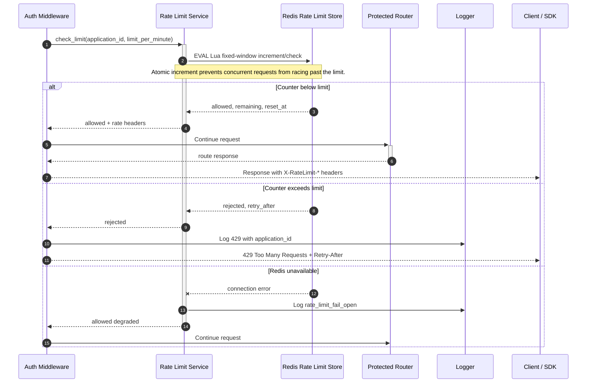
```mermaid
sequenceDiagram
    autonumber
    participant MW as Auth Middleware
    participant RL as Rate Limit Service
    participant Redis as Redis Rate Limit Store
    participant R as Protected Router
    participant Log as Logger
    participant C as Client / SDK

    MW->>+RL: check_limit(application_id, limit_per_minute)
    RL->>+Redis: EVAL Lua fixed-window increment/check
    Note over RL,Redis: Atomic increment prevents concurrent requests from racing past the limit.
    alt Counter below limit
        Redis-->>RL: allowed, remaining, reset_at
        RL-->>MW: allowed + rate headers
        MW->>+R: Continue request
        R-->>-MW: route response
        MW-->>C: Response with X-RateLimit-* headers
    else Counter exceeds limit
        Redis-->>RL: rejected, retry_after
        RL-->>MW: rejected
        MW->>Log: Log 429 with application_id
        MW-->>C: 429 Too Many Requests + Retry-After
    else Redis unavailable
        Redis--xRL: connection error
        RL->>Log: Log rate_limit_fail_open
        RL-->>-MW: allowed degraded
        MW->>R: Continue request
    end
```

**Main Flow:** Redis atomically increments and checks the current fixed window.

**Alternative Flow:** Redis failure fails open as documented, allowing the request while logging degraded protection.

**Failure Flow:** Over-limit requests return `429` with `Retry-After`.

**Postconditions:** Redis counter state reflects the request unless Redis was unavailable.

**Implementation Notes:** The documented design uses fixed-window counters for O(1) memory and one Redis round trip.

**Design Discussion:** Boundary bursts are accepted as a portfolio-scale trade-off for simplicity and performance.

---

### 3.8 API Key Rotation - Phase 2

**Purpose:** Immediately invalidate the current API key and issue a new one-time-visible key.

**Preconditions:** Caller is authenticated with the current active key and path application ID matches the authenticated application.

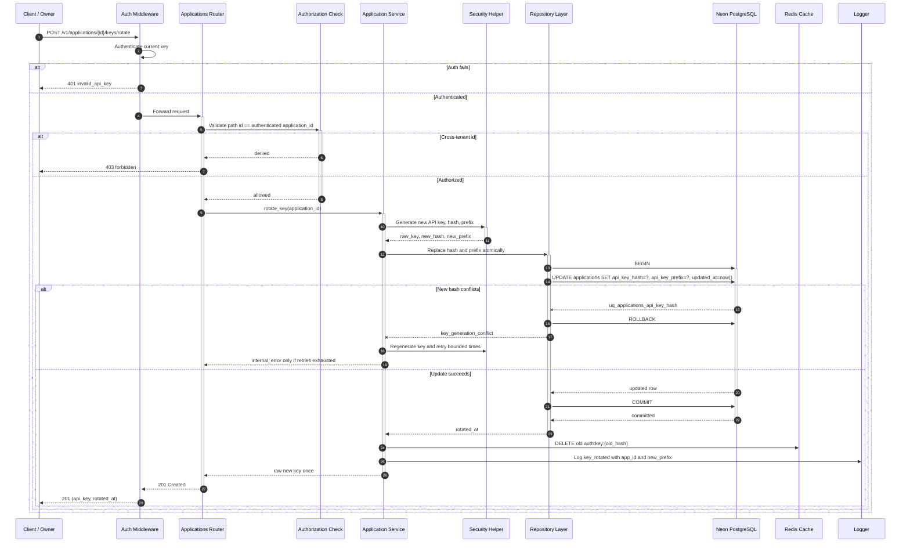
```mermaid
sequenceDiagram
    autonumber
    participant C as Client / Owner
    participant MW as Auth Middleware
    participant R as Applications Router
    participant AuthZ as Authorization Check
    participant S as Application Service
    participant Sec as Security Helper
    participant Repo as Repository Layer
    participant DB as Neon PostgreSQL
    participant Cache as Redis Cache
    participant Log as Logger

    C->>+MW: POST /v1/applications/{id}/keys/rotate
    MW->>MW: Authenticate current key
    alt Auth fails
        MW-->>C: 401 invalid_api_key
    else Authenticated
        MW->>+R: Forward request
        R->>+AuthZ: Validate path id == authenticated application_id
        alt Cross-tenant id
            AuthZ-->>R: denied
            R-->>C: 403 forbidden
        else Authorized
            AuthZ-->>-R: allowed
            R->>+S: rotate_key(application_id)
            S->>+Sec: Generate new API key, hash, prefix
            Sec-->>-S: raw_key, new_hash, new_prefix
            S->>+Repo: Replace hash and prefix atomically
            Repo->>+DB: BEGIN
            Repo->>DB: UPDATE applications SET api_key_hash=?, api_key_prefix=?, updated_at=now()
            alt New hash conflicts
                DB--xRepo: uq_applications_api_key_hash
                Repo->>DB: ROLLBACK
                Repo--xS: key_generation_conflict
                S->>Sec: Regenerate key and retry bounded times
                S-->>R: internal_error only if retries exhausted
            else Update succeeds
                DB-->>Repo: updated row
                Repo->>DB: COMMIT
                DB-->>-Repo: committed
                Repo-->>-S: rotated_at
                S->>Cache: DELETE old auth:key:{old_hash}
                S->>Log: Log key_rotated with app_id and new_prefix
                S-->>-R: raw new key once
                R-->>-MW: 201 Created
                MW-->>C: 201 {api_key, rotated_at}
            end
        end
    end
```

**Main Flow:** Authorized owner rotates the key in a database transaction, deletes old cache state, and receives the new raw key once.

**Alternative Flow:** Cross-tenant path returns `403`.

**Failure Flow:** If the database update fails or the unique hash constraint rejects the generated key, the old key remains valid and no new key is returned.

**Postconditions:** Old key is invalid; new key hash and prefix are persisted.

**Implementation Notes:** Raw keys must not be logged. Cache invalidation is mandatory because Phase 2 auth uses Redis cache-aside.

**Design Discussion:** Rotation limits blast radius after key exposure while preserving the simple static-key auth model.

---

### 3.9 Application Deactivation - Phase 2

**Purpose:** Soft-disable an application without deleting its historical event data.

**Preconditions:** Caller is authenticated and authorized for the application.

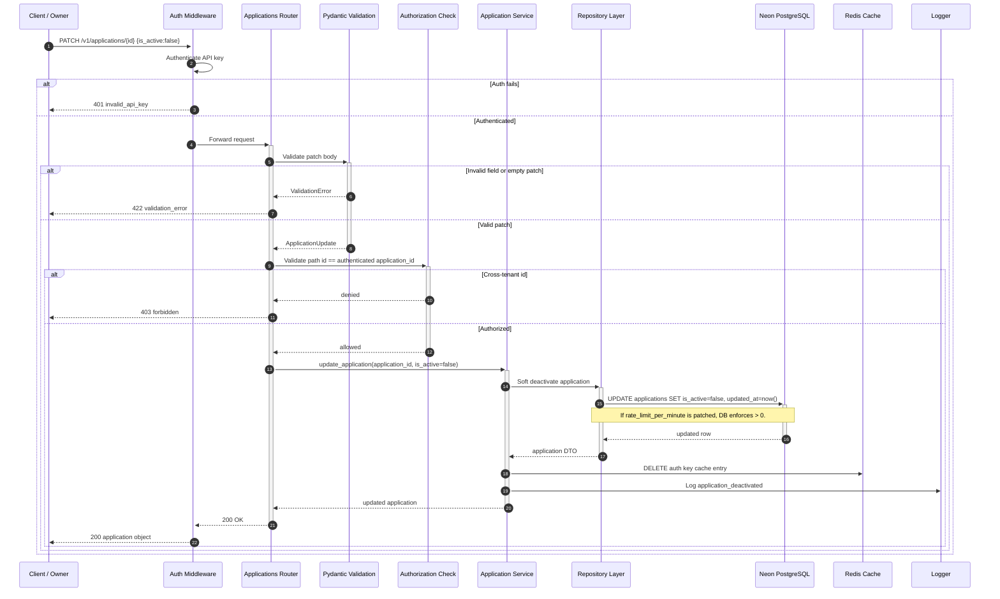
```mermaid
sequenceDiagram
    autonumber
    participant C as Client / Owner
    participant MW as Auth Middleware
    participant R as Applications Router
    participant V as Pydantic Validation
    participant AuthZ as Authorization Check
    participant S as Application Service
    participant Repo as Repository Layer
    participant DB as Neon PostgreSQL
    participant Cache as Redis Cache
    participant Log as Logger

    C->>+MW: PATCH /v1/applications/{id} {is_active:false}
    MW->>MW: Authenticate API key
    alt Auth fails
        MW-->>C: 401 invalid_api_key
    else Authenticated
        MW->>+R: Forward request
        R->>+V: Validate patch body
        alt Invalid field or empty patch
            V-->>R: ValidationError
            R-->>C: 422 validation_error
        else Valid patch
            V-->>-R: ApplicationUpdate
            R->>+AuthZ: Validate path id == authenticated application_id
            alt Cross-tenant id
                AuthZ-->>R: denied
                R-->>C: 403 forbidden
            else Authorized
                AuthZ-->>-R: allowed
                R->>+S: update_application(application_id, is_active=false)
                S->>+Repo: Soft deactivate application
                Repo->>+DB: UPDATE applications SET is_active=false, updated_at=now()
                Note over Repo,DB: If rate_limit_per_minute is patched, DB enforces > 0.
                DB-->>-Repo: updated row
                Repo-->>-S: application DTO
                S->>Cache: DELETE auth key cache entry
                S->>Log: Log application_deactivated
                S-->>-R: updated application
                R-->>-MW: 200 OK
                MW-->>C: 200 application object
            end
        end
    end
```

**Main Flow:** The application is marked inactive and auth cache is invalidated.

**Alternative Flow:** Valid requests can also update documented fields such as `rate_limit_per_minute`.

**Failure Flow:** Future use of the deactivated key returns `401`.

**Postconditions:** Historical events remain; application can no longer authenticate protected requests while inactive.

**Implementation Notes:** There is no hard-delete endpoint by design.

**Design Discussion:** Soft deactivation avoids accidental destructive deletion while enabling credential shutdown.

---

### 3.10 Worker Processing Flow - Phase 2

**Purpose:** Consume queued events, batch them, bulk insert into PostgreSQL, retry failures, and route exhausted failures to DLQ.

**Preconditions:** ARQ worker is running as a separate Render background worker and connected to Redis and Neon PostgreSQL.

```mermaid
sequenceDiagram
    autonumber
    participant Queue as Redis Queue
    participant W as ARQ Worker
    participant V as Worker Payload Parser
    participant Repo as Repository Layer
    participant DB as Neon PostgreSQL
    participant DLQ as Redis DLQ
    participant Met as Metrics Collector
    participant Log as Logger

    loop Worker polling
        W->>+Queue: Dequeue job or batch
        Queue-->>-W: queued events
        W->>+V: Parse and validate queued payloads
        alt Malformed payload
            V-->>W: invalid payload
            W->>DLQ: Push malformed payload with reason
            W->>Log: Log worker_payload_invalid
        else Payload valid
            V-->>-W: normalized events
            W->>W: Build batch
            W->>+Repo: bulk_insert_events(batch)
            Repo->>+DB: BEGIN
            Repo->>DB: INSERT many events via executemany or COPY
            Note over Repo,DB: Phase 2 events table is range-partitioned by occurred_at; primary key includes occurred_at.
            alt Insert succeeds
                DB-->>Repo: inserted count
                Repo->>DB: COMMIT
                DB-->>-Repo: committed
                Repo-->>-W: success
                W->>Met: Increment worker_success and queue_depth
                W->>Log: Log batch_insert_success
            else Insert fails
                DB--xRepo: database error
                Repo->>DB: ROLLBACK
                Repo--xW: failure
                loop Up to 3 attempts
                    W->>Repo: retry bulk_insert_events(batch)
                    alt Retry succeeds
                        Repo-->>W: success
                    else Retry fails
                        Repo--xW: failure
                    end
                end
                alt Retries exhausted
                    W->>DLQ: Push batch with failure reason
                    W->>Met: Increment dlq_count
                    W->>Log: Log worker_batch_dlq
                end
            end
        end
    end
```

**Main Flow:** Worker validates queued payloads, batches them, and persists them efficiently.

**Alternative Flow:** Malformed payloads are not allowed to crash the worker; they go to DLQ with context.

**Failure Flow:** Failed inserts retry up to the documented limit, then move to DLQ.

**Postconditions:** Successful batches are committed to PostgreSQL; failed batches are visible for operator inspection.

**Implementation Notes:** Worker logs should preserve request correlation IDs where available and avoid full metadata logs by default. Worker bulk inserts should respect the documented 500-event batch ceiling and rely on database constraints for foreign key, event-name, and idempotency integrity.

**Design Discussion:** Separating worker lifecycle from the web service prevents API deploys and request spikes from directly blocking database batch processing.

---

### 3.11 Redis Failure and Graceful Degradation - Phase 2

**Purpose:** Show how PulseTrack continues serving through direct PostgreSQL paths when Redis is unavailable.

**Preconditions:** Phase 2 components are configured; Redis becomes unavailable during auth, metrics, rate limiting, or queueing.

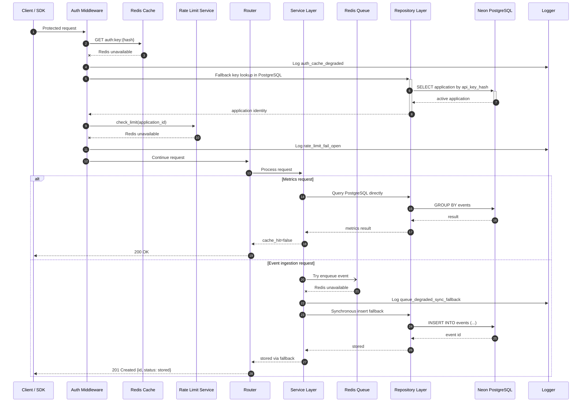
```mermaid
sequenceDiagram
    autonumber
    participant C as Client / SDK
    participant MW as Auth Middleware
    participant Cache as Redis Cache
    participant RL as Rate Limit Service
    participant R as Router
    participant S as Service Layer
    participant Queue as Redis Queue
    participant Repo as Repository Layer
    participant DB as Neon PostgreSQL
    participant Log as Logger

    C->>+MW: Protected request
    MW->>+Cache: GET auth:key:{hash}
    Cache--xMW: Redis unavailable
    MW->>Log: Log auth_cache_degraded
    MW->>+Repo: Fallback key lookup in PostgreSQL
    Repo->>+DB: SELECT application by api_key_hash
    DB-->>-Repo: active application
    Repo-->>-MW: application identity

    MW->>+RL: check_limit(application_id)
    RL--xMW: Redis unavailable
    MW->>Log: Log rate_limit_fail_open

    MW->>+R: Continue request
    R->>+S: Process request
    alt Metrics request
        S->>Repo: Query PostgreSQL directly
        Repo->>DB: GROUP BY events
        DB-->>Repo: result
        Repo-->>S: metrics result
        S-->>R: cache_hit=false
        R-->>C: 200 OK
    else Event ingestion request
        S-)Queue: Try enqueue event
        Queue--xS: Redis unavailable
        S->>Log: Log queue_degraded_sync_fallback
        S->>Repo: Synchronous insert fallback
        Repo->>DB: INSERT INTO events (...)
        DB-->>Repo: event id
        Repo-->>S: stored
        S-->>R: stored via fallback
        R-->>C: 201 Created {id, status: stored}
    end
```

**Main Flow:** Redis failures are logged and replaced with direct database paths where documented.

**Alternative Flow:** Rate limiting fails open because availability is prioritized.

**Failure Flow:** If Redis and PostgreSQL are both unavailable, the request fails with a standard server error.

**Postconditions:** Successful fallback operations are durable in PostgreSQL and visible in logs.

**Implementation Notes:** Fallback should be feature-flagged for ingestion, as documented, and measured operationally.

**Design Discussion:** Redis improves speed, but Neon PostgreSQL remains the source of truth. This keeps Redis from becoming a single point of ingestion failure.

---

### 3.12 Database Failure

**Purpose:** Show API and worker behavior when Neon PostgreSQL operations fail.

**Preconditions:** Request or worker operation requires database access and PostgreSQL is unavailable, times out, or rejects a transaction.

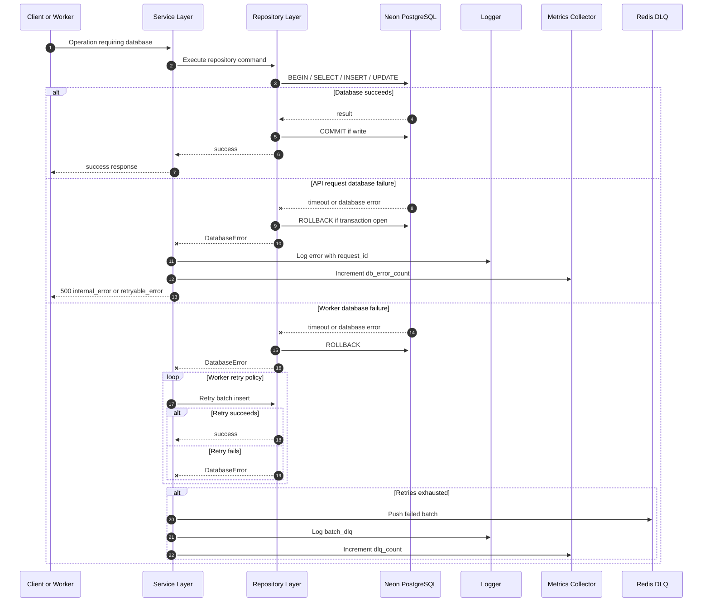
```mermaid
sequenceDiagram
    autonumber
    participant Caller as Client or Worker
    participant S as Service Layer
    participant Repo as Repository Layer
    participant DB as Neon PostgreSQL
    participant Log as Logger
    participant Met as Metrics Collector
    participant DLQ as Redis DLQ

    Caller->>+S: Operation requiring database
    S->>+Repo: Execute repository command
    Repo->>+DB: BEGIN / SELECT / INSERT / UPDATE
    alt Database succeeds
        DB-->>Repo: result
        Repo->>DB: COMMIT if write
        Repo-->>S: success
        S-->>Caller: success response
    else API request database failure
        DB--xRepo: timeout or database error
        Repo->>DB: ROLLBACK if transaction open
        Repo--xS: DatabaseError
        S->>Log: Log error with request_id
        S->>Met: Increment db_error_count
        S-->>Caller: 500 internal_error or retryable_error
    else Worker database failure
        DB--xRepo: timeout or database error
        Repo->>DB: ROLLBACK
        Repo--xS: DatabaseError
        loop Worker retry policy
            S->>Repo: Retry batch insert
            alt Retry succeeds
                Repo-->>S: success
            else Retry fails
                Repo--xS: DatabaseError
            end
        end
        alt Retries exhausted
            S->>DLQ: Push failed batch
            S->>Log: Log batch_dlq
            S->>Met: Increment dlq_count
        end
    end
```

**Main Flow:** Successful database operations return normally and writes commit.

**Alternative Flow:** Worker failures retry before DLQ.

**Failure Flow:** API failures return structured `500` errors without leaking stack traces or secrets.

**Postconditions:** No partial write should be reported as success. Open transactions are rolled back.

**Implementation Notes:** Neon cold starts should be tolerated with connection-pool retry behavior where practical.

**Design Discussion:** The API cannot safely claim success if the system of record fails. Worker retries are safe because Phase 2 delivery is at-least-once and idempotency mitigates duplicates.

---

### 3.13 Health Check

**Purpose:** Provide Render and uptime monitors with coarse liveness/readiness information.

**Preconditions:** Caller invokes `GET /v1/health`; no API key is required.

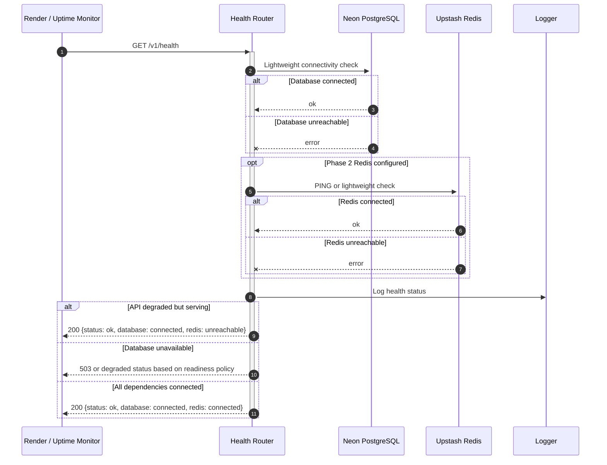
```mermaid
sequenceDiagram
    autonumber
    participant Monitor as Render / Uptime Monitor
    participant R as Health Router
    participant DB as Neon PostgreSQL
    participant Redis as Upstash Redis
    participant Log as Logger

    Monitor->>+R: GET /v1/health
    R->>+DB: Lightweight connectivity check
    alt Database connected
        DB-->>R: ok
    else Database unreachable
        DB--xR: error
    end
    opt Phase 2 Redis configured
        R->>+Redis: PING or lightweight check
        alt Redis connected
            Redis-->>R: ok
        else Redis unreachable
            Redis--xR: error
        end
    end
    R->>Log: Log health status
    alt API degraded but serving
        R-->>Monitor: 200 {status: ok, database: connected, redis: unreachable}
    else Database unavailable
        R-->>Monitor: 503 or degraded status based on readiness policy
    else All dependencies connected
        R-->>-Monitor: 200 {status: ok, database: connected, redis: connected}
    end
```

**Main Flow:** The health route checks database and, in Phase 2, Redis connectivity.

**Alternative Flow:** Redis down may still return `200` with `"redis": "unreachable"` when the API can serve through PostgreSQL fallback.

**Failure Flow:** Database unavailability may fail readiness because PostgreSQL is the system of record.

**Postconditions:** No application state changes.

**Implementation Notes:** Health output must not include connection strings, hostnames, stack traces, or detailed provider errors.

**Design Discussion:** Health checks should distinguish a degraded cache/queue from a nonfunctional API.

---

### 3.14 Logging Flow

**Purpose:** Show structured request logging, redaction, and security-event logging.

**Preconditions:** Any HTTP request reaches the FastAPI app.

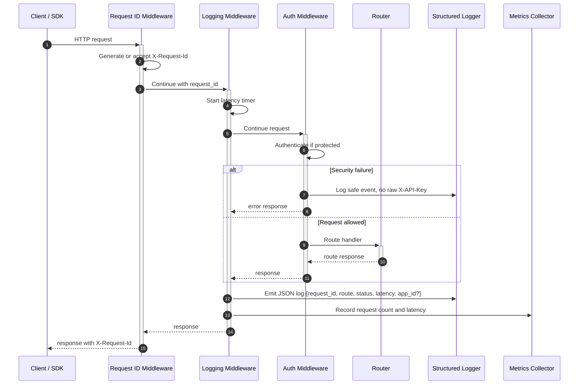
```mermaid
sequenceDiagram
    autonumber
    participant C as Client / SDK
    participant ReqID as Request ID Middleware
    participant LogMW as Logging Middleware
    participant MW as Auth Middleware
    participant R as Router
    participant Log as Structured Logger
    participant Met as Metrics Collector

    C->>+ReqID: HTTP request
    ReqID->>ReqID: Generate or accept X-Request-Id
    ReqID->>+LogMW: Continue with request_id
    LogMW->>LogMW: Start latency timer
    LogMW->>+MW: Continue request
    MW->>MW: Authenticate if protected
    alt Security failure
        MW->>Log: Log safe event, no raw X-API-Key
        MW-->>LogMW: error response
    else Request allowed
        MW->>+R: Route handler
        R-->>-MW: route response
        MW-->>-LogMW: response
    end
    LogMW->>Log: Emit JSON log {request_id, route, status, latency, app_id?}
    LogMW->>Met: Record request count and latency
    LogMW-->>-ReqID: response
    ReqID-->>-C: response with X-Request-Id
```

**Main Flow:** Middleware assigns request ID, times the request, logs sanitized context, and records metrics.

**Alternative Flow:** Security failures are logged without full credentials.

**Failure Flow:** Logging failures must not prevent the API from returning a response.

**Postconditions:** A request-correlated log line exists for every request.

**Implementation Notes:** Do not log raw API keys, database URLs, Redis URLs, or full metadata payloads by default.

**Design Discussion:** Request IDs connect client-visible errors to server logs while avoiding sensitive payload disclosure.

---

### 3.15 Request ID Generation

**Purpose:** Ensure every response and log entry can be correlated.

**Preconditions:** Request enters the FastAPI middleware stack.

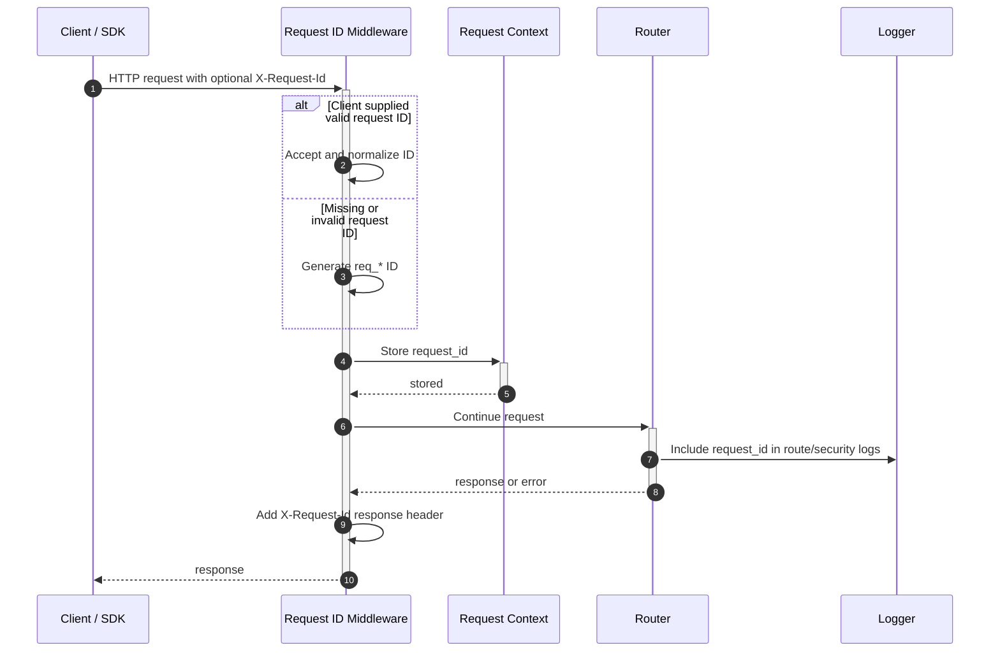
```mermaid
sequenceDiagram
    autonumber
    participant C as Client / SDK
    participant ReqID as Request ID Middleware
    participant Ctx as Request Context
    participant R as Router
    participant Log as Logger

    C->>+ReqID: HTTP request with optional X-Request-Id
    alt Client supplied valid request ID
        ReqID->>ReqID: Accept and normalize ID
    else Missing or invalid request ID
        ReqID->>ReqID: Generate req_* ID
    end
    ReqID->>+Ctx: Store request_id
    Ctx-->>-ReqID: stored
    ReqID->>+R: Continue request
    R->>Log: Include request_id in route/security logs
    R-->>-ReqID: response or error
    ReqID->>ReqID: Add X-Request-Id response header
    ReqID-->>-C: response
```

**Main Flow:** A request ID is created or propagated and then added to response headers.

**Alternative Flow:** Invalid incoming IDs are replaced.

**Failure Flow:** If route processing fails, exception handling still includes the request ID.

**Postconditions:** Client, logs, and error envelopes share the same correlation ID.

**Implementation Notes:** Keep request IDs opaque and non-secret.

**Design Discussion:** Correlation is essential for debugging distributed flows, especially Phase 2 API-to-worker handoff.

---

### 3.16 Error Handling

**Purpose:** Standardize validation, authentication, authorization, and unexpected error responses.

**Preconditions:** Any route or middleware encounters an error.

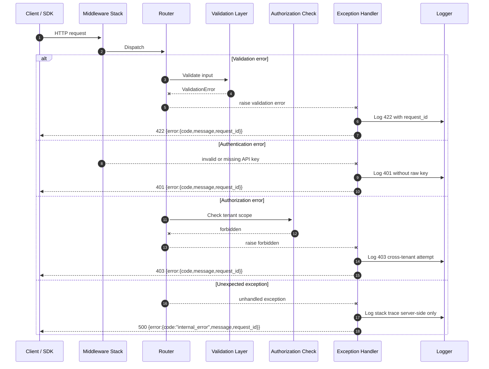
```mermaid
sequenceDiagram
    autonumber
    participant C as Client / SDK
    participant MW as Middleware Stack
    participant R as Router
    participant V as Validation Layer
    participant AuthZ as Authorization Check
    participant Err as Exception Handler
    participant Log as Logger

    C->>+MW: HTTP request
    MW->>+R: Dispatch
    alt Validation error
        R->>+V: Validate input
        V--xR: ValidationError
        R--xErr: raise validation error
        Err->>Log: Log 422 with request_id
        Err-->>C: 422 {error:{code,message,request_id}}
    else Authentication error
        MW--xErr: invalid or missing API key
        Err->>Log: Log 401 without raw key
        Err-->>C: 401 {error:{code,message,request_id}}
    else Authorization error
        R->>+AuthZ: Check tenant scope
        AuthZ--xR: forbidden
        R--xErr: raise forbidden
        Err->>Log: Log 403 cross-tenant attempt
        Err-->>C: 403 {error:{code,message,request_id}}
    else Unexpected exception
        R--xErr: unhandled exception
        Err->>Log: Log stack trace server-side only
        Err-->>C: 500 {error:{code:"internal_error",message,request_id}}
    end
```

**Main Flow:** Known errors map to documented HTTP status codes and standard envelopes.

**Alternative Flow:** Unexpected errors become safe `500` responses.

**Failure Flow:** Error handler must avoid recursive failures; if logging fails, response still returns.

**Postconditions:** Clients receive machine-parseable errors and request IDs.

**Implementation Notes:** Do not expose stack traces, SQL parameters, secrets, or full payloads in responses.

**Design Discussion:** A consistent envelope improves client behavior and makes support/debugging reliable.

---

### 3.17 Deployment Startup

**Purpose:** Show startup initialization for the API web service and Phase 2 worker.

**Preconditions:** Render starts or redeploys the service after CI/CD.

```mermaid
sequenceDiagram
    autonumber
    participant GH as GitHub Actions
    participant Render as Render Platform
    participant API as FastAPI Web Service
    participant Worker as ARQ Worker Service
    participant Cfg as Configuration
    participant DB as Neon PostgreSQL
    participant Redis as Upstash Redis
    participant Log as Logger
    participant Alembic as Alembic / Migrations

    GH->>+Render: Deploy main after lint, type-check, tests
    opt Migration step
        Render->>+Alembic: Run reviewed migrations
        Alembic->>+DB: Apply schema changes
        Note over Alembic,DB: Migration role may create/alter schema; runtime app role remains DML-only.
        DB-->>-Alembic: migration committed
        Alembic-->>-Render: migration success
    end
    Render->>+API: Start web service
    API->>+Cfg: Load env settings
    Cfg-->>-API: DATABASE_URL, REDIS_URL?, feature flags
    API->>+DB: Initialize async engine and test pool readiness
    DB-->>-API: ready
    opt Phase 2 enabled
        API->>+Redis: Initialize pooled Redis client
        Redis-->>-API: ready or degraded
    end
    API->>API: Register middleware and /v1 routers
    API->>Log: Log startup complete
    Render-->>-API: Mark web service healthy

    opt Phase 2 worker deploy
        Render->>+Worker: Start background worker
        Worker->>Cfg: Load worker env settings
        Worker->>Redis: Connect to queue and DLQ
        Worker->>DB: Initialize async database engine
        Worker->>Log: Log worker startup complete
        Render-->>-Worker: Worker running
    end
```

**Main Flow:** CI passes, Render starts services, configuration loads, database and Redis clients initialize, middleware and routers register.

**Alternative Flow:** Phase 1 starts only the API service and PostgreSQL path.

**Failure Flow:** Migration failure, missing required config, or database initialization failure prevents a healthy startup.

**Postconditions:** API is ready to serve; Phase 2 worker is ready to consume queue jobs.

**Implementation Notes:** Startup logs must not print secret values. Partition DDL is reviewed by hand because Alembic autogenerate does not reliably produce correct partition migrations.

**Design Discussion:** Separate deployables let API and worker scale and restart independently.

---

### 3.18 Shutdown Flow

**Purpose:** Show graceful shutdown of API and worker processes.

**Preconditions:** Render stops, restarts, or redeploys a service.

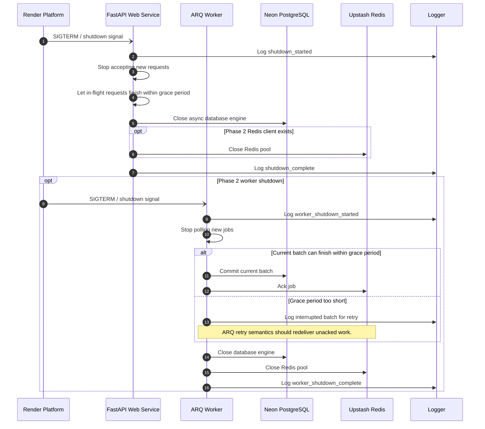
```mermaid
sequenceDiagram
    autonumber
    participant Render as Render Platform
    participant API as FastAPI Web Service
    participant Worker as ARQ Worker
    participant DB as Neon PostgreSQL
    participant Redis as Upstash Redis
    participant Log as Logger

    Render-)API: SIGTERM / shutdown signal
    API->>Log: Log shutdown_started
    API->>API: Stop accepting new requests
    API->>API: Let in-flight requests finish within grace period
    API->>DB: Close async database engine
    opt Phase 2 Redis client exists
        API->>Redis: Close Redis pool
    end
    API->>Log: Log shutdown_complete

    opt Phase 2 worker shutdown
        Render-)Worker: SIGTERM / shutdown signal
        Worker->>Log: Log worker_shutdown_started
        Worker->>Worker: Stop polling new jobs
        alt Current batch can finish within grace period
            Worker->>DB: Commit current batch
            Worker->>Redis: Ack job
        else Grace period too short
            Worker->>Log: Log interrupted batch for retry
            Note over Worker,Redis: ARQ retry semantics should redeliver unacked work.
        end
        Worker->>DB: Close database engine
        Worker->>Redis: Close Redis pool
        Worker->>Log: Log worker_shutdown_complete
    end
```

**Main Flow:** Services stop accepting new work, finish safe in-flight operations, and close connections.

**Alternative Flow:** Worker interruption relies on queue retry semantics for unacknowledged jobs.

**Failure Flow:** Forced termination may interrupt a batch; idempotency and retry/DLQ behavior protect against silent loss.

**Postconditions:** Connections are closed and logs show shutdown completion or interruption.

**Implementation Notes:** Shutdown should be idempotent and tolerate already-closed connections.

**Design Discussion:** Graceful shutdown is important for async workers because a killed process may otherwise create duplicate or delayed event persistence.

---

### 3.19 Background Cache Refresh

**Purpose:** Clarify cache behavior when no standalone background refresh process is documented.

**Preconditions:** Phase 2 Redis cache-aside is enabled for key lookup and metrics.

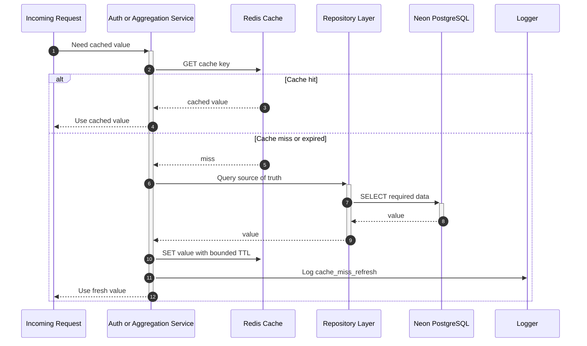
```mermaid
sequenceDiagram
    autonumber
    participant Req as Incoming Request
    participant S as Auth or Aggregation Service
    participant Cache as Redis Cache
    participant Repo as Repository Layer
    participant DB as Neon PostgreSQL
    participant Log as Logger

    Req->>+S: Need cached value
    S->>+Cache: GET cache key
    alt Cache hit
        Cache-->>S: cached value
        S-->>Req: Use cached value
    else Cache miss or expired
        Cache-->>S: miss
        S->>+Repo: Query source of truth
        Repo->>+DB: SELECT required data
        DB-->>-Repo: value
        Repo-->>-S: value
        S->>Cache: SET value with bounded TTL
        S->>Log: Log cache_miss_refresh
        S-->>-Req: Use fresh value
    end
```

**Main Flow:** Cache is refreshed lazily on request-time misses.

**Alternative Flow:** Cache hits avoid PostgreSQL reads.

**Failure Flow:** Redis failure falls back to database, as shown in the Redis failure diagram.

**Postconditions:** Cache may be populated with a bounded TTL.

**Implementation Notes:** There is no documented standalone background cache refresh worker. Adding one would be a future feature and is not assumed here.

**Design Discussion:** Cache-aside keeps the system simple: the database remains authoritative and stale cache state expires quickly.

---

### 3.20 Future Architecture Flow

**Purpose:** Show how Phase 2 extends Phase 1 without changing the core API contract.

**Preconditions:** Phase 1 is implemented and Phase 2 capabilities are enabled incrementally.

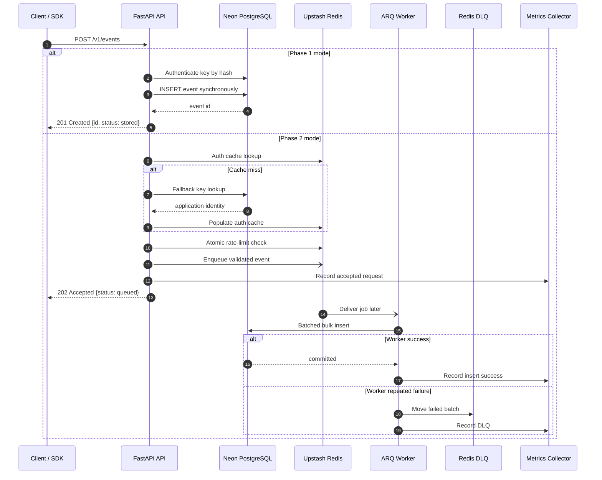
```mermaid
sequenceDiagram
    autonumber
    participant C as Client / SDK
    participant API as FastAPI API
    participant DB as Neon PostgreSQL
    participant Redis as Upstash Redis
    participant W as ARQ Worker
    participant DLQ as Redis DLQ
    participant Met as Metrics Collector

    C->>+API: POST /v1/events
    alt Phase 1 mode
        API->>DB: Authenticate key by hash
        API->>DB: INSERT event synchronously
        DB-->>API: event id
        API-->>C: 201 Created {id, status: stored}
    else Phase 2 mode
        API->>Redis: Auth cache lookup
        alt Cache miss
            API->>DB: Fallback key lookup
            DB-->>API: application identity
            API->>Redis: Populate auth cache
        end
        API->>Redis: Atomic rate-limit check
        API-)Redis: Enqueue validated event
        API->>Met: Record accepted request
        API-->>C: 202 Accepted {status: queued}
        Redis-)W: Deliver job later
        W->>DB: Batched bulk insert
        alt Worker success
            DB-->>W: committed
            W->>Met: Record insert success
        else Worker repeated failure
            W->>DLQ: Move failed batch
            W->>Met: Record DLQ
        end
    end
```

**Main Flow:** Phase 1 writes directly; Phase 2 inserts Redis and worker components around the same public event endpoint.

**Alternative Flow:** Phase 2 cache misses still fall back to PostgreSQL.

**Failure Flow:** Phase 2 worker failures end in DLQ after retries.

**Postconditions:** The public API remains `/v1/events`, but response semantics differ: `201` stored in Phase 1, `202` queued in Phase 2.

**Implementation Notes:** Clients must treat `202` as accepted, not persisted.

**Design Discussion:** Phase 2 is an architectural extension, not a rewrite. It preserves API shape while improving latency, throughput, and resilience under load.

---

## 4. Cross-Cutting Implementation Notes

### 4.1 Security Checks

- Authentication must happen before protected route business logic.
- Authorization must compare path application IDs to authenticated `application_id`.
- Event tenant identity must come from request context, not payload.
- Raw API keys must be returned only on creation or rotation and must never be logged.
- Cache keys for auth and metrics must include tenant-safe identifiers and must never store raw API keys.

### 4.2 Performance Considerations

- Phase 1 write latency is bounded by PostgreSQL key lookup and insert commit.
- Phase 2 removes the database insert from the request path by enqueueing validated events.
- Metrics cache TTL should remain short, 30-60 seconds, to balance speed and freshness.
- Batch ingestion reduces per-event HTTP overhead and improves worker bulk-insert efficiency.
- Fixed-window rate limiting is O(1) memory per application window.

### 4.3 Failure Handling

- Authentication, authorization, validation, and tenant-scope failures fail closed.
- Redis failures degrade to PostgreSQL paths where documented.
- Database failures cannot report successful persistence.
- Worker failures retry and then move to DLQ.
- Every error response must include a request ID and must avoid leaking secrets or stack traces.

### 4.4 Scalability Implications

- The API remains stateless and horizontally scalable.
- ARQ workers scale independently from the web service.
- Redis absorbs hot key lookups, metrics reads, rate-limit counters, and queue buffering in Phase 2.
- PostgreSQL remains the source of truth and is protected by batching, indexing, and partitioning.

### 4.5 Extensibility Boundaries

Future capabilities should preserve the existing design principles:

- Keep `/v1` changes additive unless breaking semantics require `/v2`.
- Prefer source-of-truth reads from PostgreSQL with cache-aside acceleration.
- Avoid adding user-login or delegated-auth features unless the product scope changes.
- Keep worker-only behavior off the synchronous API path unless correctness requires waiting.

---

*End of document.*
